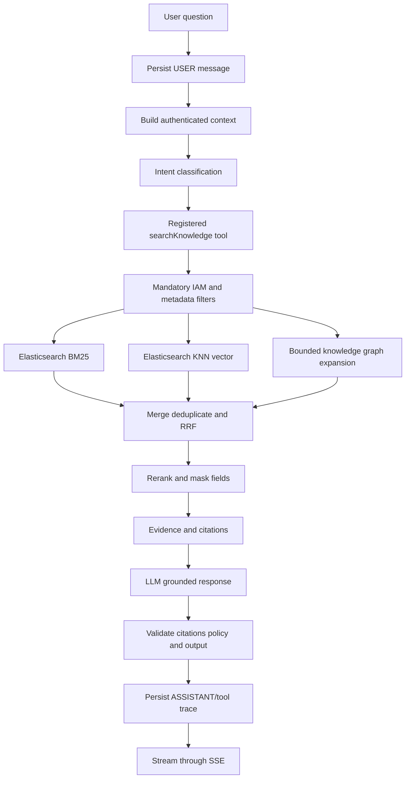
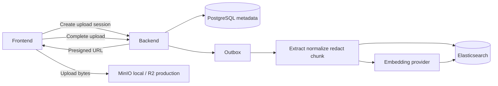
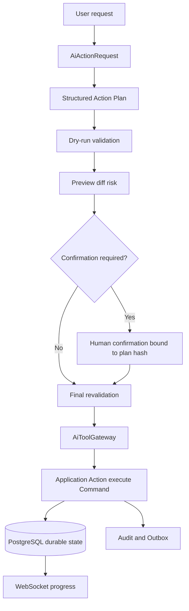

# SCOPERY AI COPILOT — END-TO-END ARCHITECTURE FLOW

> Applies to Phase 41–45. This document summarizes the locked cross-phase call flow and technology decisions. Detailed requirements remain in each phase document.

## 1. Locked stack

```text
Backend: Java 21 + Spring Boot 3.x
Database: PostgreSQL + JPA/Hibernate + Flyway
Search: Elasticsearch 8.x, BM25 + dense_vector/KNN + hybrid fusion/reranking
Local file storage: MinIO
Production file storage: Cloudflare R2
Storage protocol: S3-compatible API
Chat streaming: SSE
Agent execution streaming: WebSocket
Distributed realtime coordination: Redis Pub/Sub or Redis Streams
Reliability: Resilience4j
Observability: Micrometer + OpenTelemetry + Prometheus/Grafana-compatible dashboards
```

## 2. General read-only AI chat flow



## 3. File-to-RAG flow



## 4. Agentic action flow



## 5. Source-of-truth rules

```text
PostgreSQL = business, conversation and execution source of truth.
Cloudflare R2/MinIO = raw file bytes.
Elasticsearch = rebuildable search/vector index.
Redis = transient coordination/cache/rate limiting, never sole durable truth.
SSE/WebSocket = delivery channels, never source of truth.
```
