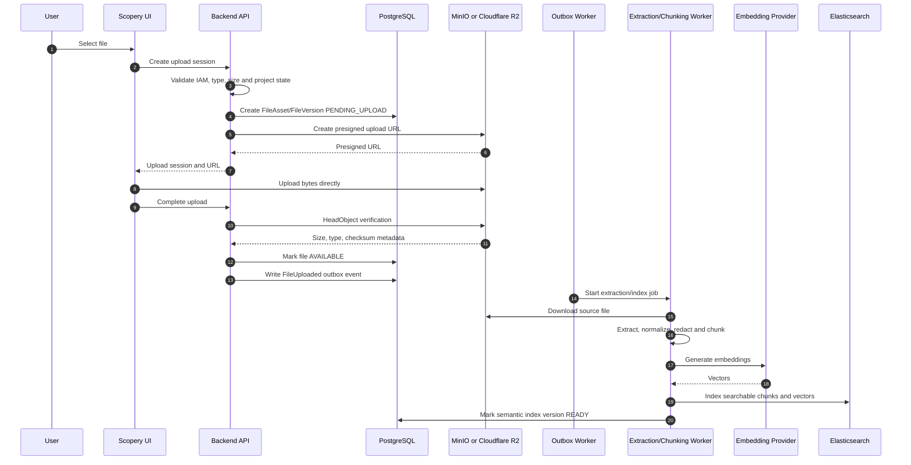

# PHASE 41 — TO-BE Knowledge Graph, Semantic Index, Elasticsearch Hybrid Search, RAG Retrieval & Grounding Foundation

> Project: Scopery Backend  
> Phase: 41  
> Document type: TO-BE implementation-grade specification  
> Status: Planning / Semantic retrieval and knowledge intelligence foundation  
> Roadmap group: Advanced AI Assistant & Knowledge Intelligence  
> Depends on: Phase 00–40, with hard runtime dependencies limited to Core Platform and explicitly declared adapters  
> API base: `/api`  
> Primary module: `modules/knowledge` (locked by ADR-041)
> Important rule: Phase 41 builds the permission-aware semantic retrieval foundation. It does not yet deliver complete conversational chat, recommendation, or action execution.

---


# ADR-041 implementation lock

Phase 41 implementation is governed by:

```text
ADR_041_PHASE_41_MVP_SEMANTIC_RETRIEVAL_FOUNDATION_REPO_ALIGNED.md
V95__phase_41_knowledge_semantic_retrieval.sql
V96__phase_41_documenthub_version_object_storage_upgrade.sql
PHASE_41_ELASTICSEARCH_KNOWLEDGE_CHUNKS_MAPPING_V001.json
PHASE_41_API_CONTRACTS_REPO_ALIGNED.md
docker-compose.phase41.override.yml
PHASE_41_IAM_EVENT_SEED_CATALOG_REPO_ALIGNED.md
PHASE_41_SOURCE_ADAPTER_CONTRACTS_REPO_ALIGNED.md
PHASE_41_MAVEN_INFRA_DEPENDENCIES_REPO_ALIGNED.md
PHASE_41_GAP_CLOSURE_MATRIX_REPO_ALIGNED.md
```

Locked decisions:

```text
Module: modules/knowledge
Table prefix: knowledge_
API base: /api/knowledge
MVP sources: TASK, DOCUMENT_VERSION, MEETING_MINUTE
Embedding: text-embedding-3-small, 1536 dimensions
Chunking: chunk-v1 with source-specific defaults
ACL signature: acl:v1:sha256:<64hex> plus explicit aclTokens
Graph: four node types and six explicit edge types
Retrieval: BM25 + KNN + application-layer RRF(k=60)
Reranker: optional, disabled by default
Document Hub: preserve storage_key and implement real object storage in Phase 41
```

If this document conflicts with ADR-041, ADR-041 wins.

---


# Repository-aligned implementation lock

The current repository review established these facts:

```text
document version table = documenthub_version
existing file columns = storage_key, content_type, checksum
latest known Flyway migration = V94
Knowledge package convention = {entity}/http/controller|request|response + application/action|service
current compose = PostgreSQL + Redis only
current pom = no Elasticsearch client or AWS S3 SDK
Phase 32 = PostgreSQL keyword search only
```

Therefore Phase 41 must use the repository-aligned artifacts listed above. It must not copy the obsolete V4100/V4101 filenames, `document_version`, `mime_type`, `checksum_sha256`, or `interfaces/rest` examples.

Current-vs-TO-BE classification:

| Capability | Current repository | Phase 41 action |
|---|---|---|
| PostgreSQL | implemented | reuse |
| Redis | implemented | reuse only where needed |
| Elasticsearch | absent | add 8.19.16 service/client/mapping/aliases |
| MinIO | absent | add local service and bucket init |
| Cloudflare R2 | no adapter | add production S3-compatible config |
| Document Hub table | `documenthub_version` | upgrade real table with V96 |
| Document bytes | storage reference only | implement presigned binary lifecycle |
| Search | PostgreSQL keyword | preserve and add hybrid retrieval |
| Knowledge module | exists | extend using current package convention |
| Error model | existing ErrorResponse/AppException | reuse; no parallel envelope |
| IAM/Event seeders | platform pattern exists | add exact Knowledge catalogs through current initializers |

If any statement conflicts with the target branch, the coding agent must stop only the conflicting migration/package step, record the exact repository evidence, and update ADR/artifact references atomically before continuing. It must not silently improvise.

---

# 0. Purpose

Phase 41 upgrades Scopery from basic permission-aware keyword search into a reusable knowledge intelligence platform.

It continues capabilities explicitly deferred by Phase 21 and Phase 32:

```text
Phase 08  → Knowledge/document type foundation
Phase 21  → AI planning proposal; full RAG and semantic index deferred
Phase 27  → Document Hub and versioned documents
Phase 28  → Requirement/application/screen/API traceability
Phase 31  → Meetings, minutes, comments and actions
Phase 32  → Global keyword search/navigation/productivity
Phase 38  → Sensitive data, privacy and retention controls
Phase 39  → Import/export/connectors
```

Phase 41 must work as a standalone semantic search/retrieval module even when conversational AI is disabled.

Phase 41 answers:

```text
How is Scopery data transformed into AI-readable knowledge?
How are document/entity changes indexed incrementally?
How does Elasticsearch support BM25 and vector retrieval together?
How are workspace/project/IAM filters enforced before results reach AI?
How are chunks versioned, cited, invalidated and rebuilt?
How can relationship graph expansion improve retrieval without granting access?
```

---

# 1. Product intention and core principle

```text
PostgreSQL/domain objects are source of truth.
Elasticsearch is a rebuildable derived index.
Object storage keeps file bytes.
KnowledgeChunk is a traceable projection, not hidden business truth.
Permission filtering is mandatory before a result reaches a caller or LLM.
Every returned chunk must point to a source object/version.
Archive, delete, retention and permission changes invalidate retrieval.
```

Standalone and modular behavior remains mandatory:

```text
Each capability works with Core Platform and available adapters.
Missing optional modules reduce available sources/tools/packs gracefully.
No optional integration becomes a hidden hard runtime dependency.
```

---

# 2. Source inputs

Before coding Phase 41, the agent must read:

```text
1. Phase 00 master roadmap and completion state
2. Phase 02 IAM; Phase 04 audit/outbox/idempotency; Phase 05 Event Registry
3. Phase 07 AI Agent Platform; Phase 08 Knowledge foundation
4. Phase 09–10 Project Core and authorization
5. Phase 21 AI Planning spec/completion
6. Phase 23 hardening
7. Phase 24–31 business artifacts
8. Phase 32 Search/Productivity
9. Phase 33 Custom Fields; Phase 34 Governance
10. Phase 38 privacy/retention; Phase 39 connectors
11. Current document extraction/storage, Elasticsearch config, outbox consumers, migrations and tests
```

The agent must inspect actual code, migrations, seeders and tests. Documentation alone is not proof of implementation.

---

# 3. Current expected gaps

Likely missing or partial:

```text
KnowledgeSource / KnowledgeProjection / KnowledgeChunk
EmbeddingModelProfile / EmbeddingJob / EmbeddingRecord
SemanticIndexDefinition / index aliases / schema versioning
HybridRetrievalPolicy / RetrievalRequest / RetrievalTrace
CitationReference
KnowledgeGraphNode / KnowledgeGraphEdge
incremental index consumer, reindex, invalidation and dead-letter flow
ACL/permission signature projection and retrieval debug
```

Every item must be classified as:

```text
CURRENTLY_IMPLEMENTED
PARTIALLY_IMPLEMENTED
MUST_IMPLEMENT_IN_PHASE_41
MUST_HARDEN_IN_PHASE_41
SEED_ONLY_IN_PHASE_41
DEFERRED_TO_PHASE_XX
NOT_IN_SCOPE_FOR_PHASE_41
```

---

# 4. Target statement

Phase 41 must deliver:

```text
1. Register supported entity/document sources and source versions
2. Build canonical text/metadata projections
3. Create immutable versioned chunks with stable traceability
4. Generate embeddings asynchronously with approved profiles
5. Use versioned Elasticsearch full-text and dense-vector indexes
6. Implement mandatory tenant/workspace/project/source filters
7. Implement lexical + vector hybrid retrieval and reranking fallback
8. Return citation-bearing context packages
9. Build bounded project relationship graph
10. Index incrementally from outbox/domain events
11. Support project/workspace/full reindex with safe alias switch
12. Integrate privacy, retention, masking, archive/delete invalidation
13. Add IAM, events, audit, observability and tests
```

---

# 5. Boundary decisions

## Must implement

```text
semantic retrieval
vector embeddings
Elasticsearch hybrid search
knowledge source/chunk/citation
relationship graph foundation
index lifecycle
permission-aware RAG context
```
## Must not claim

```text
complete AI chat
recommendation engine
business mutation
cross-tenant search
public anonymous semantic search
unrestricted graph reasoning
automatic fine-tuning
```

General prohibitions:

```text
No cross-tenant access.
No permission bypass.
No raw secret exposure.
No hidden chain-of-thought storage/exposure.
No capability may claim a side effect or quality level not implemented and tested.
```

---

# 6. Required entities and value objects

## KnowledgeSource

```text
workspaceId/projectId
sourceType/sourceRefId/sourceVersionRefId
title/language/classification
contentHash/permissionSignature
status/lastObservedAt/lastIndexedAt/version
```
## KnowledgeProjection

```text
sourceId/projectionVersion
plainText/structuredMetadata/headings
extractionMethod/extractorVersion/contentHash
status/redacted error
```
## KnowledgeChunk

```text
sourceId/projectionVersion/chunkOrdinal
chunkType/headingPath/plainText
source offsets/token estimate/contentHash
classification/metadata/isCurrent
```
## EmbeddingModelProfile

```text
provider/model/deployment
vectorDimension/maxInputTokens
normalization/batch/status/version
```
## EmbeddingJob

```text
source/chunk scope
profile version
status/attempt/idempotency key
timestamps/redacted failure
```
## SemanticIndexDefinition

```text
index family/read alias/write alias
schema/analyzer/vector version
status
```
## RetrievalTrace

```text
lexical/vector candidates
filters/exclusion reasons
reranking/latency
final citation IDs
```
## CitationReference

```text
source type/ref/version
chunk/heading/fragment
canonical app route
classification
```
## KnowledgeGraphNode/Edge

```text
typed node
typed directional edge
workspace/project scope
source/permission lifecycle
```

All mutable important entities should follow repository conventions for UUIDs, audit columns, optimistic versioning and Flyway migrations.

---


# 6A. Locked technology decisions for Phase 41–45

The following technology decisions are now explicit and must be treated as the default implementation baseline unless a later Architecture Decision Record replaces them:

```text
Backend runtime:
- Java 21.
- Spring Boot 3.x.
- Spring Web MVC for normal REST endpoints.
- Spring SSE support for Phase 42 chat streaming.
- Spring WebSocket support for Phase 44 long-running agent execution updates.

Primary transactional database:
- PostgreSQL.
- Spring Data JPA/Hibernate.
- Flyway migrations.

Search and retrieval:
- Elasticsearch 8.x.
- BM25 lexical retrieval.
- dense_vector + KNN semantic retrieval.
- Reciprocal Rank Fusion or equivalent deterministic hybrid merge.
- Optional reranker through a provider adapter.

Object/file storage:
- Local development and integration testing: MinIO.
- Staging/production: Cloudflare R2.
- Protocol: S3-compatible API.
- Java client: AWS SDK for Java v2 S3 client/presigner, behind ObjectStorageProvider.

Caching, rate limiting and distributed realtime coordination:
- Redis.
- Redis Pub/Sub or Redis Streams may coordinate multi-instance execution/status delivery.
- PostgreSQL remains the durable source of truth; Redis is never the sole durable record.

Reliability and observability:
- Resilience4j for timeout/retry/circuit-breaker/bulkhead policies.
- Micrometer metrics.
- OpenTelemetry traces.
- Prometheus-compatible metrics collection.
- Grafana-compatible dashboards.
- Structured JSON logs with correlation/trace IDs.

AI provider integration:
- LlmProvider abstraction.
- EmbeddingProvider abstraction.
- RerankerProvider abstraction.
- Provider/model/deployment selected by versioned profile; domain/application code must not depend directly on one vendor SDK.
```

Provider-specific SDKs may exist only inside infrastructure adapters. Domain and application layers depend on ports/interfaces.

---

# 6B. Locked object storage architecture

The final storage decision is:

```text
Local development: MinIO.
Production storage: Cloudflare R2.
Communication protocol: S3-compatible API.
```

These three concepts have different responsibilities:

```text
MinIO
= object storage server run locally, normally through Docker Compose.

Cloudflare R2
= managed production object storage containing real user/project file bytes.

S3-compatible API
= the common API contract used by Scopery Backend to communicate with both systems.
```

The system must use the same application port and mostly the same infrastructure implementation in both environments:

```java
public interface ObjectStorageProvider {
    StoredObject upload(StorageUploadRequest request);
    PresignedUpload createPresignedUpload(PresignedUploadRequest request);
    PresignedDownload createPresignedDownload(PresignedDownloadRequest request);
    StorageObjectMetadata head(String objectKey);
    InputStream download(String objectKey);
    void delete(String objectKey);
}
```

Default adapter direction:

```text
ObjectStorageProvider
    ↓
S3CompatibleObjectStorageProvider
    ↓ configuration only
    ├── MinIO local endpoint
    └── Cloudflare R2 production endpoint
```

Direct dependencies from domain/application services to Cloudflare, MinIO or AWS-specific classes are forbidden.

## Storage responsibility split

```text
Cloudflare R2 / MinIO:
- raw file bytes;
- original uploads;
- generated exports;
- optional derived artifacts such as preview images or extracted text blobs when explicitly modeled.

PostgreSQL:
- FileAsset/FileVersion metadata;
- ownership and workspace/project relationships;
- object key;
- content type;
- size;
- checksum;
- upload status;
- retention state;
- security classification;
- audit references.

Elasticsearch:
- extracted searchable text;
- chunks;
- embeddings;
- searchable metadata projection;
- citation/source references.
```

R2 and MinIO are not business databases. Elasticsearch is not the source of truth for file ownership or permissions.

## Required object-key convention

Object keys must be opaque, normalized and tenant-scoped. A recommended pattern is:

```text
workspaces/{workspaceId}/projects/{projectId}/documents/{documentId}/versions/{versionId}/source/{generatedObjectName}
workspaces/{workspaceId}/projects/{projectId}/meetings/{meetingId}/attachments/{attachmentId}/{generatedObjectName}
workspaces/{workspaceId}/exports/{exportJobId}/{generatedObjectName}
```

Rules:

```text
- Never use an untrusted original filename as the complete object key.
- Preserve the original filename in PostgreSQL metadata.
- Include immutable IDs in object keys.
- Prevent path traversal and control characters.
- Default bucket visibility is private.
- Public permanent URLs are forbidden for private project files.
```

## Presigned upload/download

Large file bytes should normally flow directly between frontend and object storage through short-lived presigned URLs:

```text
Frontend → Backend: create upload session.
Backend: validate permission/type/size and create PENDING_UPLOAD metadata.
Backend → storage: create presigned upload URL.
Frontend → MinIO/R2: upload bytes directly.
Frontend → Backend: complete upload.
Backend → storage: HeadObject verification.
Backend: mark AVAILABLE and publish FileUploaded/FileVersionCreated.
```

Download/preview flow:

```text
Frontend → Backend: request file preview/download.
Backend: authorize the current user against the current resource state.
Backend → storage: create short-lived presigned download URL.
Frontend → MinIO/R2: download bytes directly.
```

Presigned URLs must be short-lived, scoped to one object/operation and must not replace application authorization.

## Environment configuration

```yaml
# application-local.yml
storage:
  provider: s3-compatible
  endpoint: http://localhost:9000
  region: us-east-1
  bucket: scopery-local
  access-key: ${MINIO_ACCESS_KEY}
  secret-key: ${MINIO_SECRET_KEY}
  path-style-access: true
```

```yaml
# application-production.yml
storage:
  provider: s3-compatible
  endpoint: https://${R2_ACCOUNT_ID}.r2.cloudflarestorage.com
  region: auto
  bucket: ${R2_BUCKET_NAME}
  access-key: ${R2_ACCESS_KEY_ID}
  secret-key: ${R2_SECRET_ACCESS_KEY}
  path-style-access: true
```

Secrets must come from environment/secret management and must never be committed to source control.

## Storage test levels

```text
Unit tests:
- mock ObjectStorageProvider.

Integration tests:
- real MinIO container.

Staging smoke tests:
- dedicated private Cloudflare R2 staging bucket.
```

R2 smoke tests must cover CORS, presigned upload/download, Unicode filenames, multipart upload, metadata headers, Content-Disposition, cancellation, timeout, delete and private-bucket access.

---

# 6C. File ingestion and semantic indexing flow



Failure rules:

```text
- Upload completion is not trusted until HeadObject verification succeeds.
- Extraction/indexing failure does not delete the source file.
- Source file status and semantic-index status are separate.
- Duplicate events are safe through idempotency keys.
- Old Elasticsearch read alias remains active until replacement index is healthy.
- Delete/retention/access changes must invalidate both bytes and derived indexes according to policy.
```

---

# 6D. General AI retrieval call and search tool contract

The retrieval layer must be callable through a registered read-only tool rather than giving an LLM direct Elasticsearch access.

```text
Tool code: searchKnowledge
Execution class: READ_ONLY
Direct Elasticsearch access by LLM: forbidden
Permission source: authenticated backend context, not LLM-supplied IDs
```

Recommended internal input contract:

```json
{
  "query": "Why is API Integration blocked?",
  "workspaceId": "server-resolved",
  "projectId": "server-resolved",
  "sourceTypes": ["TASK", "TASK_DEPENDENCY", "MEETING_MINUTE", "DECISION", "RISK"],
  "filters": {},
  "topK": 20,
  "rerankTopN": 8,
  "includeGraphExpansion": true
}
```

The backend must overwrite or reject tenant/project/security fields supplied by a model. The model cannot widen its own scope.

Search pipeline:

```text
Validated actor/context
→ query normalization/rewrite
→ mandatory workspace/project/security filters
→ Elasticsearch BM25 candidates
→ Elasticsearch KNN vector candidates
→ bounded knowledge-graph expansion
→ merge and deduplicate
→ Reciprocal Rank Fusion
→ optional reranking
→ field-level masking
→ citation package
→ retrieval trace for authorized diagnostics
```

Recommended output contract:

```json
{
  "retrievalMode": "HYBRID",
  "results": [
    {
      "sourceType": "TASK",
      "sourceId": "uuid",
      "sourceVersion": 7,
      "chunkId": "uuid",
      "title": "API Integration",
      "heading": "Blocker",
      "content": "Task is waiting for Authentication API.",
      "score": 0.92,
      "appRoute": "/projects/{projectId}/tasks/{taskId}"
    }
  ],
  "truncated": false
}
```

Every result returned to an AI caller must include enough immutable source/version information to build a citation and later detect staleness.

---

---

# 7. Architecture and processing flow

```text
Domain transaction
→ outbox event
→ KnowledgeSourceResolver
→ permission-aware ProjectionBuilder
→ ChunkingService
→ EmbeddingJob
→ Elasticsearch bulk index
→ versioned read alias
→ retrieval/citation package
```

Required index behavior:

```text
asynchronous + retryable + idempotent
new index for schema changes
validate before alias switch
old read alias remains on failed rebuild
bounded retention of old indexes
observable indexing lag and failures
controlled mappings for custom metadata
```

```text
1. Normalize query and resolve actor scope.
2. Apply mandatory tenant/workspace/project/source filters.
3. Run lexical BM25 search.
4. Run vector KNN search.
5. Merge by configured RRF/weighting strategy.
6. Revalidate effective access when required.
7. Optionally expand graph with bounded depth/fan-out.
8. Rerank top candidates; fall back safely on failure.
9. Deduplicate near-identical chunks.
10. Return limited context with citations.
```

---

# 8. API contract

Required API examples:

```text
POST /api/knowledge/retrieval/search
GET /api/knowledge/sources/{sourceId}
GET /api/knowledge/sources/{sourceId}/chunks
POST /api/knowledge/sources/{sourceId}/reindex
POST /api/knowledge/indexing/workspaces/{workspaceId}/reindex
POST /api/knowledge/indexing/projects/{projectId}/reindex
GET /api/knowledge/indexing/jobs/{jobId}
GET /api/knowledge/indexing/status
POST /api/knowledge/retrieval/debug
GET /api/knowledge/graph/nodes/{nodeId}/related
POST /api/knowledge/graph/traverse
```

Controllers must map Request → Command/QueryService and return DTOs, never JPA/domain aggregates.

---

# 9. IAM and authorization

Required permissions:

```text
SEMANTIC_SEARCH_USE
SEMANTIC_SEARCH_PROJECT_USE
SEMANTIC_INDEX_VIEW_STATUS
SEMANTIC_INDEX_MANAGE
SEMANTIC_INDEX_REINDEX
SEMANTIC_INDEX_DEBUG
KNOWLEDGE_SOURCE_VIEW
KNOWLEDGE_SOURCE_MANAGE
KNOWLEDGE_CHUNK_VIEW
KNOWLEDGE_GRAPH_VIEW
KNOWLEDGE_GRAPH_MANAGE
EMBEDDING_PROFILE_VIEW
EMBEDDING_PROFILE_MANAGE
```

Rules:

```text
AI/search capability permission never grants access to underlying source objects.
Resource authorization and field masking remain mandatory.
Administrative/debug/governance permissions are sensitive and audited.
External portal scope must be explicit; internal access is never inferred.
```

---

# 10. Event Registry integration

Recommended source system:

```text
SCOPERY_AI_PHASE_41
```

Required events:

```text
KNOWLEDGE_SOURCE_DISCOVERED
KNOWLEDGE_SOURCE_UPDATED
KNOWLEDGE_SOURCE_INVALIDATED
KNOWLEDGE_PROJECTION_CREATED
KNOWLEDGE_PROJECTION_FAILED
KNOWLEDGE_CHUNKS_CREATED
EMBEDDING_JOB_REQUESTED
EMBEDDING_JOB_SUCCEEDED
EMBEDDING_JOB_FAILED
SEMANTIC_INDEX_JOB_STARTED
SEMANTIC_INDEX_JOB_SUCCEEDED
SEMANTIC_INDEX_JOB_FAILED
SEMANTIC_INDEX_REBUILD_STARTED
SEMANTIC_INDEX_ALIAS_SWITCHED
SEMANTIC_INDEX_SOURCE_REMOVED
KNOWLEDGE_GRAPH_NODE_INDEXED
KNOWLEDGE_GRAPH_EDGE_INDEXED
RETRIEVAL_REQUEST_EXECUTED
RETRIEVAL_REQUEST_BLOCKED
```

Event payloads must not include raw prompt/document content, vectors, secrets, tokens, unmasked sensitive fields or hidden reasoning.

---

# 11. Audit, outbox, idempotency, privacy and observability

```text
Audit all policy/configuration changes and sensitive administrative views.
Use outbox for cross-module/asynchronous effects.
Use stable idempotency keys for repeatable jobs/executions.
Redact errors and telemetry.
Apply Phase 38 retention, legal hold and sensitive-field policy.
Correlate operations with traceId and source/execution identifiers.
```

---

# 12. Business rules master

```text
KSR-001 PostgreSQL/domain object remains source of truth.
KSR-002 Every chunk references one source/version.
KSR-003 Content hash change creates a new current projection.
KSR-004 Archive/delete/access change invalidates retrieval promptly.
CHK-001 Chunk is immutable within a projection version.
CHK-002 Excluded sensitive fields cannot enter projection/chunk.
EMB-001 Embedding uses an approved active profile.
IDX-001 Index is rebuildable from source truth.
IDX-002 Alias switches only after validation.
ACL-001 Tenant/workspace scope is mandatory.
ACL-002 Indexed ACL cannot grant domain access.
RET-001 Returned context has citations.
RET-002 Context/result/token limits are enforced.
GPH-001 Graph edges never grant access.
PRV-001 Privacy/retention updates derived indexes.
```

---

# 13. Error catalog

```text
KNOWLEDGE_SOURCE_NOT_FOUND
KNOWLEDGE_SOURCE_UNSUPPORTED
KNOWLEDGE_SOURCE_ACCESS_DENIED
KNOWLEDGE_PROJECTION_FAILED
KNOWLEDGE_EXTRACTION_UNSUPPORTED
KNOWLEDGE_CHUNK_NOT_FOUND
EMBEDDING_PROFILE_NOT_FOUND
EMBEDDING_PROFILE_INACTIVE
EMBEDDING_DIMENSION_MISMATCH
EMBEDDING_JOB_FAILED
SEMANTIC_INDEX_NOT_CONFIGURED
SEMANTIC_INDEX_UNAVAILABLE
SEMANTIC_INDEX_MAPPING_INVALID
SEMANTIC_INDEX_ALIAS_SWITCH_FAILED
SEMANTIC_RETRIEVAL_ACCESS_DENIED
SEMANTIC_RETRIEVAL_POLICY_NOT_FOUND
SEMANTIC_RETRIEVAL_CONTEXT_LIMIT_EXCEEDED
SEMANTIC_RETRIEVAL_DEBUG_ACCESS_DENIED
KNOWLEDGE_GRAPH_TRAVERSAL_LIMIT_EXCEEDED
```

Use module-specific error catalogs. Do not throw generic business exceptions or leak provider/internal stack details.

---

# 14. Required tests

```text
sourceVersionChange_createsNewProjection
unchangedSource_doesNotDuplicateProjection
archivedSource_notRetrievable
restrictedField_notProjected
chunkOffsets_traceToSource
embeddingUsesApprovedProfile
embeddingJobRetry_success
embeddingDimensionMismatch_blocked
indexWrite_idempotent
reindexFailure_keepsOldReadAlias
hybridSearch_mergesLexicalAndVectorResults
retrieval_filtersUnauthorizedProject
retrieval_doesNotLeakSensitiveSnippet
retrieval_returnsCitationForEveryChunk
retrievalGraphExpansion_respectsDepth
privacyAnonymization_triggersReindex
retentionDelete_removesChunksVectorsEdges
taskPermissionChange_refreshesAcl
minioPresignedUpload_integrationPasses
r2PresignedUpload_stagingSmokePasses
headObjectMismatch_doesNotMarkAvailable
privateBucket_fileNotPubliclyReadable
storageDelete_reconcilesPostgresR2AndElasticsearch
searchKnowledge_serverOverridesModelScope
```

Mandatory build gates:

```bash
mvn compile
mvn test
```

---


# 14A. Locked implementation artifacts

The coding agent must use the following files as executable design inputs rather than inventing schemas:

```text
ADR_041_PHASE_41_MVP_SEMANTIC_RETRIEVAL_FOUNDATION_REPO_ALIGNED.md
V95__phase_41_knowledge_semantic_retrieval.sql
V96__phase_41_documenthub_version_object_storage_upgrade.sql
PHASE_41_ELASTICSEARCH_KNOWLEDGE_CHUNKS_MAPPING_V001.json
PHASE_41_API_CONTRACTS_REPO_ALIGNED.md
docker-compose.phase41.override.yml
```

Important locked choices:

```text
- Existing `modules/knowledge` owns semantic retrieval.
- Only TASK, DOCUMENT_VERSION and MEETING_MINUTE are production source adapters.
- text-embedding-3-small uses 1536 dimensions in mapping v001.
- chunk-v1 is deterministic and source-specific.
- permissionSignature detects staleness; aclTokens perform Elasticsearch filtering.
- Graph stores only explicit relations.
- Application-layer RRF is mandatory; external reranking is optional.
- Existing Document Hub storage_key is preserved and becomes the canonical S3 object key.
```

---

# 15. Manual verification checklist

```text
1. Index one workspace/project with an approved embedding profile.
2. Verify exact task-code search and semantic concept search.
3. Verify hybrid results contain citations and app routes.
4. Remove project permission and confirm results disappear.
5. Update/archive/delete a source and confirm invalidation.
6. Run project reindex and verify safe alias behavior.
7. Simulate embedding failure and verify lexical fallback.
8. Verify sensitive/custom fields are excluded or masked.
9. Run admin retrieval debug and inspect stage trace.
10. Verify graph related results obey permission and depth limits.
```

---

# 16. Acceptance criteria

Phase 41 is accepted only if:

```text
1. KnowledgeSource, Projection and Chunk implemented/tested
2. Embedding profile/job implemented/tested
3. Elasticsearch full-text + vector strategy implemented/tested
4. Permission-aware hybrid retrieval implemented/tested
5. Every returned chunk has a citation
6. Knowledge graph foundation implemented/tested
7. Incremental indexing and safe reindex implemented/tested
8. Privacy/retention/access invalidation implemented/tested
9. IAM/events/audit/outbox/idempotency implemented
10. No chat/recommendation/mutation is falsely claimed
11. `mvn compile` and `mvn test` pass
12. Completion file exists
13. MinIO local and Cloudflare R2 production adapters work through one ObjectStorageProvider
14. Presigned upload/download and object verification are implemented/tested
15. searchKnowledge uses server-resolved authorization scope and never exposes direct Elasticsearch access to LLM
```

Do not mark complete when tests fail, access can leak, or a deferred capability is merely claimed.

---

# 17. Required phase completion file

Agent must create:

```text
docs/phase-complete/PHASE_41_KNOWLEDGE_GRAPH_SEMANTIC_INDEX_RAG_TO_BE_COMPLETE.md
```

Required sections:

```text
# Phase 41 — Complete

## 1. Summary
## 2. Source Inputs Reviewed
## 3. Current vs TO-BE Matrix
## 4. Implemented/Hardened
## 5. Deferred Items
## 6. Boundary Decision
## 7. Entity Mapping
## 8. Elasticsearch Index/Alias Strategy
## 9. Projection Strategy
## 10. Chunking Strategy
## 11. Embedding Strategy
## 12. Hybrid Retrieval/Reranking
## 13. Citation Strategy
## 14. ACL Filtering
## 15. Knowledge Graph
## 16. Incremental Indexing
## 17. Reindex/Recovery
## 18. Privacy/Retention
## 19. API Changes
## 20. Authorization/Event Matrix
## 21. Audit/Outbox/Idempotency
## 22. Tests/Results
## 23. Manual Verification
## 24. Assumptions/Deviations/Risks
## 25. Object Storage Decision (MinIO/R2/S3 API)
## 26. Presigned Upload/Download and File Ingestion
## 27. searchKnowledge Tool Contract
## 28. Technology Stack and Provider Adapters

```

---

# 18. Prompt to give coding agent

```text
You are implementing Phase 41 — TO-BE Knowledge Graph, Semantic Index, Elasticsearch Hybrid Search, RAG Retrieval & Grounding Foundation.

This is not an as-is documentation task.

Before coding:
- Read CLAUDE.md / CLAUDE.ms.
- Read Coding_convention.md.
- Read Phase 00–40 docs and completion files.
- Inspect current backend code, migrations, seeders and tests.

Your task:
1. Classify current search/knowledge/index capability.
2. Implement KnowledgeSource, KnowledgeProjection and KnowledgeChunk.
3. Implement approved embedding profiles and idempotent jobs.
4. Implement versioned Elasticsearch indexes and safe alias switching.
5. Implement permission-aware lexical + vector hybrid retrieval.
6. Implement citations, traces and bounded knowledge graph.
7. Implement event-driven incremental indexing and controlled reindex.
8. Integrate privacy, retention, masking and access invalidation.
9. Implement ObjectStorageProvider using one S3-compatible adapter for MinIO local and Cloudflare R2 production.
10. Implement private-bucket presigned upload/download, HeadObject verification and storage/index reconciliation.
11. Implement the registered read-only searchKnowledge tool with server-resolved authorization scope.
12. Add IAM, events, audit/outbox/idempotency and tests.
13. Run mvn compile/test and create the completion file.

Do not implement or claim capabilities outside the explicit Phase 41 boundary.
```

---

# 19. Current repository vs locked TO-BE matrix

| Capability | Current repository | Phase 41 action |
|---|---|---|
| PostgreSQL | Implemented | Reuse |
| Redis | Implemented | Reuse only where needed |
| Elasticsearch | Missing from compose/pom | Add 8.19.16 + official Java client |
| MinIO | Missing from compose | Add pinned local service |
| Cloudflare R2 | No adapter | Add S3-compatible production adapter/config |
| AWS S3 SDK | Missing | Add SDK v2 client + presigner |
| Document Hub binary storage | `storage_key` reference only | Preserve key; implement actual object storage |
| Presigned upload/download | Missing/deferred | Implement |
| Phase 32 search | PostgreSQL keyword | Preserve; add Phase 41 hybrid retrieval |
| Knowledge module | Exists | Extend; no new top-level semantic module |
| Source adapters | Missing | Implement TASK, DOCUMENT_VERSION, MEETING_MINUTE only |
| Embedding profile | Missing | Seed `OPENAI_TEXT_EMBEDDING_3_SMALL_1536_V1` |
| ES mapping/aliases | Missing | Add locked v001 mapping and alias lifecycle |
| Chunking | Missing | Implement deterministic `chunk-v1` |
| Permission signature/ACL tokens | Missing | Implement locked `acl:v1` contract |
| Graph | Missing | Implement locked MVP nodes/edges |
| Reranker | Missing | Optional; disabled by default |
| AI Chat | Missing | Defer to Phase 42 |
| Suggestions | Partial/specialized | Defer generalized engine to Phase 43 |
| Agentic mutation | Missing | Defer to Phase 44 |

---
