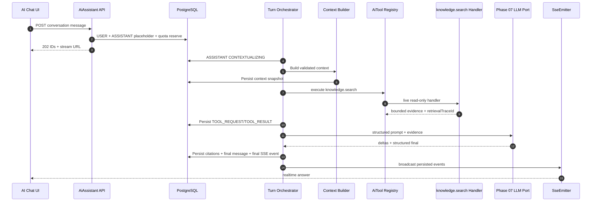

# PHASE 42 — TO-BE Contextual AI Chat, In-App Guidance & Grounded Project Q&A — Repository-Aligned

> Project: Scopery Backend  
> Phase: 42  
> Status: **TO-BE / implementation-ready after Pre-Code Checklist**  
> Module: `modules/aiassistant`  
> Table prefix: `aiassistant_`  
> API base: `/api/ai-assistant`  
> Retrieval tool: `knowledge.search` through existing AiTool registry  
> Streaming: Spring MVC `SseEmitter`  
> Migrations: V97/V98  
> Boundary: read-only assistant; no business mutation

## Conflict and precedence

```text
1. Current compile-safe repository code
2. CLAUDE.md / CLAUDE.ms
3. Coding_convention.md
4. ADR_042_PHASE_42_CONTEXTUAL_AI_CHAT_REPO_ALIGNED.md
5. This detailed specification
6. Earlier Phase 42 planning text
```

When documents conflict, ADR-042 wins.

---

# 0. Purpose

Phase 42 delivers the first user-facing Scopery AI assistant at two safe capability levels:

```text
Level 1 — Guide: explain pages, fields, actions, and workflows.
Level 2 — Contextual Answer: answer project questions with validated context and citations.
```

Examples:

```text
What does this page do?
What should I enter in this field?
Why is this action disabled?
Why is this task blocked?
Where is the latest relevant document or meeting minute?
What can I do next with my current permissions?
```

Phase 42 does not execute business mutations. Suggestion and agentic action execution remain Phase 43 and Phase 44.

---

# 1. Locked artifact set

Required implementation documents:

```text
ADR_042_PHASE_42_CONTEXTUAL_AI_CHAT_REPO_ALIGNED.md
V97__phase_42_aiassistant_conversation_core.sql
V98__phase_42_aiassistant_streaming_quota.sql
PHASE_42_API_CONTRACTS_REPO_ALIGNED.md
PHASE_42_SSE_STREAMING_CONTRACT_REPO_ALIGNED.md
PHASE_42_IAM_EVENT_SEED_CATALOG_REPO_ALIGNED.md
PHASE_42_CONTEXT_BUILDER_CONTRACT_REPO_ALIGNED.md
PHASE_42_ORCHESTRATOR_INTEGRATION_REPO_ALIGNED.md
PHASE_42_MAVEN_INFRA_DEPENDENCIES_REPO_ALIGNED.md
PHASE_42_GAP_CLOSURE_MATRIX_REPO_ALIGNED.md
PHASE_42_PRE_CODE_CHECKLIST_REPO_ALIGNED.md
```

No implementation decision should be re-invented from this file when a dedicated locked artifact exists.

---

# 2. Current repository baseline

Based on supplied repository inspection:

```text
- No AiConversation/AiMessage implementation is currently found.
- No /api/ai-assistant/conversations flow is currently found.
- No text/event-stream / SseEmitter implementation is currently found.
- Existing modules/aiagent contains tool registry CRUD/seed/execution logging, but live execution is largely stub/NO_OP.
- Existing ErrorResponse/AppException must be reused.
- Current package convention uses feature submodules with http/controller|request|response and application/action|service.
- Phase 41 reserves V95/V96 and locks knowledge.search.
```

Classification:

```text
Conversation persistence: MUST_IMPLEMENT_IN_PHASE_42
Context snapshot: MUST_IMPLEMENT_IN_PHASE_42
Citation persistence: MUST_IMPLEMENT_IN_PHASE_42
Tool transcript persistence: MUST_IMPLEMENT_IN_PHASE_42
SSE streaming/replay/cancel: MUST_IMPLEMENT_IN_PHASE_42
Live knowledge.search handler: MUST_HARDEN_IN_PHASE_42
AiTool registry reuse: MUST_REUSE_AND_HARDEN
WebSocket: DEFERRED_TO_PHASE_44
Mutation tools: NOT_IN_SCOPE_FOR_PHASE_42
```

---

# 3. Target outcomes

Phase 42 must deliver:

```text
1. Workspace/project-scoped owned conversations.
2. Durable USER/ASSISTANT/TOOL_REQUEST/TOOL_RESULT records.
3. Server-authoritative page/entity/action context snapshots.
4. Grounded project Q&A through knowledge.search.
5. Normalized citations attached to assistant messages.
6. Explain Page, Explain Field, Explain Disabled Action.
7. Suggested questions and guide metadata.
8. Spring MVC SSE with replay/reconnect/heartbeat/cancel.
9. Bounded memory summaries with deterministic triggers/invalidation.
10. Daily quotas and context/token limits.
11. Retention, redaction, legal-hold integration.
12. IAM rights, events, audit, outbox, metrics, and tests.
```

---

# 4. Boundary

## Allowed

```text
Read-only Q&A
Product/page/field/process guidance
Permission-aware source retrieval
Status/reason explanation
Accessible source summaries/comparisons
Navigation routes
Conversation lifecycle management
Answer feedback
```

## Forbidden

```text
Create/update/delete Task, WBS, Document, Meeting, Project, or other business entities
Change status/date/assignee
Send notifications/messages
Approve/finalize/lock
Execute Phase 44 mutation tools
Claim an action was executed
Store/expose private chain-of-thought
```

Server tool allowlist for Phase 42 contains exactly:

```text
knowledge.search
```

---

# 5. Module architecture

```text
Client
→ AiAssistant HTTP Controller
→ Action/QueryService
→ AiAssistantTurnOrchestrator
→ AiAssistantContextBuilder
→ existing AiTool registry
→ KnowledgeSearchAiToolHandler
→ Phase 41 Retrieval
→ existing Phase 07 LLM provider port
→ Citation validation
→ PostgreSQL persistence
→ SseEmitter delivery
```

Direct orchestrator → Knowledge retrieval service calls are forbidden. Retrieval must be observable and policy-controlled through the AiTool registry.

---

# 6. Persistence model

V97 owns:

```text
aiassistant_conversation
aiassistant_message
aiassistant_context_snapshot
aiassistant_message_citation
aiassistant_tool_call
aiassistant_memory_summary
aiassistant_guide_definition
aiassistant_suggested_question
aiassistant_answer_feedback
```

V98 owns:

```text
aiassistant_stream_event
aiassistant_active_stream
aiassistant_quota_usage
```

Important decisions:

```text
- Citations are normalized child rows, not JSON-only.
- Tool messages are durable but hidden from normal user history.
- Tool-call normalized metadata is bounded and safe.
- Stream events are durable for 24-hour replay.
- Cross-module IDs have no database FKs unless current repo already enforces them.
```

Exact DDL is in V97/V98; agents must not invent alternate columns or enums.

---

# 7. Context Builder

The client may provide route/page/entity/action/tab/locale/timezone/visible fields/available actions as hints.

The server must independently resolve:

```text
actor/workspace/project
registered page metadata
entity visibility/version
field masking
actual available action codes
disabled action reason codes
permission signature
context hash
safe memory summary
```

Context hash:

```text
ctx:v1:sha256:<64 lowercase hex>
```

Client action/field claims never grant access. Detailed payload, canonicalization, adapter contract, and failure rules are locked in the Context Builder artifact.

---

# 8. AiTool registry integration

Tool code:

```text
knowledge.search
```

Required live handler:

```text
KnowledgeSearchAiToolHandler
```

Owner:

```text
modules/knowledge
```

Phase 42 must replace/extend current stub execution sufficiently to dispatch this handler. No second tool registry may be created.

The handler is read-only and receives actor/workspace/ACL scope from the server execution context, not LLM arguments.

---

# 9. Orchestration flow



Every project factual answer requires validated evidence. No evidence produces `INSUFFICIENT_EVIDENCE`, not invention.

---

# 10. REST API

Required endpoints:

```text
POST   /api/ai-assistant/conversations
GET    /api/ai-assistant/conversations
GET    /api/ai-assistant/conversations/{conversationId}
PATCH  /api/ai-assistant/conversations/{conversationId}
POST   /api/ai-assistant/conversations/{conversationId}/archive
DELETE /api/ai-assistant/conversations/{conversationId}
POST   /api/ai-assistant/conversations/{conversationId}/messages
GET    /api/ai-assistant/conversations/{conversationId}/messages
GET    /api/ai-assistant/messages/{messageId}
GET    /api/ai-assistant/messages/{messageId}/stream
POST   /api/ai-assistant/messages/{messageId}/cancel
POST   /api/ai-assistant/explain-page
POST   /api/ai-assistant/explain-field
POST   /api/ai-assistant/explain-disabled-action
GET    /api/ai-assistant/suggested-questions
POST   /api/ai-assistant/messages/{messageId}/feedback
```

Exact request/response schemas, validation, status codes, and error mapping are in the API contract artifact.

---

# 11. SSE protocol

Mechanism:

```text
Spring MVC SseEmitter
```

Events:

```text
message.started
context.completed
retrieval.started
retrieval.completed
answer.delta
citation.added
answer.completed
answer.cancelled
answer.failed
answer.blocked
heartbeat
```

Defaults:

```text
180-second emitter timeout
15-second heartbeat
4 KiB delta
8 KiB event payload
4,096 max events/message
24-hour durable replay
Last-Event-ID/afterSequence reconnect
```

WebSocket is not required in Phase 42.

---

# 12. Message state machine

```text
RECEIVED → QUEUED → CONTEXTUALIZING → [RETRIEVING] → GENERATING → STREAMING → COMPLETED
```

Alternative final paths:

```text
non-final → CANCEL_REQUESTED → CANCELLED
non-final → FAILED
pre-generation/policy → BLOCKED
```

Final states cannot transition.

---

# 13. Memory

Strategy:

```text
summary-v1
```

Trigger when:

```text
20 completed turns since last summary
OR 12,000 unsummarized tokens
OR next turn exceeds 24,000-token context budget
```

Rules:

```text
keep latest 8 user-visible messages verbatim
summary <= 2,000 tokens
exclude tool payloads and hidden reasoning
invalidate on permission/source/retention change
never treat memory as project truth
```

---

# 14. Quota and limits

```text
8,000 chars/user message
500 messages/conversation
20 retrieval candidates
8 evidence chunks to LLM
24,000 input tokens
2,000 output tokens
2 concurrent streams/actor/workspace
200 turns/day/actor/workspace
500,000 tokens/day/actor/workspace
32 KiB tool request snapshot
64 KiB tool result snapshot
```

Limits are configuration-backed with ADR defaults.

---

# 15. Retention and privacy

```text
conversation/message/context/citation: 180 days after activity
deleted conversation physical purge: within 30 days
stream events: 24 hours
tool safe snapshots/retrieval refs: 30 days
feedback: 365 days
```

Stricter Phase 38 retention or legal hold wins.

Never store/expose:

```text
chain-of-thought
raw provider request/response
secrets
presigned URLs
ACL token lists
vectors
unbounded documents
raw stack traces
```

---

# 16. IAM

Required authorities:

```text
AI_ASSISTANT_USE
AI_ASSISTANT_PROJECT_USE
AI_ASSISTANT_CONVERSATION_VIEW
AI_ASSISTANT_CONVERSATION_MANAGE
AI_ASSISTANT_GUIDE_USE
AI_ASSISTANT_TRACEABILITY_USE
AI_ASSISTANT_FEEDBACK_CREATE
AI_ASSISTANT_ADMIN_VIEW
AI_ASSISTANT_PROMPT_MANAGE
```

AI permissions never grant source-object permissions.

Initializer:

```text
AiAssistantPermissionInitializer
```

---

# 17. Events

Source system:

```text
SCOPERY_AI_ASSISTANT
```

Initializer:

```text
AiAssistantEventDefinitionInitializer
```

Event codes and safe variables are locked in the IAM/Event catalog. SSE deltas/heartbeats are not business events.

---

# 18. Error catalog

```text
AI_CONVERSATION_NOT_FOUND
AI_CONVERSATION_ACCESS_DENIED
AI_CONVERSATION_INVALID_STATUS
AI_CONVERSATION_PROJECT_SCOPE_MISMATCH
AI_MESSAGE_NOT_FOUND
AI_MESSAGE_ALREADY_FINAL
AI_MESSAGE_EXECUTION_FAILED
AI_MESSAGE_BLOCKED_BY_POLICY
AI_MESSAGE_CONTEXT_TOO_LARGE
AI_CONTEXT_ENTITY_NOT_FOUND
AI_CONTEXT_ACCESS_DENIED
AI_CONTEXT_PAGE_UNKNOWN
AI_CONTEXT_ACTION_UNKNOWN
AI_CONTEXT_PERMISSION_CHANGED
AI_RETRIEVAL_INSUFFICIENT_EVIDENCE
AI_CITATION_INVALID
AI_CITATION_ACCESS_DENIED
AI_GUIDE_DEFINITION_NOT_FOUND
AI_ASSISTANT_QUOTA_EXCEEDED
AI_ASSISTANT_MODEL_UNAVAILABLE
AI_STREAM_EVENT_LIMIT_EXCEEDED
AI_TOOL_NOT_ALLOWED
AI_TOOL_HANDLER_UNAVAILABLE
```

Use existing `ErrorResponse` / `AppException` only.

---

# 19. Required tests

## Persistence and lifecycle

```text
createConversation_projectRequiresAccess
submitMessage_persistsUserAndAssistantBefore202
conversationCannotSwitchProject
archiveBlocksNewMessages
deleteHidesContentImmediately
messageFinalStateCannotTransition
```

## Context and IAM

```text
pageContextDoesNotGrantEntityAccess
clientAvailableActionsCannotGrantAction
permissionRemoved_oldConversationCannotRetrieveSource
restrictedSource_notIncluded
memoryPermissionChange_invalidatesSummary
```

## Retrieval/tool/grounding

```text
orchestratorCallsKnowledgeSearchThroughRegistry
registryDispatchesLiveKnowledgeSearchHandler
toolTraceIsBoundedAndSafe
groundedAnswerContainsAccessibleCitation
invalidCitationCannotFinalize
missingEvidenceReturnsInsufficientEvidence
assistantCannotInvokeMutationTool
```

## SSE

```text
sseSequenceMonotonic
sseReconnectReplaysAfterLastEventId
sseReplayThenLiveNoGap
sseCancelPersistsFinalState
sseDisconnectRecoversThroughRest
sseFinalEventPersistedBeforeBroadcast
```

## Quota/memory/retention

```text
quotaExceededBlocksProviderCall
quotaFinalizedExactlyOnce
summaryTriggersAfterTwentyTurns
summaryTriggersOnTokenBudget
summaryContainsNoToolPayloadOrHiddenReasoning
retentionPurgeHonorsLegalHold
```

Mandatory gates:

```bash
mvn compile
mvn test
```

---

# 20. Acceptance criteria

Phase 42 is accepted only when:

```text
1. V97/V98 apply on clean and upgrade database.
2. All Phase 42 entities/repositories exist.
3. All locked REST endpoints and DTOs exist.
4. Context Builder is server-authoritative.
5. knowledge.search executes through the existing AiTool registry live handler.
6. Every project factual answer has validated citations.
7. Normal user history hides tool transcript.
8. SseEmitter streaming/replay/reconnect/cancel is tested.
9. Quota, retention, memory triggers/invalidation are enforced.
10. IAM/event initializers are idempotent.
11. No mutation tool or false mutation claim is possible.
12. No secret/raw ACL/vector/chain-of-thought leakage exists.
13. mvn compile and mvn test pass.
14. Completion file contains evidence and current-vs-TO-BE mapping.
```

---

# 21. Completion file

Create:

```text
src/docs/phase-complete/PHASE_42_CONTEXTUAL_AI_CHAT_GUIDANCE_TO_BE_COMPLETE.md
```

Required sections:

```text
# Phase 42 — Complete
## 1. Summary
## 2. Inputs Reviewed
## 3. Current vs TO-BE
## 4. ADR-042 Compliance
## 5. Database Migrations
## 6. Module/Package Mapping
## 7. REST API Contracts
## 8. Conversation/Message Persistence
## 9. Context Builder
## 10. AiTool Registry and knowledge.search Handler
## 11. Orchestrator/LLM Integration
## 12. Citation Validation
## 13. SSE Streaming/Replay/Cancel
## 14. Quota and Context Budget
## 15. Memory Trigger/Invalidation
## 16. Retention/Privacy/Legal Hold
## 17. IAM/Event Initializers
## 18. Tests and Build Results
## 19. Manual Verification
## 20. Deferred Items
## 21. Assumptions/Deviations/Risks
```

---

# 22. Coding agent prompt

```text
Implement Phase 42 from the repository-aligned artifact package.

Before coding:
- Read CLAUDE.md / CLAUDE.ms and Coding_convention.md.
- Execute PHASE_42_PRE_CODE_CHECKLIST_REPO_ALIGNED.md.
- Inspect actual AiTool registry and current NO_OP/stub execution.
- Confirm V97/V98 availability.
- Confirm Phase 41 knowledge.search contract/implementation.

Implement exactly:
- modules/aiassistant and aiassistant_* tables;
- V97/V98 migrations;
- locked REST contracts;
- server-authoritative Context Builder;
- registry-only knowledge.search execution through KnowledgeSearchAiToolHandler;
- Phase 07 LLM adapter reuse;
- normalized citations/tool traces;
- Spring MVC SseEmitter streaming with durable replay/cancel;
- quotas, memory triggers/invalidation, retention/privacy;
- IAM/Event initializers and tests.

Do not:
- create a second tool registry;
- bypass the registry to call Knowledge retrieval;
- add WebFlux or WebSocket for Phase 42;
- expose TOOL messages in normal history;
- store chain-of-thought/secrets/raw ACL/vectors;
- invoke mutation tools;
- invent request/response/DDL fields that conflict with locked artifacts.

Run mvn compile and mvn test. Create the required completion file with evidence.
```
