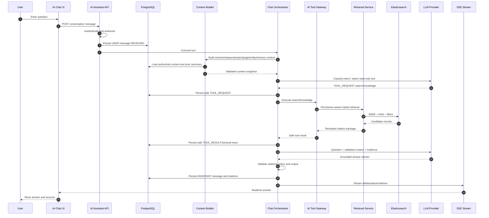

# PHASE 42 — TO-BE Contextual AI Chat, In-App Guide, Explain This Page, Help Replacement & Grounded Project Q&A

> Project: Scopery Backend  
> Phase: 42  
> Document type: TO-BE implementation-grade specification  
> Status: Planning / Low-risk contextual assistant and user guidance layer  
> Roadmap group: Advanced AI Assistant & Knowledge Intelligence  
> Depends on: Phase 00–41, with hard runtime dependencies limited to Core Platform and explicitly declared adapters  
> API base: `/api`  
> Primary module: `modules/aichat`, `modules/assistant`, or `modules/copilot` depending on repository architecture  
> Important rule: Phase 42 answers, explains, guides and links users to the correct UI/action, but it does not mutate business data.

---

# 0. Purpose

Phase 42 delivers the first user-facing AI Copilot experience.

It implements the low-risk levels requested for Scopery:

```text
Level 1 — Guide: explain where and how to do something.
Level 2 — Contextual Answer: explain the current page, object, state or error.
```

It uses Phase 41 retrieval and Phase 07 AI execution to replace fragmented static guides with grounded, context-aware help.

Phase 42 answers:

```text
What does this page or field do?
Why is this button disabled?
Why is this task blocked?
Where is the latest approved document or decision?
How do I create WBS/tasks from requirements?
What can I do next with my current permissions?
```

---

# 1. Product intention and core principle

```text
The assistant may explain and guide.
It may not silently change data.
Project facts must be grounded in accessible sources.
UI context is a hint, not permission.
Conversation memory is scoped, minimized and revalidated.
```

Standalone and modular behavior remains mandatory:

```text
Each capability works with Core Platform and available adapters.
Missing optional modules reduce available sources/tools/packs gracefully.
No optional integration becomes a hidden hard runtime dependency.
```

---

# 2. Source inputs

Before coding Phase 42, the agent must read:

```text
1. Phase 00–41 docs/completion
2. Phase 02 IAM
3. Phase 07 AI Agent Platform
4. Phase 08/27 Knowledge/Document
5. Phase 09–10 Project/Authorization
6. Phase 21 AI Planning
7. Phase 32 Search/Navigation/QuickAction metadata
8. Phase 33 Custom Fields
9. Phase 34 Governance
10. Phase 38 privacy/retention
11. Phase 41 retrieval
12. Frontend route/page/action metadata and current error catalogs
13. Current code, migrations and tests
```

The agent must inspect actual code, migrations, seeders and tests. Documentation alone is not proof of implementation.

---

# 3. Current expected gaps

Likely missing or partial:

```text
AiConversation
AiMessage
AiMessageCitation
AiContextSnapshot
AiConversationMemorySummary
AiSuggestedQuestion
AiGuideDefinition
AiAnswerFeedback
streaming state
conversation retention/context budget policies
```

Every item must be classified as:

```text
CURRENTLY_IMPLEMENTED
PARTIALLY_IMPLEMENTED
MUST_IMPLEMENT_IN_PHASE_42
MUST_HARDEN_IN_PHASE_42
SEED_ONLY_IN_PHASE_42
DEFERRED_TO_PHASE_XX
NOT_IN_SCOPE_FOR_PHASE_42
```

---

# 4. Target statement

Phase 42 must deliver:

```text
1. Persist workspace/project scoped conversations and messages
2. Capture validated page/entity/permission context
3. Provide contextual chat and grounded Q&A
4. Attach citations and in-app routes
5. Implement Explain Page/Field/Disabled Action
6. Provide suggested questions/help prompts
7. Manage history/title/archive/delete/retention
8. Implement safe memory summarization
9. Handle insufficient evidence/access restrictions honestly
10. Enforce quota/context/token limits
11. Add feedback, IAM, events, privacy, audit and tests
```

---

# 5. Boundary decisions

## Allowed

```text
read-only Q&A
page/field/process explanation
navigation guidance
status and disabled-action explanation
summaries/comparisons of accessible records
in-app routes when registered
```
## Not allowed

```text
create/update/delete entity
send message/notification
change status/date/assignee
apply suggestion
approve/finalize/lock
claim an action occurred
```

General prohibitions:

```text
No cross-tenant access.
No permission bypass.
No raw secret exposure.
No hidden chain-of-thought storage/exposure.
No capability may claim a side effect or quality level not implemented and tested.
```

---

# 6. Required entities and value objects

## AiConversation

```text
workspaceId/projectId/owner
type/capabilityLevel/assistantAgent
status/title/lastMessageAt
retention policy/version
```
## AiMessage

```text
conversation/role/content/status
model/deployment/prompt refs
tokens/latency/error
no hidden chain-of-thought
```
## AiContextSnapshot

```text
actor/workspace/project
route/page/entity/tab
visible fields/available action codes
permission signature/locale/timezone/context hash
```
## AiMessageCitation

```text
message ordinal
source type/ref/version/chunk
title/heading/fragment/app route
```
## AiConversationMemorySummary

```text
versioned user-visible summary
permission-aware invalidation
no hidden reasoning
```
## AiSuggestedQuestion/AiGuideDefinition

```text
page/action/locale scoped prompts
official metadata-backed guidance
```
## AiAnswerFeedback

```text
rating/reason/comment
incorrect/outdated/citation/permission/helpfulness issue
```

All mutable important entities should follow repository conventions for UUIDs, audit columns, optimistic versioning and Flyway migrations.

---


# 6A. Locked technology decisions for Phase 41–45

The following technology decisions are now explicit and must be treated as the default implementation baseline unless a later Architecture Decision Record replaces them:

```text
Backend runtime:
- Java 21.
- Spring Boot 3.x.
- Spring Web MVC for normal REST endpoints.
- Spring SSE support for Phase 42 chat streaming.
- Spring WebSocket support for Phase 44 long-running agent execution updates.

Primary transactional database:
- PostgreSQL.
- Spring Data JPA/Hibernate.
- Flyway migrations.

Search and retrieval:
- Elasticsearch 8.x.
- BM25 lexical retrieval.
- dense_vector + KNN semantic retrieval.
- Reciprocal Rank Fusion or equivalent deterministic hybrid merge.
- Optional reranker through a provider adapter.

Object/file storage:
- Local development and integration testing: MinIO.
- Staging/production: Cloudflare R2.
- Protocol: S3-compatible API.
- Java client: AWS SDK for Java v2 S3 client/presigner, behind ObjectStorageProvider.

Caching, rate limiting and distributed realtime coordination:
- Redis.
- Redis Pub/Sub or Redis Streams may coordinate multi-instance execution/status delivery.
- PostgreSQL remains the durable source of truth; Redis is never the sole durable record.

Reliability and observability:
- Resilience4j for timeout/retry/circuit-breaker/bulkhead policies.
- Micrometer metrics.
- OpenTelemetry traces.
- Prometheus-compatible metrics collection.
- Grafana-compatible dashboards.
- Structured JSON logs with correlation/trace IDs.

AI provider integration:
- LlmProvider abstraction.
- EmbeddingProvider abstraction.
- RerankerProvider abstraction.
- Provider/model/deployment selected by versioned profile; domain/application code must not depend directly on one vendor SDK.
```

Provider-specific SDKs may exist only inside infrastructure adapters. Domain and application layers depend on ports/interfaces.

---

# 6B. Locked object storage architecture

The final storage decision is:

```text
Local development: MinIO.
Production storage: Cloudflare R2.
Communication protocol: S3-compatible API.
```

These three concepts have different responsibilities:

```text
MinIO
= object storage server run locally, normally through Docker Compose.

Cloudflare R2
= managed production object storage containing real user/project file bytes.

S3-compatible API
= the common API contract used by Scopery Backend to communicate with both systems.
```

The system must use the same application port and mostly the same infrastructure implementation in both environments:

```java
public interface ObjectStorageProvider {
    StoredObject upload(StorageUploadRequest request);
    PresignedUpload createPresignedUpload(PresignedUploadRequest request);
    PresignedDownload createPresignedDownload(PresignedDownloadRequest request);
    StorageObjectMetadata head(String objectKey);
    InputStream download(String objectKey);
    void delete(String objectKey);
}
```

Default adapter direction:

```text
ObjectStorageProvider
    ↓
S3CompatibleObjectStorageProvider
    ↓ configuration only
    ├── MinIO local endpoint
    └── Cloudflare R2 production endpoint
```

Direct dependencies from domain/application services to Cloudflare, MinIO or AWS-specific classes are forbidden.

## Storage responsibility split

```text
Cloudflare R2 / MinIO:
- raw file bytes;
- original uploads;
- generated exports;
- optional derived artifacts such as preview images or extracted text blobs when explicitly modeled.

PostgreSQL:
- FileAsset/FileVersion metadata;
- ownership and workspace/project relationships;
- object key;
- content type;
- size;
- checksum;
- upload status;
- retention state;
- security classification;
- audit references.

Elasticsearch:
- extracted searchable text;
- chunks;
- embeddings;
- searchable metadata projection;
- citation/source references.
```

R2 and MinIO are not business databases. Elasticsearch is not the source of truth for file ownership or permissions.

## Required object-key convention

Object keys must be opaque, normalized and tenant-scoped. A recommended pattern is:

```text
workspaces/{workspaceId}/projects/{projectId}/documents/{documentId}/versions/{versionId}/source/{generatedObjectName}
workspaces/{workspaceId}/projects/{projectId}/meetings/{meetingId}/attachments/{attachmentId}/{generatedObjectName}
workspaces/{workspaceId}/exports/{exportJobId}/{generatedObjectName}
```

Rules:

```text
- Never use an untrusted original filename as the complete object key.
- Preserve the original filename in PostgreSQL metadata.
- Include immutable IDs in object keys.
- Prevent path traversal and control characters.
- Default bucket visibility is private.
- Public permanent URLs are forbidden for private project files.
```

## Presigned upload/download

Large file bytes should normally flow directly between frontend and object storage through short-lived presigned URLs:

```text
Frontend → Backend: create upload session.
Backend: validate permission/type/size and create PENDING_UPLOAD metadata.
Backend → storage: create presigned upload URL.
Frontend → MinIO/R2: upload bytes directly.
Frontend → Backend: complete upload.
Backend → storage: HeadObject verification.
Backend: mark AVAILABLE and publish FileUploaded/FileVersionCreated.
```

Download/preview flow:

```text
Frontend → Backend: request file preview/download.
Backend: authorize the current user against the current resource state.
Backend → storage: create short-lived presigned download URL.
Frontend → MinIO/R2: download bytes directly.
```

Presigned URLs must be short-lived, scoped to one object/operation and must not replace application authorization.

## Environment configuration

```yaml
# application-local.yml
storage:
  provider: s3-compatible
  endpoint: http://localhost:9000
  region: us-east-1
  bucket: scopery-local
  access-key: ${MINIO_ACCESS_KEY}
  secret-key: ${MINIO_SECRET_KEY}
  path-style-access: true
```

```yaml
# application-production.yml
storage:
  provider: s3-compatible
  endpoint: https://${R2_ACCOUNT_ID}.r2.cloudflarestorage.com
  region: auto
  bucket: ${R2_BUCKET_NAME}
  access-key: ${R2_ACCESS_KEY_ID}
  secret-key: ${R2_SECRET_ACCESS_KEY}
  path-style-access: true
```

Secrets must come from environment/secret management and must never be committed to source control.

## Storage test levels

```text
Unit tests:
- mock ObjectStorageProvider.

Integration tests:
- real MinIO container.

Staging smoke tests:
- dedicated private Cloudflare R2 staging bucket.
```

R2 smoke tests must cover CORS, presigned upload/download, Unicode filenames, multipart upload, metadata headers, Content-Disposition, cancellation, timeout, delete and private-bucket access.

---

# 6C. Conversation, message and tool-call persistence

Phase 42 must persist user-visible conversation history and the minimum operational trace needed to reproduce and govern a response.

Required message roles:

```text
SYSTEM
USER
ASSISTANT
TOOL_REQUEST
TOOL_RESULT
```

Required message statuses:

```text
RECEIVED
QUEUED
RETRIEVING
GENERATING
STREAMING
COMPLETED
FAILED
CANCELLED
BLOCKED
```

`AiMessage` must support or link to:

```text
conversationId
parentMessageId/turnId
role
status
user-visible content
model provider/model/deployment/profile refs
input/output token count
latency
finish reason
error code and redacted failure summary
created/started/completed/cancelled timestamps
correlation/trace ID
```

`TOOL_REQUEST` and `TOOL_RESULT` records must store a safe, schema-validated representation:

```text
- tool code/version;
- request hash;
- masked input summary;
- server-resolved workspace/project scope;
- result source IDs/versions/chunk IDs;
- result count and truncation flag;
- latency/status/error code;
- no secrets;
- no raw hidden chain-of-thought.
```

Large retrieval payloads may be stored as bounded snapshots or referenced by durable retrieval trace IDs. Conversation history must not become an unlimited duplicate document store.

Conversation memory rules:

```text
- Store a user-visible, versioned summary only.
- Never store or expose private chain-of-thought.
- Memory is not project truth.
- Memory must be invalidated/rebuilt after permission, retention or major source-version changes.
- Every new turn revalidates access independently of old conversation content.
```

---

# 6D. End-to-end AI chat call flow



Read-only chat must never call Phase 44 mutation tools.

---

# 6E. Chat streaming protocol: SSE

Phase 42 must use Server-Sent Events as the default response-streaming protocol because the main flow is server-to-client token/status delivery.

Required API direction:

```text
POST /api/ai-assistant/conversations/{conversationId}/messages
→ persists the user message and creates an assistant message/turn
→ returns messageId, turnId and stream endpoint

GET /api/ai-assistant/messages/{messageId}/stream
Accept: text/event-stream
→ streams the assistant turn

POST /api/ai-assistant/messages/{messageId}/cancel
→ requests cancellation
```

Required SSE event types:

```text
message.started
context.completed
retrieval.started
retrieval.completed
answer.delta
citation.added
answer.completed
answer.cancelled
answer.failed
heartbeat
```

Example:

```text
event: answer.delta
id: 17
data: {"messageId":"...","sequence":17,"text":"The task is blocked"}
```

Streaming rules:

```text
- Sequence numbers are monotonic per assistant message.
- SSE is a delivery channel, not the durable source of truth.
- Final answer/status/citations are persisted in PostgreSQL.
- Reconnect uses Last-Event-ID or a resume cursor where supported.
- Client can recover final state from GET message/conversation APIs.
- Heartbeats prevent idle proxy termination.
- Duplicate deltas after reconnect must be deduplicated by sequence.
- Cancellation is best-effort and final durable status must be CANCELLED or COMPLETED/FAILED.
- Provider/network failure persists FAILED state and a redacted error code.
```

WebSocket is not mandatory for Phase 42. It is introduced in Phase 44 for long-running bidirectional agent execution status.

---

---

# 7. Architecture and processing flow

```text
Resolve authenticated actor
→ validate workspace/project/entity
→ validate page/action metadata
→ select retrieval policy
→ retrieve accessible evidence
→ fit context budget
→ execute approved assistant prompt
→ validate answer/citations
→ persist user-visible answer and metadata
```

Response modes:

```text
GENERAL_GUIDE
GROUNDED_ANSWER
CURRENT_PAGE_EXPLANATION
FIELD_EXPLANATION
DISABLED_ACTION_EXPLANATION
TRACEABILITY_ANSWER
COMPARISON_SUMMARY
INSUFFICIENT_EVIDENCE
ACCESS_RESTRICTED
OUT_OF_SCOPE
```

General guide may use registered product metadata. Project factual answers require citations.

---

# 8. API contract

Required API examples:

```text
POST /api/ai-assistant/conversations
GET /api/ai-assistant/conversations
GET /api/ai-assistant/conversations/{conversationId}
PATCH /api/ai-assistant/conversations/{conversationId}
POST /api/ai-assistant/conversations/{conversationId}/messages
GET /api/ai-assistant/conversations/{conversationId}/messages
POST /api/ai-assistant/conversations/{conversationId}/archive
DELETE /api/ai-assistant/conversations/{conversationId}
POST /api/ai-assistant/explain-page
POST /api/ai-assistant/explain-field
POST /api/ai-assistant/explain-disabled-action
GET /api/ai-assistant/suggested-questions
POST /api/ai-assistant/messages/{messageId}/feedback
GET /api/ai-assistant/messages/{messageId}/stream
POST /api/ai-assistant/messages/{messageId}/cancel
GET /api/ai-assistant/messages/{messageId}
```

Controllers must map Request → Command/QueryService and return DTOs, never JPA/domain aggregates.

---

# 9. IAM and authorization

Required permissions:

```text
AI_ASSISTANT_USE
AI_ASSISTANT_PROJECT_USE
AI_ASSISTANT_CONVERSATION_VIEW
AI_ASSISTANT_CONVERSATION_MANAGE
AI_ASSISTANT_GUIDE_USE
AI_ASSISTANT_TRACEABILITY_USE
AI_ASSISTANT_FEEDBACK_CREATE
AI_ASSISTANT_ADMIN_VIEW
AI_ASSISTANT_PROMPT_MANAGE
```

Rules:

```text
AI/search capability permission never grants access to underlying source objects.
Resource authorization and field masking remain mandatory.
Administrative/debug/governance permissions are sensitive and audited.
External portal scope must be explicit; internal access is never inferred.
```

---

# 10. Event Registry integration

Recommended source system:

```text
SCOPERY_AI_PHASE_42
```

Required events:

```text
AI_CONVERSATION_CREATED
AI_CONVERSATION_ARCHIVED
AI_CONVERSATION_DELETED
AI_MESSAGE_REQUESTED
AI_MESSAGE_COMPLETED
AI_MESSAGE_FAILED
AI_MESSAGE_BLOCKED
AI_ANSWER_CITATIONS_ATTACHED
AI_ANSWER_FEEDBACK_SUBMITTED
AI_CONTEXT_ACCESS_REVALIDATED
AI_CONTEXT_REDACTED
AI_GUIDE_RESPONSE_GENERATED
```

Event payloads must not include raw prompt/document content, vectors, secrets, tokens, unmasked sensitive fields or hidden reasoning.

---

# 11. Audit, outbox, idempotency, privacy and observability

```text
Audit all policy/configuration changes and sensitive administrative views.
Use outbox for cross-module/asynchronous effects.
Use stable idempotency keys for repeatable jobs/executions.
Redact errors and telemetry.
Apply Phase 38 retention, legal hold and sensitive-field policy.
Correlate operations with traceId and source/execution identifiers.
```

---

# 12. Business rules master

```text
CHAT-001 Conversation belongs to one workspace.
CHAT-002 Project conversation cannot mix hidden projects.
CHAT-003 Every message revalidates effective access.
CHAT-004 Client-provided page context never grants access.
CHAT-005 Hidden reasoning is never stored/exposed.
ANS-001 Project factual answer requires citation.
ANS-002 General guide knowledge is distinguishable from project evidence.
ANS-003 Assistant never claims mutation in Phase 42.
ANS-004 Missing evidence produces uncertainty, not invention.
MEM-001 Memory summary contains only user-visible content.
MEM-002 Permission changes can invalidate/redact memory.
GUIDE-001 UI instructions use registered page/action metadata.
PRV-001 Conversation follows retention and sensitive-access policy.
```

---

# 13. Error catalog

```text
AI_CONVERSATION_NOT_FOUND
AI_CONVERSATION_ACCESS_DENIED
AI_CONVERSATION_INVALID_STATUS
AI_CONVERSATION_PROJECT_SCOPE_MISMATCH
AI_MESSAGE_NOT_FOUND
AI_MESSAGE_EXECUTION_FAILED
AI_MESSAGE_BLOCKED_BY_POLICY
AI_MESSAGE_CONTEXT_TOO_LARGE
AI_CONTEXT_ENTITY_NOT_FOUND
AI_CONTEXT_ACCESS_DENIED
AI_CONTEXT_PAGE_UNKNOWN
AI_CONTEXT_PERMISSION_CHANGED
AI_RETRIEVAL_INSUFFICIENT_EVIDENCE
AI_CITATION_INVALID
AI_CITATION_ACCESS_DENIED
AI_GUIDE_DEFINITION_NOT_FOUND
AI_ASSISTANT_QUOTA_EXCEEDED
AI_ASSISTANT_MODEL_UNAVAILABLE
```

Use module-specific error catalogs. Do not throw generic business exceptions or leak provider/internal stack details.

---

# 14. Required tests

```text
createProjectConversation_requiresProjectAccess
conversationCannotSwitchProjectSilently
messageRevalidatesProjectAccess
pageContextDoesNotGrantEntityAccess
permissionRemoved_oldConversationCannotRetrieveSource
restrictedFinanceSource_notIncluded
groundedAnswer_containsCitation
citationPointsToAccessibleSource
missingEvidence_returnsInsufficientEvidence
assistantDoesNotClaimMutation
explainDisabledAction_usesActualReasonCode
productGuideAnswer_usesRegisteredPageMetadata
memorySummary_containsNoHiddenReasoning
permissionChange_invalidatesUnsafeSummary
quotaExceeded_blocksProviderCall
streamFailure_persistsFailedMessage
toolRequestAndResult_persistSafeTrace
toolTrace_neverStoresSecretOrChainOfThought
sseSequence_monotonic
sseReconnect_deduplicatesBySequence
sseCancel_persistsFinalState
sseDisconnect_clientCanRecoverFromRest
```

Mandatory build gates:

```bash
mvn compile
mvn test
```

---

# 15. Manual verification checklist

```text
1. Open a project page and ask what the page does.
2. Ask why a blocked task cannot start and verify cited dependency.
3. Ask for restricted finance data and confirm no leakage.
4. Open a citation to the latest approved document.
5. Remove permission and retry an old conversation.
6. Use Explain Field and Why Disabled.
7. Ask about an unknown page and verify honest fallback.
8. Archive/delete a conversation and verify audit/retention.
9. Confirm no business record changes during chat.
```

---

# 16. Acceptance criteria

Phase 42 is accepted only if:

```text
1. Conversation/message/context/citation entities implemented/tested
2. Page/entity/project context validated
3. Grounded Q&A uses Phase 41
4. Project facts include citations
5. Explain Page/Field/Disabled Action implemented
6. Every message revalidates permissions
7. Memory/retention/privacy implemented
8. Assistant never mutates or falsely claims mutation
9. IAM/events/audit/quota implemented
10. `mvn compile` and `mvn test` pass
11. Completion file exists
12. USER/ASSISTANT/TOOL_REQUEST/TOOL_RESULT persistence is implemented and bounded
13. SSE streaming, reconnect, sequence, cancellation and durable final-state recovery are implemented/tested
14. WebSocket is not required or falsely claimed for Phase 42
```

Do not mark complete when tests fail, access can leak, or a deferred capability is merely claimed.

---

# 17. Required phase completion file

Agent must create:

```text
docs/phase-complete/PHASE_42_CONTEXTUAL_AI_CHAT_GUIDANCE_TO_BE_COMPLETE.md
```

Required sections:

```text
# Phase 42 — Complete

## 1. Summary
## 2. Inputs Reviewed
## 3. Current vs TO-BE
## 4. Implemented/Hardened
## 5. Deferred Items
## 6. Read-only Boundary
## 7. Entity Mapping
## 8. API Changes
## 9. Conversation Strategy
## 10. Page/Entity Context
## 11. Retrieval/Citations
## 12. Guide Metadata
## 13. Disabled Action Explanation
## 14. Memory/Retention
## 15. Prompt Profiles
## 16. Permissions/Masking
## 17. Quota/Cost
## 18. Events/Audit
## 19. Tests/Results
## 20. Manual Verification
## 21. Assumptions/Deviations/Risks
## 22. Message/Tool Transcript Persistence
## 23. SSE Streaming Contract and Recovery
## 24. End-to-End AI Call Flow
## 25. Technology Stack and Provider Adapters

```

---

# 18. Prompt to give coding agent

```text
You are implementing Phase 42 — TO-BE Contextual AI Chat, In-App Guide, Explain This Page, Help Replacement & Grounded Project Q&A.

This is not an as-is documentation task.

Before coding:
- Read CLAUDE.md / CLAUDE.ms.
- Read Coding_convention.md.
- Read Phase 00–41 docs and completion files.
- Inspect current backend code, migrations, seeders and tests.

Your task:
1. Classify current chat/help capability.
2. Implement conversation/message/context/citation/memory/feedback.
3. Implement read-only contextual chat using Phase 41.
4. Implement Explain Page/Field/Disabled Action.
5. Require citations for project facts.
6. Revalidate IAM/source access on every message.
7. Persist bounded USER/ASSISTANT/TOOL_REQUEST/TOOL_RESULT traces without hidden chain-of-thought.
8. Implement SSE streaming with sequence, heartbeat, reconnect/resume, cancellation and durable final-state recovery.
9. Implement retention/quota/audit/privacy.
10. Seed assistants/prompts/suggested questions.
11. Add events/permissions/tests and run compile/test.

Do not implement or claim capabilities outside the explicit Phase 42 boundary.
```

---

# 19. Quick tracking matrix

| Capability | Current backend | Phase action | Later |
|---|---|---|---|
| AI provider/agent | Phase 07 | Reuse | Phase 45 governs |
| Hybrid retrieval | Phase 41 | Reuse | — |
| Conversation/context | Missing | Must implement | — |
| Product guide | Static/unknown | AI guide metadata | — |
| Project Q&A/citations | Missing | Must implement | — |
| Memory/feedback | Missing | Must implement | — |
| General suggestions | Partial Phase 21 | Defer | Phase 43 |
| Action execution | Missing | Defer | Phase 44 |
| Evaluation dashboard | Missing | Defer | Phase 45 |

| Tool request/result transcript | Missing | Must implement safely | Phase 45 governs |
| SSE chat streaming | Missing/partial | Must implement | Phase 45 hardens |
| WebSocket chat | Not required | Explicitly defer | Phase 44 action execution |

---

# 20. Agent anti-bịa rules

```text
1. Do not claim implementation without code and tests.
2. Do not bypass IAM, resource authorization, masking, governance or baseline rules.
3. Do not treat Elasticsearch, LLM output, suggestion or conversation memory as source of truth.
4. Do not store/expose hidden reasoning.
5. Do not hide partial failure, insufficient evidence, stale state, provider outage or deferred gaps.
6. Do not activate adapters/tools/providers that do not exist and pass tests.
7. Do not claim external side effects without real provider delivery result.
```

---

# 21. Final principle

Phase 42 is complete when:

```text
validated page/entity context
+ permission-aware retrieval
+ grounded response
+ citations
+ honest uncertainty
+ read-only boundary
= trustworthy contextual assistant
```
