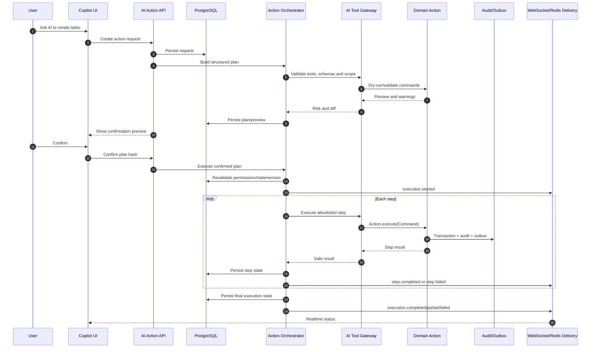

# PHASE 44 — TO-BE AI Tool Gateway, Action Planning, Safe Execution, Acting-on-behalf & Agentic Operations

> Project: Scopery Backend  
> Phase: 44  
> Document type: TO-BE implementation-grade specification  
> Status: Planning / Controlled AI action execution and agentic operations layer  
> Roadmap group: Advanced AI Assistant & Knowledge Intelligence  
> Depends on: Phase 00–43, with hard runtime dependencies limited to Core Platform and explicitly declared adapters  
> API base: `/api`  
> Primary module: `modules/aitool`, `modules/aiaction`, `modules/copilot/action`, or `modules/agentic` depending on repository architecture  
> Important rule: Phase 44 executes only allowlisted domain commands. AI cannot call repositories/database directly, bypass IAM, or perform forbidden destructive/sensitive actions.

---

# 0. Purpose

Phase 44 implements:

```text
Level 4 — Prepare Action: build a validated plan and diff.
Level 5 — Execute Allowed Action: execute approved actions through registered domain commands.
```

It generalizes Phase 21 safe apply and consumes accepted Phase 43 suggestions or direct chat intent.

Phase 44 answers:

```text
Which allowlisted domain tools are needed?
What objects/versions will change?
What risk/permission/baseline impact exists?
Does the user need to confirm?
How are steps executed idempotently?
How are partial failure and compensation reported?
```

---

# 1. Product intention and core principle

```text
AI never writes database directly.
Every tool maps to a real Application Action/Command.
Human authorization and agent/tool authorization are both required.
State/version is revalidated immediately before execution.
High-risk actions require confirmation.
Forbidden actions remain forbidden.
Every execution is auditable and idempotent.
```

Standalone and modular behavior remains mandatory:

```text
Each capability works with Core Platform and available adapters.
Missing optional modules reduce available sources/tools/packs gracefully.
No optional integration becomes a hidden hard runtime dependency.
```

---

# 2. Source inputs

Before coding Phase 44, the agent must read:

```text
1. Phase 00–43 docs/completion
2. Phase 02 IAM and acting-on-behalf
3. Phase 04 audit/outbox/idempotency
4. Phase 07 AI tool concepts
5. Phase 09–40 domain actions
6. Phase 19 baseline/change guards
7. Phase 21 safe apply
8. Phase 32 commands/quick actions
9. Phase 34 governance/locking
10. Phase 38 sensitive controls
11. Phase 39 providers/connectors
12. Phase 41–43 retrieval/chat/suggestions
13. Current transaction/error/versioning code and tests
```

The agent must inspect actual code, migrations, seeders and tests. Documentation alone is not proof of implementation.

---

# 3. Current expected gaps

Likely missing or partial:

```text
AiToolDefinition/AiToolVersion/schema
AiToolAuthorizationPolicy/AiToolRiskPolicy
AiActionRequest/AiActionPlan/AiActionStep
AiActionPreview/AiActionConfirmation
AiActionExecution/AiActionStepExecution
AiActionCompensation
policy decision and acting-on-behalf trace
batch limits and gateway adapters
```

Every item must be classified as:

```text
CURRENTLY_IMPLEMENTED
PARTIALLY_IMPLEMENTED
MUST_IMPLEMENT_IN_PHASE_44
MUST_HARDEN_IN_PHASE_44
SEED_ONLY_IN_PHASE_44
DEFERRED_TO_PHASE_XX
NOT_IN_SCOPE_FOR_PHASE_44
```

---

# 4. Target statement

Phase 44 must deliver:

```text
1. Versioned allowlisted tool catalog
2. Tool schemas and domain action mapping
3. Risk classes and execution modes
4. Natural-language intent to structured plan
5. Dry-run/preview and masked diff
6. Permission/state/version/baseline/policy validation
7. Confirmation lifecycle bound to plan hash
8. Step-by-step domain action execution
9. Idempotency/retries/partial handling
10. Explicit compensation when supported
11. Acting-on-behalf traceability
12. Safe batch limits
13. Phase 21/43 apply integration
14. Action history/summary
15. IAM/events/audit/metrics/tests
```

---

# 5. Boundary decisions

## Allowed architecture

```text
AI Orchestrator → AiToolGateway → allowlisted adapter → Action.execute(Command)
registered query/read tools
provider-backed external tools only when real and configured
```
## Forbidden architecture

```text
LLM→repository/JPA/raw SQL
arbitrary shell/code execution
arbitrary HTTP URL
unrestricted connector credentials
direct Elasticsearch business mutation
AI permission grants
```

General prohibitions:

```text
No cross-tenant access.
No permission bypass.
No raw secret exposure.
No hidden chain-of-thought storage/exposure.
No capability may claim a side effect or quality level not implemented and tested.
```

---

# 6. Required entities and value objects

## AiToolDefinition/AiToolVersion

```text
code/module/adapter
input/output schema
permissions/scopes/risk/mode
dry-run/compensation/batch/status/version
```
## AiToolAuthorizationPolicy

```text
workspace/project/user/agent/tool
risk/batch/time/sensitive/external dimensions
ALLOW_AUTO/ALLOW_CONFIRM/PREVIEW_ONLY/DENY
```
## AiActionRequest

```text
conversation/message/suggestion refs
actor/workspace/project/intent/scope
client context/status
```
## AiActionPlan

```text
plan version/hash/status
summary/risk/mode
context/expiry/confirmation
baseline/external side effect
```
## AiActionStep

```text
sequence/tool/version
schema-bound input/target/expected version
dependencies/permission/risk/mode/compensation
```
## AiActionPreview

```text
masked before/after
reason/warnings
baseline/finance/resource/client impact
```
## AiActionConfirmation

```text
plan/version/hash
user/decision/time/expiry/channel
```
## AiActionExecution/StepExecution

```text
actor/agent/acting-on-behalf
status/trace/idempotency
per-step attempts/results/redacted errors
```
## AiActionCompensation

```text
supported compensation only
best-effort status
never fake global rollback
```

All mutable important entities should follow repository conventions for UUIDs, audit columns, optimistic versioning and Flyway migrations.

---


# 6A. Locked technology decisions for Phase 41–45

The following technology decisions are now explicit and must be treated as the default implementation baseline unless a later Architecture Decision Record replaces them:

```text
Backend runtime:
- Java 21.
- Spring Boot 3.x.
- Spring Web MVC for normal REST endpoints.
- Spring SSE support for Phase 42 chat streaming.
- Spring WebSocket support for Phase 44 long-running agent execution updates.

Primary transactional database:
- PostgreSQL.
- Spring Data JPA/Hibernate.
- Flyway migrations.

Search and retrieval:
- Elasticsearch 8.x.
- BM25 lexical retrieval.
- dense_vector + KNN semantic retrieval.
- Reciprocal Rank Fusion or equivalent deterministic hybrid merge.
- Optional reranker through a provider adapter.

Object/file storage:
- Local development and integration testing: MinIO.
- Staging/production: Cloudflare R2.
- Protocol: S3-compatible API.
- Java client: AWS SDK for Java v2 S3 client/presigner, behind ObjectStorageProvider.

Caching, rate limiting and distributed realtime coordination:
- Redis.
- Redis Pub/Sub or Redis Streams may coordinate multi-instance execution/status delivery.
- PostgreSQL remains the durable source of truth; Redis is never the sole durable record.

Reliability and observability:
- Resilience4j for timeout/retry/circuit-breaker/bulkhead policies.
- Micrometer metrics.
- OpenTelemetry traces.
- Prometheus-compatible metrics collection.
- Grafana-compatible dashboards.
- Structured JSON logs with correlation/trace IDs.

AI provider integration:
- LlmProvider abstraction.
- EmbeddingProvider abstraction.
- RerankerProvider abstraction.
- Provider/model/deployment selected by versioned profile; domain/application code must not depend directly on one vendor SDK.
```

Provider-specific SDKs may exist only inside infrastructure adapters. Domain and application layers depend on ports/interfaces.

---

# 6B. Locked object storage architecture

The final storage decision is:

```text
Local development: MinIO.
Production storage: Cloudflare R2.
Communication protocol: S3-compatible API.
```

These three concepts have different responsibilities:

```text
MinIO
= object storage server run locally, normally through Docker Compose.

Cloudflare R2
= managed production object storage containing real user/project file bytes.

S3-compatible API
= the common API contract used by Scopery Backend to communicate with both systems.
```

The system must use the same application port and mostly the same infrastructure implementation in both environments:

```java
public interface ObjectStorageProvider {
    StoredObject upload(StorageUploadRequest request);
    PresignedUpload createPresignedUpload(PresignedUploadRequest request);
    PresignedDownload createPresignedDownload(PresignedDownloadRequest request);
    StorageObjectMetadata head(String objectKey);
    InputStream download(String objectKey);
    void delete(String objectKey);
}
```

Default adapter direction:

```text
ObjectStorageProvider
    ↓
S3CompatibleObjectStorageProvider
    ↓ configuration only
    ├── MinIO local endpoint
    └── Cloudflare R2 production endpoint
```

Direct dependencies from domain/application services to Cloudflare, MinIO or AWS-specific classes are forbidden.

## Storage responsibility split

```text
Cloudflare R2 / MinIO:
- raw file bytes;
- original uploads;
- generated exports;
- optional derived artifacts such as preview images or extracted text blobs when explicitly modeled.

PostgreSQL:
- FileAsset/FileVersion metadata;
- ownership and workspace/project relationships;
- object key;
- content type;
- size;
- checksum;
- upload status;
- retention state;
- security classification;
- audit references.

Elasticsearch:
- extracted searchable text;
- chunks;
- embeddings;
- searchable metadata projection;
- citation/source references.
```

R2 and MinIO are not business databases. Elasticsearch is not the source of truth for file ownership or permissions.

## Required object-key convention

Object keys must be opaque, normalized and tenant-scoped. A recommended pattern is:

```text
workspaces/{workspaceId}/projects/{projectId}/documents/{documentId}/versions/{versionId}/source/{generatedObjectName}
workspaces/{workspaceId}/projects/{projectId}/meetings/{meetingId}/attachments/{attachmentId}/{generatedObjectName}
workspaces/{workspaceId}/exports/{exportJobId}/{generatedObjectName}
```

Rules:

```text
- Never use an untrusted original filename as the complete object key.
- Preserve the original filename in PostgreSQL metadata.
- Include immutable IDs in object keys.
- Prevent path traversal and control characters.
- Default bucket visibility is private.
- Public permanent URLs are forbidden for private project files.
```

## Presigned upload/download

Large file bytes should normally flow directly between frontend and object storage through short-lived presigned URLs:

```text
Frontend → Backend: create upload session.
Backend: validate permission/type/size and create PENDING_UPLOAD metadata.
Backend → storage: create presigned upload URL.
Frontend → MinIO/R2: upload bytes directly.
Frontend → Backend: complete upload.
Backend → storage: HeadObject verification.
Backend: mark AVAILABLE and publish FileUploaded/FileVersionCreated.
```

Download/preview flow:

```text
Frontend → Backend: request file preview/download.
Backend: authorize the current user against the current resource state.
Backend → storage: create short-lived presigned download URL.
Frontend → MinIO/R2: download bytes directly.
```

Presigned URLs must be short-lived, scoped to one object/operation and must not replace application authorization.

## Environment configuration

```yaml
# application-local.yml
storage:
  provider: s3-compatible
  endpoint: http://localhost:9000
  region: us-east-1
  bucket: scopery-local
  access-key: ${MINIO_ACCESS_KEY}
  secret-key: ${MINIO_SECRET_KEY}
  path-style-access: true
```

```yaml
# application-production.yml
storage:
  provider: s3-compatible
  endpoint: https://${R2_ACCOUNT_ID}.r2.cloudflarestorage.com
  region: auto
  bucket: ${R2_BUCKET_NAME}
  access-key: ${R2_ACCESS_KEY_ID}
  secret-key: ${R2_SECRET_ACCESS_KEY}
  path-style-access: true
```

Secrets must come from environment/secret management and must never be committed to source control.

## Storage test levels

```text
Unit tests:
- mock ObjectStorageProvider.

Integration tests:
- real MinIO container.

Staging smoke tests:
- dedicated private Cloudflare R2 staging bucket.
```

R2 smoke tests must cover CORS, presigned upload/download, Unicode filenames, multipart upload, metadata headers, Content-Disposition, cancellation, timeout, delete and private-bucket access.

---

# 6C. Tool gateway and action-call contract

The LLM does not execute an application action directly. It may emit a structured proposed tool call that is validated and converted into an `AiActionPlan`.

```text
LLM proposed tool call
→ schema validation
→ tool/version lookup
→ server-side scope resolution
→ actor permission check
→ agent/tool policy check
→ domain dry-run validation
→ risk classification
→ preview/diff
→ confirmation when required
→ final revalidation
→ Action.execute(Command)
```

Tool request fields supplied by a model are untrusted. Workspace/project/user identity, expected resource visibility and effective permissions are resolved by backend context.

Each active tool must declare:

```text
toolCode
toolVersion
input/output JSON schema
mapped Application Action/Command
required actor permissions
required agent/tool permissions
allowed scopes
risk class
execution mode
batch limit
dry-run support
idempotency strategy
compensation capability
external side-effect flag
```

No tool may expose repository, EntityManager, raw SQL, shell, arbitrary code execution or unrestricted HTTP access.

---

# 6D. Durable action execution and realtime status

REST APIs and PostgreSQL remain the source of truth for action plans and execution state. Phase 44 adds WebSocket for long-running, bidirectional execution updates.

Recommended channel:

```text
WebSocket endpoint: /api/ws/ai-actions
Subscription topic: /user/queue/ai-actions/{executionId}
Client commands: subscribe, pause, resume, cancel where policy permits
```

Required realtime event types:

```text
execution.started
step.started
step.progress
step.completed
step.failed
execution.waiting_for_confirmation
execution.paused
execution.resumed
execution.cancelled
execution.partially_completed
execution.completed
execution.failed
compensation.started
compensation.completed
heartbeat
```

Rules:

```text
- WebSocket messages are delivery notifications, not authoritative storage.
- Every state transition is persisted before or atomically with publication.
- Reconnecting clients query REST for the current execution and step states.
- Event payloads contain sequence numbers and execution version.
- Cancellation/pause is accepted only when the current step/tool supports it.
- A dropped connection must not roll back or duplicate the action.
- Multi-instance delivery may use Redis Pub/Sub or Redis Streams.
- Redis is not the only durable execution record.
- SSE may be offered as read-only fallback for environments where WebSocket is unavailable.
```

## Chat integration

When an action originates from chat, persist links among:

```text
AiConversation
AiMessage USER
AiMessage TOOL_REQUEST or proposed action call
AiActionRequest
AiActionPlan
AiActionExecution
AiMessage ASSISTANT execution summary
```

Tool-result persistence must be redacted and bounded. Final user-visible result must state exactly which steps succeeded, failed, were skipped or compensated.

---

# 6E. Example high-level action flow



---

---

# 7. Architecture and processing flow

```text
User intent or accepted suggestion
→ resolve accessible context
→ choose allowlisted tools
→ build schema-valid steps
→ dry-run/domain validation
→ risk and authorization policy
→ preview/diff
→ confirmation when required
→ revalidate state/versions/permissions
→ execute Action.execute(Command)
→ audit/outbox/result/compensation
```

Execution modes and default direction:

```text
READ_ONLY
SUGGEST_ONLY
CONFIRM_BEFORE_EXECUTE
AUTO_EXECUTE
FORBIDDEN
```

Risk classes:

```text
LOW / MEDIUM / HIGH / CRITICAL
```

Low-risk drafts may be auto-executed by workspace policy. Bulk, external, baseline, finance, finalize/lock and sensitive actions require confirmation or are forbidden. Permission mutation and project/workspace deletion are forbidden for the general assistant.

---

# 8. API contract

Required API examples:

```text
GET /api/ai-actions/tools
GET /api/ai-actions/tools/{toolCode}
POST /api/ai-actions/requests
GET /api/ai-actions/requests/{requestId}
POST /api/ai-actions/requests/{requestId}/plan
GET /api/ai-actions/plans/{planId}
POST /api/ai-actions/plans/{planId}/validate
POST /api/ai-actions/plans/{planId}/preview
POST /api/ai-actions/plans/{planId}/confirm
POST /api/ai-actions/plans/{planId}/cancel
POST /api/ai-actions/plans/{planId}/execute
GET /api/ai-actions/executions/{executionId}
GET /api/ai-actions/executions/{executionId}/steps
POST /api/ai-actions/executions/{executionId}/compensate
GET /api/ai-actions/history
GET /api/ai-actions/executions/{executionId}/events
POST /api/ai-actions/executions/{executionId}/pause
POST /api/ai-actions/executions/{executionId}/resume
POST /api/ai-actions/executions/{executionId}/cancel
WebSocket /api/ws/ai-actions
```

Controllers must map Request → Command/QueryService and return DTOs, never JPA/domain aggregates.

---

# 9. IAM and authorization

Required permissions:

```text
AI_TOOL_VIEW
AI_TOOL_MANAGE
AI_ACTION_REQUEST
AI_ACTION_PLAN
AI_ACTION_PREVIEW
AI_ACTION_CONFIRM
AI_ACTION_EXECUTE
AI_ACTION_AUTO_EXECUTE
AI_ACTION_HISTORY_VIEW
AI_ACTION_COMPENSATE
AI_ACT_ON_BEHALF
AI_ACTION_POLICY_VIEW
AI_ACTION_POLICY_MANAGE
```

Rules:

```text
AI/search capability permission never grants access to underlying source objects.
Resource authorization and field masking remain mandatory.
Administrative/debug/governance permissions are sensitive and audited.
External portal scope must be explicit; internal access is never inferred.
```

---

# 10. Event Registry integration

Recommended source system:

```text
SCOPERY_AI_PHASE_44
```

Required events:

```text
AI_TOOL_CREATED
AI_TOOL_VERSION_ACTIVATED
AI_TOOL_DISABLED
AI_ACTION_REQUEST_CREATED
AI_ACTION_PLAN_CREATED
AI_ACTION_PLAN_VALIDATED
AI_ACTION_PLAN_INVALIDATED
AI_ACTION_PREVIEW_GENERATED
AI_ACTION_CONFIRMATION_REQUESTED
AI_ACTION_PLAN_CONFIRMED
AI_ACTION_PLAN_CANCELLED
AI_ACTION_EXECUTION_STARTED
AI_ACTION_STEP_SUCCEEDED
AI_ACTION_STEP_FAILED
AI_ACTION_EXECUTION_SUCCEEDED
AI_ACTION_EXECUTION_PARTIAL
AI_ACTION_EXECUTION_FAILED
AI_ACTION_COMPENSATION_STARTED
AI_ACTION_COMPENSATION_COMPLETED
AI_ACTION_POLICY_DENIED
```

Event payloads must not include raw prompt/document content, vectors, secrets, tokens, unmasked sensitive fields or hidden reasoning.

---

# 11. Audit, outbox, idempotency, privacy and observability

```text
Audit all policy/configuration changes and sensitive administrative views.
Use outbox for cross-module/asynchronous effects.
Use stable idempotency keys for repeatable jobs/executions.
Redact errors and telemetry.
Apply Phase 38 retention, legal hold and sensitive-field policy.
Correlate operations with traceId and source/execution identifiers.
```

---

# 12. Business rules master

```text
TOOL-001 Only active registered tool version is executable.
TOOL-002 Tool maps to allowlisted domain action.
TOOL-003 Input schema validates before execution.
AUTH-001 Human business permission and agent/tool permission are both required.
AUTH-002 AI cannot elevate/grant permission.
PLAN-001 Plan is versioned and hashed.
PLAN-002 Material state change invalidates confirmation.
PLAN-003 Preview precedes confirmation when required.
PLAN-004 Expected target version is checked.
EXEC-001 No direct repository/database write.
EXEC-002 Every step uses domain action/error catalog.
EXEC-003 Repeated execution is idempotent.
EXEC-004 Partial execution is reported honestly.
EXEC-005 Compensation only when supported.
RISK-001 Forbidden action cannot be overridden by user text.
RISK-002 High/critical does not auto-execute by default.
BASE-001 Baseline-controlled changes route to ChangeRequest.
EXT-001 External side effects require real provider, permission, confirmation and delivery tracking.
BULK-001 Batch limits are enforced.
```

---

# 13. Error catalog

```text
AI_TOOL_NOT_FOUND
AI_TOOL_INACTIVE
AI_TOOL_SCHEMA_INVALID
AI_TOOL_ADAPTER_NOT_FOUND
AI_TOOL_PERMISSION_DENIED
AI_TOOL_POLICY_DENIED
AI_ACTION_REQUEST_NOT_FOUND
AI_ACTION_PLAN_NOT_FOUND
AI_ACTION_PLAN_INVALID_STATUS
AI_ACTION_PLAN_VALIDATION_FAILED
AI_ACTION_PLAN_STALE
AI_ACTION_PLAN_EXPIRED
AI_ACTION_PREVIEW_REQUIRED
AI_ACTION_CONFIRMATION_REQUIRED
AI_ACTION_CONFIRMATION_INVALID
AI_ACTION_CONFIRMATION_EXPIRED
AI_ACTION_EXECUTION_ALREADY_COMPLETED
AI_ACTION_EXECUTION_FAILED
AI_ACTION_EXECUTION_PARTIAL
AI_ACTION_STEP_FAILED
AI_ACTION_IDEMPOTENCY_CONFLICT
AI_ACTION_TARGET_VERSION_CONFLICT
AI_ACTION_BASELINE_GUARD_BLOCKED
AI_ACTION_BATCH_LIMIT_EXCEEDED
AI_ACTION_EXTERNAL_PROVIDER_UNAVAILABLE
AI_ACTION_COMPENSATION_UNSUPPORTED
AI_ACTION_FORBIDDEN
```

Use module-specific error catalogs. Do not throw generic business exceptions or leak provider/internal stack details.

---

# 14. Required tests

```text
inactiveTool_notExecutable
unknownAdapter_blocked
toolSchemaVersionImmutable
missingDomainCapability_toolNotActive
createActionPlan_fromAcceptedSuggestion
createActionPlan_fromChatIntent
invalidToolPayload_rejected
previewShowsMaskedBeforeAfter
highRiskPlan_requiresConfirmation
forbiddenPermissionChangePlan_denied
actorWithoutBusinessPermission_denied
agentWithoutToolPermission_denied
resourceAccessRevalidatedBeforeExecution
confirmedPlan_executesDomainAction
unconfirmedPlan_executionBlocked
repeatedExecution_doesNotDuplicateCreate
versionConflict_invalidatesPlan
multiStepPartialFailure_recordsPartial
supportedCompensation_executes
bulkLimit_enforced
externalEmail_requiresConfirmedProviderTool
changeRequestGuard_preserved
webSocketDisconnect_executionContinuesAndRestRecoversState
webSocketEvents_haveMonotonicSequence
redisUnavailable_executionStateRemainsDurable
pauseCancel_onlyWhenToolSupportsIt
chatOrigin_linksMessagePlanAndExecution
```

Mandatory build gates:

```bash
mvn compile
mvn test
```

---

# 15. Manual verification checklist

```text
1. Ask AI to create draft tasks and inspect preview.
2. Confirm and verify domain actions/audit/outbox.
3. Repeat execution and verify no duplicates.
4. Modify target before confirmation and verify invalidation.
5. Move baseline-controlled dates and verify ChangeRequest route.
6. Ask AI to grant permission and verify forbidden.
7. Force a middle-step failure and inspect PARTIAL status.
8. Test supported compensation and bulk limit.
9. Test external message without provider/confirmation.
10. Review human actor + agent + tool version history.
11. Verify no repository/SQL/shell tool exists.
```

---

# 16. Acceptance criteria

Phase 44 is accepted only if:

```text
1. Tool catalog/schema/policy implemented
2. Request/plan/step/preview/confirmation/execution implemented
3. Every active tool maps to existing domain action
4. Dual actor+agent authorization enforced
5. Risk/confirmation/forbidden rules enforced
6. Versions/state revalidated
7. Idempotency prevents duplicates
8. Partial/compensation represented honestly
9. Baseline/change guards preserved
10. Phase 21/43 apply uses gateway
11. Audit/events/metrics implemented
12. No DB/repository/shell/arbitrary HTTP tool
13. Compile/test pass and completion exists
14. WebSocket execution updates are implemented with REST/PostgreSQL as durable truth
15. Redis coordination failure cannot lose or falsify execution state
16. Chat-originated action links conversation/message/request/plan/execution end to end
```

Do not mark complete when tests fail, access can leak, or a deferred capability is merely claimed.

---

# 17. Required phase completion file

Agent must create:

```text
docs/phase-complete/PHASE_44_AI_TOOL_ACTION_AGENTIC_OPERATIONS_TO_BE_COMPLETE.md
```

Required sections:

```text
# Phase 44 — Complete

## 1. Summary
## 2. Inputs Reviewed
## 3. Current vs TO-BE
## 4. Implemented/Hardened
## 5. Forbidden Actions Boundary
## 6. Tool Registry Mapping
## 7. Entity Mapping
## 8. Action Plan/Steps
## 9. Preview/Diff
## 10. Risk/Modes
## 11. Confirmation
## 12. Acting-on-behalf
## 13. Domain Action Gateway
## 14. Idempotency/Concurrency
## 15. Partial/Compensation
## 16. Baseline/ChangeRequest
## 17. External Side Effects
## 18. API/Authorization
## 19. Events/Audit/Observability
## 20. Tests/Results
## 21. Manual Verification
## 22. Assumptions/Deviations/Risks
## 23. WebSocket/Redis Realtime Execution
## 24. Chat-to-Action Traceability
## 25. Tool Gateway Schema Contract
## 26. Technology Stack and Recovery

```

---

# 18. Prompt to give coding agent

```text
You are implementing Phase 44 — TO-BE AI Tool Gateway, Action Planning, Safe Execution, Acting-on-behalf & Agentic Operations.

This is not an as-is documentation task.

Before coding:
- Read CLAUDE.md / CLAUDE.ms.
- Read Coding_convention.md.
- Read Phase 00–43 docs and completion files.
- Inspect current backend code, migrations, seeders and tests.

Your task:
1. Classify current AI tool/safe-apply capability.
2. Implement versioned tool definitions, schemas and policies.
3. Implement request/plan/steps/preview/confirmation/execution/compensation.
4. Map active tools to existing Application Actions/Commands.
5. Enforce dual authorization, risk modes, batch limits and forbidden actions.
6. Revalidate state/version/permission immediately before execution.
7. Persist chat-to-request-to-plan-to-execution traceability and bounded tool results.
8. Implement WebSocket execution updates with REST/PostgreSQL as durable truth and Redis coordination for multi-instance delivery.
9. Implement reconnect, pause/resume/cancel only where supported, and SSE read-only fallback if selected.
10. Preserve baseline/governance guards.
11. Integrate Phase 21 and Phase 43 apply.
12. Add audit/events/idempotency/metrics/tests and run compile/test.

Do not implement or claim capabilities outside the explicit Phase 44 boundary.
```

---

# 19. Quick tracking matrix

| Capability | Current backend | Phase action | Later |
|---|---|---|---|
| Domain actions | Existing | Reuse only | — |
| Phase 21 safe apply | Limited | Adapt/migrate | — |
| Tool registry/plan/preview | Missing | Must implement | Phase 45 governs |
| Confirmation/dual auth | Partial/missing | Must implement | — |
| Idempotent execution | Platform partial | Harden | — |
| Partial/compensation | Missing | Implement honestly | — |
| Low-risk auto execute | Missing | Policy-controlled | Phase 45 rollout |
| Permission mutation | Not allowed | Forbidden | Maybe never |
| Critical autonomy | Not allowed | Forbidden/default | Maybe never |

| WebSocket execution updates | Missing | Must implement | Phase 45 hardens |
| Redis multi-instance delivery | Missing/unknown | Implement as coordination only | Phase 45 governs |
| Chat-to-action traceability | Missing | Must implement | — |

---

# 20. Agent anti-bịa rules

```text
1. Do not claim implementation without code and tests.
2. Do not bypass IAM, resource authorization, masking, governance or baseline rules.
3. Do not treat Elasticsearch, LLM output, suggestion or conversation memory as source of truth.
4. Do not store/expose hidden reasoning.
5. Do not hide partial failure, insufficient evidence, stale state, provider outage or deferred gaps.
6. Do not activate adapters/tools/providers that do not exist and pass tests.
7. Do not claim external side effects without real provider delivery result.
```

---

# 21. Final principle

Phase 44 is complete when:

```text
user intent
+ allowlisted tool
+ valid plan
+ preview/diff
+ dual authorization
+ risk policy
+ confirmation
+ domain action execution
+ idempotency/audit
= controlled agentic operation
```
