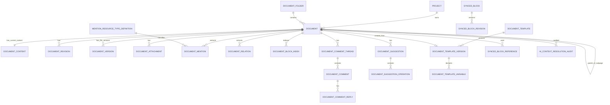

# SCOPERY BACKEND FUNCTIONAL SPEC
# Native Document Editor · Simple Table · Resource Mention · AI Context Resolution

> **Loại tài liệu:** Backend implementation specification  
> **Phạm vi:** Mở rộng `DocumentHub`, `Knowledge`, `Governance`, `Trust`, `Notification` và `AI Assistant` để hỗ trợ tài liệu native được soạn trực tiếp trong Scopery.  
> **API prefix:** Tài liệu này bám Wave 4 contract với prefix `/api/v1`. Nếu repository đã chốt `/api`, phải đổi đồng bộ toàn bộ route trước khi code.  
> **Storage:** Cloudflare R2 cho production, MinIO cho local development; native content lưu trong database, file binary lưu trong object storage.  
> **Completion rule:** Không được đánh dấu chức năng hoàn thành nếu thiếu entity, relation, permission mapping, API binding, migration, event, test hoặc contract bắt buộc trong tài liệu này.

---

# 0. Product Decision

## 0.1 Mục tiêu

Document Hub phải hỗ trợ ba loại tài liệu:

```text
NATIVE
Tài liệu được soạn trực tiếp trong Scopery.

FILE
Tài liệu chỉ quản lý file upload như PDF, DOCX, XLSX, hình ảnh.

HYBRID
Tài liệu native có nội dung soạn trực tiếp và có file đính kèm/version.
```

Native Document phải hỗ trợ:

- Rich text.
- Heading.
- In đậm, in nghiêng, gạch chân, gạch ngang.
- Inline code.
- Màu chữ.
- Highlight.
- Link.
- List.
- To-do.
- Toggle.
- Quote.
- Callout.
- Divider.
- Code block.
- Equation block.
- Image.
- File.
- PDF.
- Video/audio/embed.
- Bookmark.
- Simple Table.
- Nhiều cột.
- Sub-page.
- Table of contents.
- Breadcrumb block.
- Mention `@resource`.
- Comment.
- Suggestion mode.
- Revision/history.
- Template.
- Synced block.
- Scopery Smart Block.
- AI write/rewrite/summarize/extract.
- Governance, approval, finalization và access control.

## 0.2 Ngoài phạm vi

Không triển khai:

- Notion Database Table.
- Database properties.
- Board view từ database.
- Calendar/timeline/gallery view từ database.
- Relation/Rollup/Formula của database.
- Query engine cho document database.
- Spreadsheet engine.
- Real-time multiplayer cursor trong phiên bản đầu.
- Offline-first collaborative editing.
- Arbitrary HTML.
- Arbitrary JavaScript.
- Arbitrary CSS.
- Macro hoặc executable content.

`Simple Table` chỉ là block trình bày nội dung.

---

# 1. Bounded Contexts và trách nhiệm

## 1.1 DocumentHub

Chịu trách nhiệm:

- Document metadata.
- Content mode.
- Folder.
- Native content.
- File versions.
- Attachments.
- Document revision.
- Sub-page.
- Template.
- Generated document.
- Share.
- Client visibility validation.

## 1.2 NativeEditor

Có thể là package/module con của DocumentHub.

Chịu trách nhiệm:

- AST schema.
- Block validation.
- Inline marks.
- Simple Table.
- Columns.
- Synced block.
- Comment anchors.
- Suggestion operations.
- Save/concurrency.
- Plain-text extraction.
- Revision snapshots.

## 1.3 ResourceReference

Chịu trách nhiệm:

- Resource type registry.
- Mention search.
- Canonical reference.
- Batch resolve.
- Permission evaluation.
- Route resolution.
- Portal visibility.
- AI projection selection.

## 1.4 Knowledge

Chịu trách nhiệm:

- Extract plain text.
- Chunking.
- Indexing.
- Reindex jobs.
- Semantic retrieval.
- Knowledge source relation.
- Knowledge graph relation.

## 1.5 AI Assistant

Chịu trách nhiệm:

- Conversation/message.
- SSE.
- Resolve document context.
- Resolve tagged resource context.
- Permission-aware projection.
- Citation.
- AI suggestions.
- Apply only after explicit user confirmation.

## 1.6 Governance

Chịu trách nhiệm:

- Ownership.
- Access grant.
- Lock.
- Finalization.
- Version snapshot.
- Restore.
- Baseline guard.
- Audit.

## 1.7 Trust

Chịu trách nhiệm:

- Classification.
- Sensitive field/object.
- Masking.
- Sensitive access audit.
- Export audit.
- AI processing policy.
- Portal/client visibility policy.

## 1.8 Notification

Chịu trách nhiệm:

- User/team mention notification.
- Comment notification.
- Review/approval notification.
- Preference.
- Mute/unmute.
- Deep-link safety.

---

# 2. Aggregate Model

## 2.1 Aggregate roots

```text
Document
DocumentTemplate
SyncedBlock
DocumentCommentThread
DocumentSuggestion
MentionResourceTypeDefinition
```

## 2.2 Supporting entities

```text
DocumentContent
DocumentRevision
DocumentAttachment
DocumentMention
DocumentRelation
DocumentBlockIndex
DocumentComment
DocumentCommentReply
DocumentSuggestionOperation
DocumentTemplateVersion
DocumentTemplateVariable
SyncedBlockRevision
AiContextResolutionAudit
```

## 2.3 Value objects

```text
CanonicalResourceRef
DocumentAst
BlockNode
InlineNode
TextMark
CommentAnchor
SuggestionPatch
Classification
ContentChecksum
RevisionNumber
PermissionDecision
ClientVisibilityIssue
AiContextProjection
```

---

# 3. Entity Relationship Diagram



---

# 4. Document Entity

## 4.1 Fields bổ sung

Bổ sung vào entity `Document` hiện có:

| Field | Type | Null | Rule |
|---|---|---:|---|
| `content_mode` | VARCHAR(16) | No | `NATIVE`, `FILE`, `HYBRID` |
| `parent_document_id` | UUID FK | Yes | Sub-page parent |
| `current_content_revision_id` | UUID FK | Yes | Null cho FILE |
| `current_content_revision_no` | BIGINT | No | Default 0 |
| `editor_schema_version` | INTEGER | Yes | Null cho FILE |
| `content_checksum` | VARCHAR(128) | Yes | SHA-256 canonical AST |
| `content_updated_at` | TIMESTAMP | Yes | |
| `content_updated_by` | UUID | Yes | |
| `template_version_id` | UUID FK | Yes | Source template |
| `page_icon` | VARCHAR(255) | Yes | Emoji hoặc asset ref |
| `page_cover_object_key` | VARCHAR(1024) | Yes | Object storage key |
| `content_width` | VARCHAR(16) | No | `CENTERED`, `WIDE`, `FULL` |
| `client_visible` | BOOLEAN | No | Default false |
| `classification` | VARCHAR(32) | No | Default from document type |
| `archived_at` | TIMESTAMP | Yes | |
| `archived_by` | UUID | Yes | |
| `version` | BIGINT | No | Optimistic locking |

## 4.2 Constraints

```text
CHK_DOCUMENT_CONTENT_MODE
content_mode IN ('NATIVE', 'FILE', 'HYBRID')

CHK_DOCUMENT_CONTENT_REVISION
FILE => current_content_revision_id IS NULL
NATIVE/HYBRID => current_content_revision_id MAY be null only before first save

CHK_DOCUMENT_PARENT_NOT_SELF
parent_document_id IS NULL OR parent_document_id <> id

CHK_DOCUMENT_PARENT_SCOPE
Parent and child must belong to the same project.

CHK_DOCUMENT_PARENT_CYCLE
A document cannot become a descendant of itself.

CHK_DOCUMENT_CLIENT_VISIBLE
Client-visible document must pass client visibility validation before approve/share/publish.
```

## 4.3 Delete/cascade rules

- Không hard-delete Document trong flow thông thường.
- Archive document không archive tự động sub-pages.
- Archive parent có warning nếu còn active sub-pages.
- Hard-delete chỉ dùng retention/anonymization flow.
- Hard-delete Document:
  - Cascade `DocumentContent`, `DocumentBlockIndex`, `DocumentMention`, `DocumentRelation`.
  - Comments/suggestions follow retention policy.
  - File objects delete through storage outbox job.
  - Audit log không cascade nếu compliance policy yêu cầu giữ.

---

# 5. DocumentContent

## 5.1 Mục đích

Lưu canonical AST hiện tại.

## 5.2 Fields

| Field | Type | Rule |
|---|---|---|
| `id` | UUID | PK |
| `document_id` | UUID | Unique FK |
| `schema_version` | INTEGER | Required |
| `revision_no` | BIGINT | Required |
| `ast_json` | JSONB | Canonical document AST |
| `plain_text` | TEXT | Extracted server-side |
| `word_count` | INTEGER | Server calculated |
| `character_count` | INTEGER | Server calculated |
| `checksum` | VARCHAR(128) | SHA-256 |
| `last_saved_at` | TIMESTAMP | |
| `last_saved_by` | UUID | |
| `created_at` | TIMESTAMP | |
| `updated_at` | TIMESTAMP | |
| `version` | BIGINT | Optimistic lock |

## 5.3 Unique constraints

```text
UQ_DOCUMENT_CONTENT_DOCUMENT(document_id)
UQ_DOCUMENT_CONTENT_REVISION(document_id, revision_no)
```

## 5.4 Canonicalization

Trước khi tính checksum:

- Sắp xếp JSON object keys.
- Không đổi thứ tự block.
- Xóa client-only fields.
- Xóa selection/caret state.
- Xóa temporary upload progress.
- Chuẩn hóa empty string/null theo schema.
- Chuẩn hóa marks order.
- Chuẩn hóa URL.
- Không thay đổi block ID.

---

# 6. Document AST Contract

## 6.1 Root schema

```json
{
  "type": "doc",
  "schemaVersion": 1,
  "content": [
    {
      "id": "block-uuid",
      "type": "paragraph",
      "attrs": {},
      "content": [
        {
          "type": "text",
          "text": "Hello",
          "marks": [
            { "type": "bold" }
          ]
        }
      ]
    }
  ]
}
```

## 6.2 Block ID

Mọi block phải có UUID ổn định:

- Tạo ở client hoặc server.
- Server validate UUID.
- Không được đổi khi block chỉ thay nội dung.
- Duplicate block phải tạo ID mới.
- Synced block reference dùng ID riêng.
- Comment/suggestion anchor trỏ bằng block ID.

## 6.3 Inline marks được phép

```text
bold
italic
underline
strike
inlineCode
link
textColor
highlight
```

### Link attrs

```json
{
  "type": "link",
  "attrs": {
    "href": "https://example.com",
    "target": "_blank",
    "rel": "noopener noreferrer"
  }
}
```

Rules:

- Chỉ `http`, `https`, `mailto`, route nội bộ được whitelist.
- Chặn `javascript:`, `data:` không được phép.
- External link tự thêm `noopener noreferrer`.
- URL phải normalize.

### Text color/highlight

Whitelist:

```text
DEFAULT
GRAY
RED
ORANGE
YELLOW
GREEN
BLUE
PURPLE
PINK
```

Không nhận arbitrary CSS color trong phiên bản đầu.

## 6.4 Block types

### Text blocks

```text
paragraph
heading
bulletList
orderedList
listItem
todoList
todoItem
toggle
quote
callout
divider
codeBlock
equationBlock
```

### Media blocks

```text
image
file
pdf
video
audio
embed
bookmark
```

### Layout blocks

```text
columns
column
tableOfContents
breadcrumb
subpageReference
syncedBlockReference
```

### Data presentation

```text
simpleTable
tableRow
tableCell
```

### Scopery blocks

```text
resourceMentionBlock
smartBlock
approvalBlock
statusBlock
progressBlock
aiGeneratedBlock
```

## 6.5 Heading

```json
{
  "id": "<uuid>",
  "type": "heading",
  "attrs": {
    "level": 1
  },
  "content": []
}
```

Allowed level:

```text
1, 2, 3, 4
```

## 6.6 Todo item

```json
{
  "id": "<uuid>",
  "type": "todoItem",
  "attrs": {
    "checked": false
  },
  "content": []
}
```

## 6.7 Toggle

- Có title content.
- Có nested blocks.
- Server giới hạn depth.

## 6.8 Callout

Attrs:

```text
icon
style: INFO | WARNING | SUCCESS | DANGER | NEUTRAL
```

## 6.9 Code block

Attrs:

```text
language
caption
lineNumbers
```

Rules:

- Plain text only.
- Không execute.
- Maximum block size.
- Language chỉ là syntax label.

## 6.10 Equation block

- Lưu LaTeX text.
- Server không execute shell.
- Sanitize output renderer.
- Giới hạn length.

---

# 7. Simple Table

## 7.1 Mục tiêu

Simple Table là block để trình bày dữ liệu tĩnh trong tài liệu.

Không có:

- Database property.
- Relation.
- Rollup.
- Formula.
- Saved views.
- Board/calendar/timeline.
- Row page.
- Query engine.

## 7.2 AST

```json
{
  "id": "<uuid>",
  "type": "simpleTable",
  "attrs": {
    "headerRow": true,
    "headerColumn": false,
    "columnWidths": [240, 160, 120],
    "borderStyle": "DEFAULT"
  },
  "content": [
    {
      "id": "<uuid>",
      "type": "tableRow",
      "content": [
        {
          "id": "<uuid>",
          "type": "tableCell",
          "attrs": {
            "colspan": 1,
            "rowspan": 1,
            "align": "LEFT",
            "background": "DEFAULT"
          },
          "content": [
            {
              "id": "<uuid>",
              "type": "paragraph",
              "content": []
            }
          ]
        }
      ]
    }
  ]
}
```

## 7.3 Table rules

- Tối thiểu 1 hàng, 1 cột.
- Tối đa cấu hình:
  - 200 hàng.
  - 50 cột.
  - 5.000 cells.
- `columnWidths.length` phải bằng số cột logical.
- Phiên bản đầu:
  - `colspan = 1`.
  - `rowspan = 1`.
  - Không merge cell.
- Mỗi row phải có cùng số cell.
- Cell chỉ chứa:
  - Paragraph.
  - List.
  - Todo.
  - Resource mention inline.
  - Link.
- Không chứa:
  - Table lồng table.
  - Columns.
  - Sub-page.
  - Smart block phức tạp.
- Copy/paste Excel là frontend feature; backend chỉ nhận AST hợp lệ.
- Export CSV dùng plain-text extraction của cell.

## 7.4 Table mutation

Frontend chỉnh table trong local AST rồi lưu qua content API.

Không cần endpoint row/cell riêng trong MVP.

---

# 8. Columns and Layout

## 8.1 Columns AST

```json
{
  "id": "<uuid>",
  "type": "columns",
  "attrs": {
    "ratios": [0.5, 0.5]
  },
  "content": [
    {
      "id": "<uuid>",
      "type": "column",
      "content": []
    },
    {
      "id": "<uuid>",
      "type": "column",
      "content": []
    }
  ]
}
```

## 8.2 Rules

- Tối thiểu 2 cột.
- Tối đa 4 cột.
- Tổng ratios sai số tối đa `0.001` so với `1.0`.
- Mỗi ratio tối thiểu `0.15`.
- Không lồng columns quá 2 cấp.
- Mobile stacking do frontend xử lý.
- Không chứa columns trực tiếp trong simple table cell.

---

# 9. Media and Attachments

## 9.1 DocumentAttachment

| Field | Type |
|---|---|
| `id` | UUID |
| `document_id` | UUID |
| `block_id` | UUID |
| `object_key` | VARCHAR |
| `file_name` | VARCHAR |
| `content_type` | VARCHAR |
| `file_size_bytes` | BIGINT |
| `checksum` | VARCHAR |
| `status` | `PENDING`, `AVAILABLE`, `FAILED`, `ARCHIVED` |
| `classification` | VARCHAR |
| `uploaded_by` | UUID |
| `uploaded_at` | TIMESTAMP |
| `archived_at` | TIMESTAMP |
| `version` | BIGINT |

## 9.2 Attachment relation

- Một media/file block tham chiếu `attachmentId`.
- Một attachment chỉ thuộc một document.
- Attachment không được tham chiếu bởi document khác.
- Duplicate document phải copy metadata và quyết định:
  - Copy object.
  - Hoặc reference immutable object nếu storage policy cho phép.
- Archive block không xóa ngay attachment.
- Garbage collection xóa attachment không còn block tham chiếu sau grace period.

## 9.3 Upload flow

```text
POST presigned-upload
→ upload R2/MinIO
→ complete-upload
→ insert block reference
→ save content
```

## 9.4 Security

- MIME sniff server-side.
- Virus scan hook nếu có.
- File size policy.
- Checksum.
- Quarantine status nếu scan chưa xong.
- Không expose object key trực tiếp cho user.
- Presigned URL TTL ngắn.
- Không log URL.

---

# 10. Sub-pages

## 10.1 Model

Sub-page là `Document` có `parent_document_id`.

Không dùng folder làm sub-page.

## 10.2 Rules

- Parent/child cùng project.
- Tối đa depth mặc định: 10.
- Không cycle.
- Child có thể nằm trong folder khác nếu policy cho phép; mặc định inherit folder từ parent khi create.
- Permission không tự động inherit nếu Governance policy dùng explicit grant; mặc định inherit project/document policy.
- Archive parent không archive child.
- Move sub-page phải validate cycle.
- `subpageReference` block chỉ trỏ document con hoặc document user có quyền mention.

## 10.3 API

```text
POST /api/v1/projects/{projectId}/documents/{documentId}/subpages
GET  /api/v1/projects/{projectId}/documents/{documentId}/subpages
POST /api/v1/projects/{projectId}/documents/{documentId}/move
```

Create request:

```json
{
  "title": "Authentication",
  "code": "DOC-AUTH-001",
  "documentTypeCode": "SRS_SECTION",
  "contentMode": "NATIVE",
  "folderId": "<uuid>"
}
```

Move request:

```json
{
  "parentDocumentId": "<uuid-or-null>",
  "folderId": "<uuid-or-null>"
}
```

---

# 11. Synced Blocks

## 11.1 Mục tiêu

Một block nội dung có thể được hiển thị ở nhiều document và cập nhật theo source.

## 11.2 SyncedBlock

| Field | Type |
|---|---|
| `id` | UUID |
| `workspace_id` | UUID |
| `project_id` | UUID nullable |
| `source_document_id` | UUID |
| `source_block_id` | UUID |
| `name` | VARCHAR |
| `status` | ACTIVE, ARCHIVED |
| `current_revision_no` | BIGINT |
| `classification` | VARCHAR |
| `created_by` | UUID |
| `created_at` | TIMESTAMP |
| `version` | BIGINT |

## 11.3 SyncedBlockRevision

- Immutable snapshot AST của source block.
- Revision number.
- Checksum.
- Created by/at.

## 11.4 Reference block

```json
{
  "id": "<uuid>",
  "type": "syncedBlockReference",
  "attrs": {
    "syncedBlockId": "<uuid>",
    "mode": "LIVE"
  }
}
```

Modes:

```text
LIVE
SNAPSHOT
```

## 11.5 Rules

- Actor cần `SYNCED_BLOCK_CREATE`.
- Document reader cần quyền đọc synced block.
- Reference không tự cấp quyền.
- Nếu access revoked:
  - Render restricted placeholder.
- Nếu source archived:
  - Render archived status hoặc last allowed snapshot theo policy.
- AI resolve synced block qua cùng permission gate.
- Không recursive synced block.
- Synced block không chứa chính nó.
- Max expansion depth = 1 trong MVP.

## 11.6 API

```text
POST /api/v1/projects/{projectId}/documents/{documentId}/synced-blocks
GET  /api/v1/synced-blocks/{syncedBlockId}
GET  /api/v1/synced-blocks/{syncedBlockId}/content
POST /api/v1/synced-blocks/{syncedBlockId}/snapshot
PATCH /api/v1/synced-blocks/{syncedBlockId}/archive
```

---

# 12. Templates

## 12.1 Mở rộng DocumentTemplate

Existing Document Template phải hỗ trợ:

```text
FILE_TEMPLATE
NATIVE_TEMPLATE
HYBRID_TEMPLATE
```

## 12.2 DocumentTemplateVersion

| Field | Type |
|---|---|
| `id` | UUID |
| `template_id` | UUID |
| `version_no` | INTEGER |
| `status` | DRAFT, PUBLISHED, ARCHIVED |
| `schema_version` | INTEGER |
| `ast_json` | JSONB |
| `variables_json` | JSONB |
| `classification` | VARCHAR |
| `created_by` | UUID |
| `created_at` | TIMESTAMP |
| `published_at` | TIMESTAMP |
| `checksum` | VARCHAR |

## 12.3 Template variables

```text
{{organization.name}}
{{workspace.name}}
{{project.name}}
{{project.code}}
{{project.owner.name}}
{{client.name}}
{{currentDate}}
{{currentUser.name}}
```

## 12.4 Variable rules

- Variable registry whitelist.
- Variable has:
  - Code.
  - Type.
  - Resolver.
  - Required permission.
  - Client visibility.
  - AI visibility.
- Không cho arbitrary expression.
- Missing required variable => render fails.
- Missing optional variable => empty/fallback.
- Sensitive variable không render vào client-visible template.
- Resolve server-side.

## 12.5 Render flow

```text
Select template version
→ validate variables
→ resolve context
→ render AST
→ validate mentions/client visibility
→ create Document
→ create initial DocumentContent
→ create revision 1
→ emit events
```

## 12.6 API

```text
POST /api/v1/workspaces/{workspaceId}/document-templates
POST /api/v1/workspaces/{workspaceId}/document-templates/{templateId}/versions
GET  /api/v1/workspaces/{workspaceId}/document-templates/{templateId}/versions
GET  /api/v1/workspaces/{workspaceId}/document-templates/{templateId}/versions/{versionId}
PUT  /api/v1/workspaces/{workspaceId}/document-templates/{templateId}/versions/{versionId}
POST /api/v1/workspaces/{workspaceId}/document-templates/{templateId}/versions/{versionId}/publish
POST /api/v1/projects/{projectId}/documents/from-template
```

---

# 13. Comments

## 13.1 CommentThread

| Field | Type |
|---|---|
| `id` | UUID |
| `document_id` | UUID |
| `anchor_type` | DOCUMENT, BLOCK, TEXT_RANGE |
| `block_id` | UUID nullable |
| `anchor_json` | JSONB nullable |
| `status` | OPEN, RESOLVED |
| `created_by` | UUID |
| `created_at` | TIMESTAMP |
| `resolved_by` | UUID nullable |
| `resolved_at` | TIMESTAMP nullable |
| `version` | BIGINT |

## 13.2 Text range anchor

```json
{
  "blockId": "<uuid>",
  "from": 10,
  "to": 25,
  "selectedTextHash": "sha256"
}
```

Rules:

- Anchor position chỉ có ý nghĩa trong block text.
- Khi content thay đổi:
  - Try re-anchor bằng text hash/context.
  - Nếu không được, mark `ORPHANED`.
- Orphaned comment vẫn xem được nhưng không highlight chính xác.

## 13.3 Comment

| Field | Type |
|---|---|
| `id` | UUID |
| `thread_id` | UUID |
| `body_ast_json` | JSONB |
| `plain_text` | TEXT |
| `visibility` | INTERNAL, CLIENT |
| `created_by` | UUID |
| `created_at` | TIMESTAMP |
| `updated_at` | TIMESTAMP nullable |
| `deleted_at` | TIMESTAMP nullable |

## 13.4 Rules

- Comment body dùng subset rich text.
- Không cho table/columns/sub-page trong comment.
- Client comment chỉ thấy trong client-visible document và portal access.
- Mention user/team trong comment phải kiểm tra access.
- Resolve không xóa thread.
- Reopen giữ history.
- Edit comment chỉ owner trong time window hoặc admin.
- Delete là soft-delete.
- Audit giữ actor/time.

## 13.5 API

```text
POST /api/v1/projects/{projectId}/documents/{documentId}/comment-threads
GET  /api/v1/projects/{projectId}/documents/{documentId}/comment-threads
POST /api/v1/document-comments/{commentId}/replies
PUT  /api/v1/document-comments/{commentId}
DELETE /api/v1/document-comments/{commentId}
POST /api/v1/document-comment-threads/{threadId}/resolve
POST /api/v1/document-comment-threads/{threadId}/reopen
```

---

# 14. Suggestion Mode

## 14.1 Mục tiêu

Cho phép đề xuất thay đổi nội dung nhưng không sửa canonical AST cho đến khi accept.

## 14.2 DocumentSuggestion

| Field | Type |
|---|---|
| `id` | UUID |
| `document_id` | UUID |
| `base_revision_no` | BIGINT |
| `status` | PROPOSED, ACCEPTED, REJECTED, SUPERSEDED |
| `created_by` | UUID |
| `created_at` | TIMESTAMP |
| `decided_by` | UUID nullable |
| `decided_at` | TIMESTAMP nullable |
| `decision_note` | TEXT nullable |
| `version` | BIGINT |

## 14.3 SuggestionOperation

Operations:

```text
INSERT_TEXT
DELETE_TEXT
REPLACE_TEXT
INSERT_BLOCK
DELETE_BLOCK
REPLACE_BLOCK
MOVE_BLOCK
UPDATE_ATTRS
```

Fields:

| Field | Type |
|---|---|
| `id` | UUID |
| `suggestion_id` | UUID |
| `operation_type` | VARCHAR |
| `block_id` | UUID nullable |
| `path_json` | JSONB |
| `before_json` | JSONB nullable |
| `after_json` | JSONB nullable |
| `order_no` | INTEGER |

## 14.4 Rules

- Suggestion dựa trên `base_revision_no`.
- Accept phải revalidate against current revision.
- Nếu conflict:
  - Return `SUGGESTION_BASE_REVISION_CONFLICT`.
  - Không partial apply.
- Accept toàn bộ suggestion là atomic.
- Reject không thay document.
- Accepted suggestion tạo content revision.
- AI rewrite phải tạo suggestion, không sửa trực tiếp mặc định.
- Suggestion có mention mới phải permission validate lúc accept.
- Client reviewer chỉ accept/reject nếu policy cho phép.

## 14.5 API

```text
POST /api/v1/projects/{projectId}/documents/{documentId}/suggestions
GET  /api/v1/projects/{projectId}/documents/{documentId}/suggestions
GET  /api/v1/document-suggestions/{suggestionId}
POST /api/v1/document-suggestions/{suggestionId}/accept
POST /api/v1/document-suggestions/{suggestionId}/reject
```

---

# 15. Revisions and History

## 15.1 DocumentRevision

| Field | Type |
|---|---|
| `id` | UUID |
| `document_id` | UUID |
| `revision_no` | BIGINT |
| `revision_type` | AUTOSAVE_CHECKPOINT, MANUAL, APPROVAL, FINALIZATION, RESTORE, TEMPLATE_CREATE, AI_ACCEPT |
| `schema_version` | INTEGER |
| `ast_json` | JSONB |
| `plain_text` | TEXT |
| `checksum` | VARCHAR |
| `change_summary` | TEXT nullable |
| `created_by` | UUID |
| `created_at` | TIMESTAMP |
| `source_revision_id` | UUID nullable |
| `restored_from_revision_id` | UUID nullable |

## 15.2 Immutability

- Revision không update.
- Revision không delete trừ retention policy.
- Revision number tăng tuần tự trong transaction.
- Unique `(document_id, revision_no)`.

## 15.3 Revision creation policy

Canonical content save không nhất thiết tạo immutable revision mỗi lần gõ.

Tạo revision khi:

- First content save.
- Manual `Create version`.
- Approve.
- Finalize.
- Restore.
- Accept suggestion.
- Accept AI rewrite.
- Autosave checkpoint:
  - Tối đa một revision mỗi 5 phút khi có thay đổi.
  - Configurable.
- Before high-risk operation.

## 15.4 Restore

Flow:

1. Check permission.
2. Check Governance lock/finalization.
3. Check baseline guard.
4. Load target revision.
5. Validate AST schema.
6. Validate mentions.
7. Create safety revision of current content.
8. Replace canonical content.
9. Create `RESTORE` revision.
10. Re-extract mentions/index/plain text.
11. Emit events.

Restore không xóa history.

## 15.5 API

```text
GET  /api/v1/projects/{projectId}/documents/{documentId}/revisions
GET  /api/v1/projects/{projectId}/documents/{documentId}/revisions/{revisionId}
GET  /api/v1/projects/{projectId}/documents/{documentId}/revisions/diff
POST /api/v1/projects/{projectId}/documents/{documentId}/revisions
POST /api/v1/projects/{projectId}/documents/{documentId}/revisions/{revisionId}/restore
```

---

# 16. Native Content Save API

## 16.1 Get content

```text
GET /api/v1/projects/{projectId}/documents/{documentId}/content
```

Response:

```json
{
  "documentId": "<uuid>",
  "schemaVersion": 1,
  "revisionNo": 12,
  "checksum": "sha256...",
  "content": {
    "type": "doc",
    "schemaVersion": 1,
    "content": []
  },
  "wordCount": 1200,
  "characterCount": 8450,
  "lastSavedAt": "<instant>",
  "lastSavedBy": "<uuid>",
  "editable": true,
  "lock": null,
  "permissionVersion": 33
}
```

## 16.2 Save content

```text
PUT /api/v1/projects/{projectId}/documents/{documentId}/content
```

Headers:

```text
Idempotency-Key: <uuid>
If-Match: "<revisionNo>:<checksum>"
```

Request:

```json
{
  "baseRevisionNo": 12,
  "schemaVersion": 1,
  "content": {
    "type": "doc",
    "schemaVersion": 1,
    "content": []
  },
  "saveReason": "AUTOSAVE"
}
```

Response:

```json
{
  "documentId": "<uuid>",
  "revisionNo": 13,
  "checksum": "sha256...",
  "savedAt": "<instant>",
  "savedBy": "<uuid>",
  "revisionCreated": false,
  "mentionSummary": {
    "resolved": 4,
    "restricted": 0,
    "invalid": 0
  },
  "indexingState": "QUEUED"
}
```

## 16.3 Transaction steps

Trong một database transaction:

1. Load document `FOR UPDATE`.
2. Check document/project scope.
3. Check `DOCUMENT_READ`.
4. Check `DOCUMENT_EDIT`.
5. Check lock/finalization.
6. Verify `baseRevisionNo`.
7. Validate AST.
8. Validate block IDs and limits.
9. Sanitize marks/URLs/embed.
10. Extract mentions.
11. Batch validate mention permissions.
12. Extract resource relations.
13. Extract attachment references.
14. Verify attachments belong to document and are available.
15. Canonicalize AST.
16. Calculate checksum.
17. Detect no-op.
18. Update `DocumentContent`.
19. Increment revision number.
20. Update Document content metadata.
21. Replace block index projection.
22. Diff and replace mention projection.
23. Diff and replace relation projection.
24. Create checkpoint revision if policy requires.
25. Append outbox events.
26. Commit.

After commit:

- Knowledge indexing worker.
- Notification worker.
- Search indexing.
- Synced block update.
- AI cache invalidation.

## 16.4 Conflict response

HTTP `409`:

```json
{
  "success": false,
  "errorCode": "DOCUMENT_CONTENT_REVISION_CONFLICT",
  "message": "The document was updated by another user.",
  "details": {
    "submittedBaseRevisionNo": 12,
    "currentRevisionNo": 14,
    "currentChecksum": "sha256...",
    "lastSavedAt": "<instant>",
    "lastSavedBy": "<uuid>"
  }
}
```

Frontend phải:

- Không overwrite.
- Cho reload.
- Cho copy local changes.
- Cho compare nếu API hỗ trợ.
- Không auto-force save.

## 16.5 No-op save

Nếu checksum không đổi:

- Không increment revision.
- Không reindex.
- Không emit content changed.
- Return current state với `noOp=true`.

---

# 17. Block Index Projection

## 17.1 DocumentBlockIndex

Không phải canonical content. Đây là projection để query/anchor.

| Field | Type |
|---|---|
| `document_id` | UUID |
| `block_id` | UUID |
| `parent_block_id` | UUID nullable |
| `block_type` | VARCHAR |
| `sort_path` | VARCHAR |
| `plain_text_preview` | VARCHAR |
| `depth` | INTEGER |
| `is_client_visible` | BOOLEAN |
| `classification` | VARCHAR |
| `content_revision_no` | BIGINT |

Primary key:

```text
(document_id, block_id)
```

## 17.2 Uses

- Validate comment anchor.
- Deep link block.
- Search heading path.
- Table of contents.
- AI citation.
- Smart block refresh.
- Partial preview.

Projection rebuild atomically with save.

---

# 18. Resource Mention

## 18.1 Canonical resource ref

```text
{RESOURCE_TYPE}:{UUID}
```

Examples:

```text
TASK:550e8400-e29b-41d4-a716-446655440000
REQUIREMENT:...
DOCUMENT:...
USER:...
```

## 18.2 DocumentMention

| Field | Type |
|---|---|
| `id` | UUID |
| `document_id` | UUID |
| `block_id` | UUID |
| `resource_ref` | VARCHAR |
| `resource_type` | VARCHAR |
| `resource_id` | UUID |
| `mention_mode` | LIVE, SNAPSHOT, REFERENCE_ONLY |
| `label_snapshot` | VARCHAR nullable |
| `snapshot_json` | JSONB nullable |
| `classification` | VARCHAR |
| `client_visibility_state` | ALLOWED, BLOCKED, SANITIZED |
| `created_revision_no` | BIGINT |
| `last_seen_revision_no` | BIGINT |
| `created_at` | TIMESTAMP |

Unique:

```text
(document_id, block_id, resource_ref, mention occurrence key)
```

Nếu một block nhắc cùng resource nhiều lần, cần `occurrence_id` từ AST node.

## 18.3 Mention node

```json
{
  "type": "resourceMention",
  "attrs": {
    "occurrenceId": "<uuid>",
    "resourceRef": "TASK:<uuid>",
    "resourceType": "TASK",
    "resourceId": "<uuid>",
    "labelSnapshot": "TASK-128 · Implement SSO",
    "mentionMode": "LIVE"
  }
}
```

## 18.4 Mention permissions

Tách riêng:

```text
DISCOVER
READ
MENTION
EMBED
AI_READ
PORTAL_READ
NOTIFY_MENTIONED_PARTY
```

## 18.5 Insert rule

```text
CanInsertMention =
DISCOVER
AND READ
AND MENTION
AND same/allowed scope
AND document policy allows resource type
AND classification cross-reference allowed
AND client visibility valid when applicable
```

## 18.6 AI rule

```text
CanAiRead =
READ
AND AI_READ
AND actor ACL
AND document ACL
AND field classification
AND AI processing policy
AND provider/residency policy
AND no legal/privacy block
```

## 18.7 Mention does not grant access

Tag resource không:

- Tạo access grant.
- Tăng permission.
- Cho portal đọc.
- Cho AI đọc.
- Gửi notification mặc định cho resource owner.
- Copy resource data vào document trừ SNAPSHOT.

---

# 19. Mention Resource Type Registry

## 19.1 MentionResourceTypeDefinition

| Field | Type |
|---|---|
| `resource_type` | VARCHAR PK |
| `display_name` | VARCHAR |
| `scope_type` | GLOBAL, ORGANIZATION, WORKSPACE, PROJECT |
| `enabled` | BOOLEAN |
| `resolver_code` | VARCHAR |
| `route_resolver_code` | VARCHAR |
| `search_provider_code` | VARCHAR |
| `discover_permission` | VARCHAR |
| `read_permission` | VARCHAR |
| `mention_permission` | VARCHAR |
| `embed_permission` | VARCHAR |
| `ai_read_permission` | VARCHAR |
| `portal_read_permission` | VARCHAR |
| `notification_supported` | BOOLEAN |
| `allowed_modes_json` | JSONB |
| `ai_projection_policy_code` | VARCHAR |
| `created_at` | TIMESTAMP |
| `updated_at` | TIMESTAMP |

## 19.2 Required initial resource types

```text
USER
TEAM
PROJECT
PROJECT_PHASE
WBS_NODE
TASK
MILESTONE
REQUIREMENT
SCOPE_ITEM
DELIVERABLE
RISK
ISSUE
ASSUMPTION
DEPENDENCY
DECISION
MEETING
DOCUMENT
TEST_CASE
DEFECT
RELEASE
CHANGE_REQUEST
BASELINE
APPLICATION
SUPPORT_CASE
```

Financial resource types disabled by default until field-level projection is approved:

```text
ESTIMATION_RUN
FINANCE_SCENARIO
QUOTE
QUOTE_VERSION
PROFITABILITY_PLAN
```

## 19.3 Registry completion gate

Không bật type nếu thiếu:

- Search resolver.
- Detail resolver.
- Route resolver.
- Permission codes.
- AI projection.
- Portal rule.
- Tests.

---

# 20. Mention Search API

```text
GET /api/v1/resource-mentions/search
```

Query:

```text
workspaceId
projectId
documentId
q
resourceTypes
mentionMode
clientVisible
page
size
```

Response:

```json
{
  "items": [
    {
      "resourceRef": "TASK:<uuid>",
      "resourceType": "TASK",
      "resourceId": "<uuid>",
      "code": "TASK-128",
      "label": "Implement SSO login",
      "scopeLabel": "Digital Transformation",
      "status": "IN_PROGRESS",
      "classification": "INTERNAL",
      "allowedActions": {
        "mention": true,
        "embed": true,
        "aiRead": true,
        "portalRead": false
      },
      "allowedMentionModes": [
        "LIVE",
        "SNAPSHOT",
        "REFERENCE_ONLY"
      ],
      "disabledReasonCode": null
    }
  ],
  "page": 0,
  "size": 20,
  "totalElements": 1
}
```

## 20.1 Security rules

- Permission filter trong backend query.
- Không trả resource không có DISCOVER.
- Không trả total count của hidden resource.
- Search current project first.
- Cross-project search chỉ khi policy cho phép.
- Cross-workspace default blocked.
- Client-visible mode loại resource không portal-safe.
- Rate limit.
- Audit abnormal enumeration.

---

# 21. Batch Mention Resolve

```text
POST /api/v1/resource-mentions/resolve
```

Request:

```json
{
  "documentId": "<uuid>",
  "resourceRefs": [
    "TASK:<uuid>",
    "DOCUMENT:<uuid>"
  ],
  "projection": "MENTION_CHIP",
  "purpose": "DOCUMENT_RENDER"
}
```

States:

```text
RESOLVED
ACCESS_REVOKED
NOT_FOUND
ARCHIVED
SOFT_DELETED
OUT_OF_SCOPE
CLASSIFICATION_BLOCKED
AI_PROCESSING_BLOCKED
PORTAL_VISIBILITY_BLOCKED
```

Rules:

- Max refs/request configurable, default 200.
- Deduplicate.
- Preserve request order in response map.
- Resolve in batches by resource type.
- No N+1.
- Permission evaluate each resource.
- Hidden resource returns safe label:
  - `Restricted resource`.
- Do not return old label snapshot if DISCOVER revoked.

---

# 22. Scopery Smart Blocks

## 22.1 Purpose

Smart Block hiển thị dữ liệu domain trong document.

Examples:

```text
PROJECT_SUMMARY
PROJECT_HEALTH
TASK_LIST
WBS
MILESTONE_LIST
REQUIREMENT
TRACEABILITY_SUMMARY
RAID_LIST
MEETING
TEST_COVERAGE
DEFECT_LIST
RELEASE_READINESS
ESTIMATION_SUMMARY
FINANCE_SUMMARY
QUOTE_SUMMARY
BASELINE_COMPARISON
CHANGE_IMPACT
DOCUMENT_LIST
```

## 22.2 Smart block AST

```json
{
  "id": "<uuid>",
  "type": "smartBlock",
  "attrs": {
    "smartBlockType": "TASK_LIST",
    "mode": "LIVE",
    "resourceRefs": [
      "PROJECT:<uuid>"
    ],
    "configuration": {
      "status": ["TODO", "IN_PROGRESS"],
      "limit": 20,
      "columns": ["code", "title", "status", "assignee"]
    }
  }
}
```

## 22.3 Modes

```text
LIVE
SNAPSHOT
```

## 22.4 Rules

- LIVE render qua backend resolver.
- SNAPSHOT lưu sanitized projection.
- Smart block không tự cấp quyền.
- AI đọc smart block qua AI context resolver.
- Client-visible validate.
- Financial smart block field masking.
- Configuration whitelist theo type.
- Max row/record count.
- Pagination hoặc truncated state.
- No arbitrary query.
- No raw SQL/filter expression.

## 22.5 API

```text
POST /api/v1/smart-blocks/preview
POST /api/v1/smart-blocks/resolve
POST /api/v1/smart-blocks/snapshot
GET  /api/v1/smart-blocks/types
```

---

# 23. AI Context Resolution

## 23.1 Principle

Frontend không dựng prompt bằng dữ liệu từ cache.

Frontend gửi:

- Conversation.
- Document ID.
- Optional block ID.
- Resource refs.
- User prompt.
- Requested purpose.

Backend:

1. Load actor/session.
2. Check document read.
3. Parse current allowed content.
4. Resolve mentions.
5. Resolve smart blocks.
6. Apply field masking.
7. Apply AI policy.
8. Create typed projections.
9. Record audit.
10. Call model.
11. Return citations.

## 23.2 API

```text
POST /api/v1/ai-assistant/context/resolve
```

Request:

```json
{
  "workspaceId": "<uuid>",
  "projectId": "<uuid>",
  "documentId": "<uuid>",
  "blockIds": [],
  "resourceRefs": [],
  "purpose": "ANSWER_QUESTION",
  "modelProvider": "OPENAI",
  "modelName": null
}
```

Response:

```json
{
  "contextId": "<uuid>",
  "document": {
    "documentId": "<uuid>",
    "revisionNo": 13,
    "plainText": "..."
  },
  "resources": [
    {
      "citationRef": "ctx-001",
      "resourceRef": "TASK:<uuid>",
      "resourceType": "TASK",
      "title": "TASK-128 · Implement SSO",
      "projection": {
        "status": "IN_PROGRESS",
        "dueDate": "2026-08-01"
      },
      "sourceVersion": 5,
      "classification": "INTERNAL"
    }
  ],
  "denied": [
    {
      "resourceRef": "FINANCE_SCENARIO:<uuid>",
      "reasonCode": "AI_READ_DENIED"
    }
  ],
  "expiresAt": "<instant>"
}
```

## 23.3 Purpose codes

```text
ANSWER_QUESTION
SUMMARIZE
REWRITE
TRANSLATE
FIX_GRAMMAR
CONTINUE_WRITING
EXTRACT_TASKS
EXTRACT_REQUIREMENTS
EXTRACT_RISKS
EXTRACT_DECISIONS
GENERATE_MEETING_MINUTES
GENERATE_DOCUMENT
```

## 23.4 Projection whitelist

Mỗi tuple:

```text
resourceType + purpose + classification
```

phải có projection policy.

Ví dụ Task/ANSWER_QUESTION:

- Code.
- Title.
- Description.
- Status.
- Priority.
- Assignees.
- Start.
- Due.

Không mặc định gửi:

- Cost.
- Private comments.
- Audit.
- Sensitive attachment.
- Personal profile.
- Deleted data.

## 23.5 Recursive expansion

Default:

```text
maxDepth = 0
```

Optional:

```text
maxDepth = 1
```

Chỉ cho relation whitelist.

Mỗi expanded resource phải permission check riêng.

## 23.6 Citations

AI response phải trả citation metadata:

```json
{
  "citationRef": "ctx-001",
  "resourceRef": "TASK:<uuid>",
  "label": "TASK-128",
  "sourceVersion": 5,
  "route": "/w/.../p/.../work/...",
  "resolvedAt": "<instant>"
}
```

Nếu quyền bị thu hồi sau đó:

- Citation render restricted.
- Không trả cached sensitive label.

---

# 24. AI Writing Operations

## 24.1 Rules

AI không tự sửa canonical document.

AI operation kết quả phải là:

```text
PREVIEW
SUGGESTION
NEW_DOCUMENT_DRAFT
```

## 24.2 Rewrite flow

```text
Select text/block
→ request AI
→ stream result
→ preview diff
→ accept
→ create suggestion or content update
→ create revision
```

## 24.3 Extract domain entities

Ví dụ extract tasks:

1. AI trả structured candidates.
2. User review/edit.
3. Backend validate.
4. Create domain entities qua domain APIs.
5. Insert canonical mentions to created entities.
6. Save document.
7. Emit audit/events.

Không để AI gọi trực tiếp database repository.

---

# 25. Client Visibility Validation

## 25.1 API

```text
POST /api/v1/projects/{projectId}/documents/{documentId}/validate-client-visibility
```

Response:

```json
{
  "valid": false,
  "issues": [
    {
      "blockId": "<uuid>",
      "issueType": "MENTION_NOT_PORTAL_VISIBLE",
      "resourceRef": "FINANCE_SCENARIO:<uuid>",
      "recommendedActions": [
        "REMOVE",
        "CONVERT_TO_SANITIZED_SNAPSHOT"
      ]
    }
  ]
}
```

## 25.2 Must run before

- Set `client_visible=true`.
- Create portal share.
- Approve client-facing document.
- Publish template output to portal.
- Export client copy.
- AI portal answer uses document.

## 25.3 Blocking issues

```text
INTERNAL_MENTION
RESTRICTED_RESOURCE
SENSITIVE_FIELD
INTERNAL_COMMENT
INTERNAL_ATTACHMENT
UNSAFE_SMART_BLOCK
UNRESOLVED_REFERENCE
AI_GENERATED_UNREVIEWED
```

---

# 26. Governance Integration

## 26.1 Edit permission

Content save requires:

```text
DOCUMENT_READ
DOCUMENT_EDIT
```

And:

- Not archived.
- Not locked.
- Not finalized.
- Baseline guard allows/warns.
- Actor scope valid.

## 26.2 Approve

Before approve:

- Content exists.
- AST valid.
- No pending upload.
- No invalid mention.
- Required document metadata complete.
- Client validation if client-visible.
- Open blocking suggestions resolved based on policy.
- Governance policy check.
- Create approval revision.
- Lock/finalize if policy says.

## 26.3 Finalize

- Create finalization revision.
- Lock editing.
- Preserve content checksum.
- Only unfinalize with permission.
- AI may read but cannot apply edit.
- Comments may remain allowed by policy.

## 26.4 Restore

See revision restore flow and baseline guard.

---

# 27. Notification Rules

## 27.1 User mention

Notify only if:

- Actor has notify permission.
- Target user has document access.
- Not self-mention.
- Preference allows.
- Document not hidden from target.
- Mention newly added in current save.

Do not notify repeatedly on every autosave.

Use diff between previous and new mention projection.

## 27.2 Team mention

- Resolve active team members.
- Filter members without access.
- Maximum recipient threshold.
- Require confirmation if over threshold.
- Deduplicate.
- Rate limit.

## 27.3 Resource mention

Default no notification.

Optional explicit action:

```text
MENTION_AND_NOTIFY_WATCHERS
```

requires policy.

## 27.4 Comment

- Notify mentioned users.
- Notify thread participants.
- Respect internal/client visibility.
- Deep link includes document/block/thread.
- Never send inaccessible deep link.

---

# 28. Knowledge Indexing

## 28.1 Content extraction

On content save:

- Server extracts plain text.
- Preserve heading path.
- Include table cell text.
- Include mention display label only when indexing actor/policy permits.
- Smart block:
  - LIVE block indexed as reference, not full live data by default.
  - SNAPSHOT indexed sanitized content.
- Exclude internal comments unless source type configured.
- Exclude unresolved suggestions by default.

## 28.2 Index event

```text
DOCUMENT_CONTENT_CHANGED
```

Payload:

```json
{
  "documentId": "<uuid>",
  "projectId": "<uuid>",
  "workspaceId": "<uuid>",
  "revisionNo": 13,
  "checksum": "...",
  "classification": "INTERNAL"
}
```

## 28.3 Idempotency

Index worker key:

```text
documentId + revisionNo
```

Older job must not overwrite newer index.

---

# 29. Events and Outbox

## 29.1 Domain events

```text
DOCUMENT_CREATED
DOCUMENT_NATIVE_CONTENT_INITIALIZED
DOCUMENT_CONTENT_SAVED
DOCUMENT_CONTENT_CONFLICT_DETECTED
DOCUMENT_REVISION_CREATED
DOCUMENT_REVISION_RESTORED
DOCUMENT_MENTION_ADDED
DOCUMENT_MENTION_REMOVED
DOCUMENT_COMMENT_ADDED
DOCUMENT_COMMENT_RESOLVED
DOCUMENT_SUGGESTION_CREATED
DOCUMENT_SUGGESTION_ACCEPTED
DOCUMENT_SUGGESTION_REJECTED
DOCUMENT_TEMPLATE_RENDERED
DOCUMENT_CLIENT_VISIBILITY_VALIDATED
DOCUMENT_APPROVED
DOCUMENT_FINALIZED
DOCUMENT_UNFINALIZED
SYNCED_BLOCK_UPDATED
AI_DOCUMENT_CONTEXT_RESOLVED
AI_DOCUMENT_SUGGESTION_CREATED
```

## 29.2 Outbox

Mọi event integration dùng transactional outbox.

Consumers:

- Knowledge indexing.
- Search.
- Notification.
- Audit.
- AI cache invalidation.
- Synced block projection.
- Portal update.
- Activity feed.

## 29.3 Event payload rule

- Chỉ identifiers + safe summary.
- Không đưa full AST vào event.
- Không đưa presigned URL.
- Không đưa sensitive content.
- Trace ID.
- Actor ID.
- Revision number.
- Classification.

---

# 30. Error Catalog

| Code | HTTP | Meaning |
|---|---:|---|
| `DOCUMENT_CONTENT_MODE_INVALID` | 400 | Mode không hợp lệ |
| `DOCUMENT_NATIVE_CONTENT_NOT_SUPPORTED` | 409 | FILE document không có native content |
| `DOCUMENT_CONTENT_SCHEMA_UNSUPPORTED` | 422 | Schema version không hỗ trợ |
| `DOCUMENT_CONTENT_INVALID` | 422 | AST không hợp lệ |
| `DOCUMENT_CONTENT_TOO_LARGE` | 413 | Vượt giới hạn |
| `DOCUMENT_BLOCK_LIMIT_EXCEEDED` | 422 | Quá nhiều block |
| `DOCUMENT_BLOCK_DEPTH_EXCEEDED` | 422 | Quá sâu |
| `DOCUMENT_DUPLICATE_BLOCK_ID` | 422 | Trùng block ID |
| `DOCUMENT_CONTENT_REVISION_CONFLICT` | 409 | Optimistic lock |
| `DOCUMENT_LOCKED` | 423 | Governance lock |
| `DOCUMENT_FINALIZED` | 409 | Đã finalize |
| `DOCUMENT_ARCHIVED` | 409 | Đã archive |
| `DOCUMENT_PARENT_CYCLE` | 422 | Sub-page cycle |
| `DOCUMENT_PARENT_SCOPE_MISMATCH` | 422 | Khác project |
| `DOCUMENT_TABLE_INVALID` | 422 | Table shape không hợp lệ |
| `DOCUMENT_TABLE_LIMIT_EXCEEDED` | 422 | Quá row/cell |
| `DOCUMENT_ATTACHMENT_NOT_AVAILABLE` | 409 | Attachment chưa hoàn tất |
| `DOCUMENT_ATTACHMENT_SCOPE_MISMATCH` | 422 | Attachment sai document |
| `DOCUMENT_MENTION_TYPE_DISABLED` | 422 | Type chưa bật |
| `DOCUMENT_MENTION_RESOURCE_NOT_FOUND` | 422 | Resource không tồn tại |
| `DOCUMENT_MENTION_DISCOVER_DENIED` | 403 | Không discover |
| `DOCUMENT_MENTION_READ_DENIED` | 403 | Không read |
| `DOCUMENT_MENTION_INSERT_DENIED` | 403 | Không mention |
| `DOCUMENT_MENTION_OUT_OF_SCOPE` | 422 | Sai scope |
| `DOCUMENT_CLIENT_VISIBILITY_INVALID` | 409 | Không publish client được |
| `DOCUMENT_COMMENT_ANCHOR_INVALID` | 422 | Anchor sai |
| `DOCUMENT_COMMENT_VISIBILITY_DENIED` | 403 | Visibility không được phép |
| `DOCUMENT_SUGGESTION_BASE_REVISION_CONFLICT` | 409 | Suggestion stale |
| `DOCUMENT_TEMPLATE_VARIABLE_MISSING` | 422 | Thiếu variable |
| `DOCUMENT_TEMPLATE_VARIABLE_DENIED` | 403 | Variable nhạy cảm |
| `SYNCED_BLOCK_RECURSION` | 422 | Recursion |
| `AI_RESOURCE_READ_DENIED` | 403 | AI_READ denied |
| `AI_PROCESSING_POLICY_BLOCKED` | 403 | Policy block |
| `AI_CONTEXT_TOO_LARGE` | 413 | Context vượt giới hạn |
| `GOVERNANCE_BASELINE_GUARD_BLOCKED` | 409 | Baseline guard |
| `IDEMPOTENCY_KEY_REUSED_WITH_DIFFERENT_PAYLOAD` | 409 | Idempotency conflict |

---

# 31. Limits and Configuration

Default:

```text
maxDocumentAstBytes = 5 MB
maxBlocks = 10,000
maxBlockDepth = 20
maxTextNodeLength = 100,000
maxCodeBlockLength = 500,000
maxTableRows = 200
maxTableColumns = 50
maxTableCells = 5,000
maxColumns = 4
maxColumnDepth = 2
maxMentionsPerDocument = 2,000
maxMentionResolveBatch = 200
maxCommentsPerDocument = 50,000
maxTemplateVariables = 200
maxSmartBlockRows = 500
maxAiContextCharacters = policy-based
autosaveCheckpointMinutes = 5
orphanAttachmentGraceDays = 7
```

Limits phải config được và server enforce.

---

# 32. Database Indexes

Recommended:

```text
document(project_id, status, content_mode)
document(parent_document_id, status)
document(folder_id, status)
document(client_visible, classification)

document_content(document_id)
document_content(updated_at)

document_revision(document_id, revision_no DESC)
document_revision(document_id, created_at DESC)

document_block_index(document_id, block_id)
document_block_index(document_id, block_type)
document_block_index(document_id, sort_path)

document_mention(document_id, resource_ref)
document_mention(resource_type, resource_id)
document_mention(document_id, client_visibility_state)

document_attachment(document_id, status)
document_attachment(object_key)

comment_thread(document_id, status)
comment_thread(document_id, block_id)
comment(thread_id, created_at)

document_suggestion(document_id, status)
document_suggestion(document_id, base_revision_no)

synced_block(workspace_id, status)
synced_block(project_id, status)
```

Full-text:

- PostgreSQL `tsvector` on plain text if used.
- Knowledge indexing remains external/vector layer.

---

# 33. Migration Plan

## 33.1 Flyway

Suggested files after current latest migration:

```text
Vxxx__document_native_content.sql
Vxxx+1__document_revision_comment_suggestion.sql
Vxxx+2__document_mention_resource_registry.sql
Vxxx+3__document_template_native.sql
Vxxx+4__document_synced_block_and_smart_block.sql
Vxxx+5__document_native_indexes.sql
Vxxx+6__document_native_seed_catalog.sql
```

Actual version numbers must follow repository latest migration.

## 33.2 Backfill

Existing documents:

```text
content_mode = FILE
current_content_revision_no = 0
```

Existing template:

```text
template_type = FILE_TEMPLATE
```

No native content generated automatically.

---

# 34. API Summary

## 34.1 Document content

```text
GET  /projects/{projectId}/documents/{documentId}/content
PUT  /projects/{projectId}/documents/{documentId}/content
```

## 34.2 Revisions

```text
GET  /projects/{projectId}/documents/{documentId}/revisions
GET  /projects/{projectId}/documents/{documentId}/revisions/{revisionId}
GET  /projects/{projectId}/documents/{documentId}/revisions/diff
POST /projects/{projectId}/documents/{documentId}/revisions
POST /projects/{projectId}/documents/{documentId}/revisions/{revisionId}/restore
```

## 34.3 Sub-pages

```text
POST /projects/{projectId}/documents/{documentId}/subpages
GET  /projects/{projectId}/documents/{documentId}/subpages
POST /projects/{projectId}/documents/{documentId}/move
```

## 34.4 Comments

```text
POST /projects/{projectId}/documents/{documentId}/comment-threads
GET  /projects/{projectId}/documents/{documentId}/comment-threads
POST /document-comments/{commentId}/replies
PUT  /document-comments/{commentId}
DELETE /document-comments/{commentId}
POST /document-comment-threads/{threadId}/resolve
POST /document-comment-threads/{threadId}/reopen
```

## 34.5 Suggestions

```text
POST /projects/{projectId}/documents/{documentId}/suggestions
GET  /projects/{projectId}/documents/{documentId}/suggestions
GET  /document-suggestions/{suggestionId}
POST /document-suggestions/{suggestionId}/accept
POST /document-suggestions/{suggestionId}/reject
```

## 34.6 Mentions

```text
GET  /resource-mentions/types
GET  /resource-mentions/search
POST /resource-mentions/resolve
POST /resource-mentions/validate
```

## 34.7 Client validation

```text
POST /projects/{projectId}/documents/{documentId}/validate-client-visibility
```

## 34.8 Templates

```text
POST /workspaces/{workspaceId}/document-templates/{templateId}/versions
GET  /workspaces/{workspaceId}/document-templates/{templateId}/versions
GET  /workspaces/{workspaceId}/document-templates/{templateId}/versions/{versionId}
PUT  /workspaces/{workspaceId}/document-templates/{templateId}/versions/{versionId}
POST /workspaces/{workspaceId}/document-templates/{templateId}/versions/{versionId}/publish
POST /projects/{projectId}/documents/from-template
```

## 34.9 Synced blocks

```text
POST /projects/{projectId}/documents/{documentId}/synced-blocks
GET  /synced-blocks/{syncedBlockId}
GET  /synced-blocks/{syncedBlockId}/content
POST /synced-blocks/{syncedBlockId}/snapshot
PATCH /synced-blocks/{syncedBlockId}/archive
```

## 34.10 Smart blocks

```text
GET  /smart-blocks/types
POST /smart-blocks/preview
POST /smart-blocks/resolve
POST /smart-blocks/snapshot
```

## 34.11 AI

```text
POST /ai-assistant/context/resolve
GET  /ai-assistant/messages/{messageId}/citations
```

---

# 35. Business Rules

## Document

- `BR-NDE-001`: FILE document không được gọi native content save.
- `BR-NDE-002`: NATIVE/HYBRID document được phép có content.
- `BR-NDE-003`: Content save phải optimistic-lock.
- `BR-NDE-004`: No-op save không tạo revision.
- `BR-NDE-005`: Approved/finalized behavior theo Governance policy.
- `BR-NDE-006`: Archived document không edit.
- `BR-NDE-007`: Parent/child cùng project.
- `BR-NDE-008`: Không cycle sub-page.
- `BR-NDE-009`: Hard delete chỉ qua retention/compliance.
- `BR-NDE-010`: Client-visible phải validate trước publish/share.

## AST

- `BR-NDE-011`: Block ID unique trong document.
- `BR-NDE-012`: Block depth và count không vượt config.
- `BR-NDE-013`: Chỉ block/mark whitelist.
- `BR-NDE-014`: URL/embed phải sanitize.
- `BR-NDE-015`: Không executable content.
- `BR-NDE-016`: Simple Table không có database behavior.
- `BR-NDE-017`: Simple Table shape phải rectangular.
- `BR-NDE-018`: Attachment reference phải thuộc document và AVAILABLE.

## Mention

- `BR-NDE-019`: Mention lưu canonical ref, không resolve bằng label.
- `BR-NDE-020`: Mention insert cần DISCOVER+READ+MENTION.
- `BR-NDE-021`: Mention không grant access.
- `BR-NDE-022`: AI cần AI_READ riêng.
- `BR-NDE-023`: Portal cần PORTAL_READ riêng.
- `BR-NDE-024`: Resource type disabled không được mention.
- `BR-NDE-025`: Access revoked phải hide safe.
- `BR-NDE-026`: Financial type disabled cho đến khi projection approved.
- `BR-NDE-027`: Mention notification chỉ cho mention mới.
- `BR-NDE-028`: Resource mention mặc định không notify owner.

## Revision

- `BR-NDE-029`: Revision immutable.
- `BR-NDE-030`: Restore tạo revision mới.
- `BR-NDE-031`: Approve/finalize tạo revision.
- `BR-NDE-032`: Suggestion accept atomic.
- `BR-NDE-033`: Stale suggestion không auto merge.

## AI

- `BR-NDE-034`: Frontend cache không phải AI context source.
- `BR-NDE-035`: AI dùng quyền actor.
- `BR-NDE-036`: AI projection whitelist.
- `BR-NDE-037`: AI output không tự apply.
- `BR-NDE-038`: AI factual resource cần citation.
- `BR-NDE-039`: Recursive resource expansion mặc định disabled.
- `BR-NDE-040`: Sensitive AI access phải audit.

## Comments/templates/synced blocks

- `BR-NDE-041`: Comment client/internal tách visibility.
- `BR-NDE-042`: Mention target phải có access trước notification.
- `BR-NDE-043`: Template variable server-side whitelist.
- `BR-NDE-044`: Sensitive variable không render portal.
- `BR-NDE-045`: Synced block không recursive.
- `BR-NDE-046`: Synced block không grant access.
- `BR-NDE-047`: Snapshot chỉ chứa field actor được phép đọc.
- `BR-NDE-048`: Smart block không cho arbitrary query.

---

# 36. Acceptance Criteria

## AC-NDE-001 — Create native document

Given actor có `DOCUMENT_CREATE`,  
When tạo document với `contentMode=NATIVE`,  
Then document được tạo, content revision 0 hoặc initial empty revision theo policy, và không cần file version.

## AC-NDE-002 — Save rich content

Given editable native document revision 5,  
When save AST hợp lệ với `baseRevisionNo=5`,  
Then revision current thành 6, checksum cập nhật, projections và outbox được ghi trong cùng transaction.

## AC-NDE-003 — Concurrent save

Given current revision 7,  
When client save với base revision 6,  
Then trả 409 và không overwrite.

## AC-NDE-004 — Simple Table

Given table 3x4 hợp lệ,  
When save,  
Then content lưu thành công và plain text chứa nội dung cell.

## AC-NDE-005 — Invalid table

Given row có số cell khác nhau,  
When save,  
Then trả `DOCUMENT_TABLE_INVALID`.

## AC-NDE-006 — Mention correct resource

Given `TASK:<uuid>` và title/code thay đổi,  
When document reload,  
Then mention vẫn resolve đúng bằng UUID và hiển thị label mới nếu actor có quyền.

## AC-NDE-007 — Mention access revoked

Given mention được chèn khi actor có quyền,  
When quyền đọc resource bị thu hồi,  
Then document render `Restricted resource`, AI không nhận resource và title cũ không bị leak.

## AC-NDE-008 — AI actor permission

Given service account có quyền rộng nhưng user không có `AI_READ`,  
When user hỏi AI về tagged resource,  
Then resource bị loại khỏi context.

## AC-NDE-009 — Client visibility

Given client-visible document có internal finance mention,  
When validate/publish,  
Then bị block với issue cụ thể.

## AC-NDE-010 — Suggestion

Given suggestion dựa trên revision 10 và current vẫn 10,  
When authorized reviewer accept,  
Then operation apply atomic và tạo revision 11.

## AC-NDE-011 — Stale suggestion

Given suggestion dựa revision 10 nhưng current 12,  
When accept,  
Then trả conflict và không partial apply.

## AC-NDE-012 — Restore

Given revision 3, current 8,  
When restore revision 3,  
Then current content bằng snapshot 3, history 1–8 giữ nguyên và tạo revision 9 loại RESTORE.

## AC-NDE-013 — Notification

Given user mới được mention và có document access,  
When save,  
Then một notification được tạo; autosave tiếp theo không tạo duplicate.

## AC-NDE-014 — Template

Given published native template và đủ variables,  
When create from template,  
Then document/content/revision/mentions được tạo transactionally.

## AC-NDE-015 — Synced block

Given document B tham chiếu synced block từ A,  
When source update,  
Then LIVE reference hiển thị revision mới nếu reader còn quyền.

---

# 37. Test Cases

## 37.1 Document creation and content mode

| ID | Scenario | Expected |
|---|---|---|
| TC-NDE-001 | Create NATIVE document | Không yêu cầu file |
| TC-NDE-002 | Create FILE document | Content endpoint trả mode error |
| TC-NDE-003 | Create HYBRID document | Cho content và attachment |
| TC-NDE-004 | Invalid content mode | 400 |
| TC-NDE-005 | Actor thiếu create permission | 403 |
| TC-NDE-006 | Duplicate code trong project nếu code unique | Conflict |
| TC-NDE-007 | Create sub-page same project | Success |
| TC-NDE-008 | Create sub-page cross project | Scope mismatch |
| TC-NDE-009 | Move tạo cycle | Parent cycle |
| TC-NDE-010 | Depth > limit | Reject |

## 37.2 AST validation

| ID | Scenario | Expected |
|---|---|---|
| TC-NDE-011 | Valid paragraph/heading/list | Save |
| TC-NDE-012 | Unknown block type | 422 |
| TC-NDE-013 | Unknown mark | 422 |
| TC-NDE-014 | Duplicate block ID | 422 |
| TC-NDE-015 | Invalid UUID block ID | 422 |
| TC-NDE-016 | Depth limit exceeded | 422 |
| TC-NDE-017 | Block count exceeded | 422 |
| TC-NDE-018 | `javascript:` link | Reject/sanitize |
| TC-NDE-019 | Arbitrary HTML | Reject |
| TC-NDE-020 | Code block does not execute | Stored as text |

## 37.3 Formatting and content

| ID | Scenario | Expected |
|---|---|---|
| TC-NDE-021 | Bold/italic/underline/strike | Persist |
| TC-NDE-022 | Text color whitelist | Persist |
| TC-NDE-023 | Invalid color | Reject |
| TC-NDE-024 | Highlight whitelist | Persist |
| TC-NDE-025 | Heading level 4 | Persist |
| TC-NDE-026 | Heading level 5 | Reject |
| TC-NDE-027 | Todo checked | Persist |
| TC-NDE-028 | Columns ratio valid | Persist |
| TC-NDE-029 | Columns ratio invalid | Reject |
| TC-NDE-030 | Nested columns too deep | Reject |

## 37.4 Simple Table

| ID | Scenario | Expected |
|---|---|---|
| TC-NDE-031 | 1x1 table | Save |
| TC-NDE-032 | 200x50 within cell max? | Enforce total cells |
| TC-NDE-033 | 201 rows | Reject |
| TC-NDE-034 | 51 columns | Reject |
| TC-NDE-035 | Unequal cells per row | Reject |
| TC-NDE-036 | Column widths mismatch | Reject |
| TC-NDE-037 | Nested table in cell | Reject |
| TC-NDE-038 | Mention in cell | Allowed if permission |
| TC-NDE-039 | Table plain-text extraction | Correct row/cell text |
| TC-NDE-040 | CSV export sanitation | No formula execution risk |

## 37.5 Save/concurrency

| ID | Scenario | Expected |
|---|---|---|
| TC-NDE-041 | Correct base revision | Save |
| TC-NDE-042 | Stale base revision | 409 |
| TC-NDE-043 | Same idempotency/payload retry | Same response |
| TC-NDE-044 | Same key different payload | 409 |
| TC-NDE-045 | No-op checksum | No increment |
| TC-NDE-046 | Document locked | 423 |
| TC-NDE-047 | Document finalized | Reject |
| TC-NDE-048 | Document archived | Reject |
| TC-NDE-049 | Transaction fails after projections | Full rollback |
| TC-NDE-050 | Outbox write fails | Full rollback |

## 37.6 Attachments

| ID | Scenario | Expected |
|---|---|---|
| TC-NDE-051 | Available attachment same document | Save |
| TC-NDE-052 | Pending attachment | Reject |
| TC-NDE-053 | Attachment from other document | Reject |
| TC-NDE-054 | Expired presigned upload | New URL/retry |
| TC-NDE-055 | MIME mismatch | Fail/quarantine |
| TC-NDE-056 | Virus scan fail | Block |
| TC-NDE-057 | Removed block attachment | Mark orphan candidate |
| TC-NDE-058 | Garbage collection before grace | Must not delete |

## 37.7 Mention search and insert

| ID | Scenario | Expected |
|---|---|---|
| TC-NDE-059 | DISCOVER+READ+MENTION | Result and insert allowed |
| TC-NDE-060 | No DISCOVER | Not in result/count |
| TC-NDE-061 | DISCOVER no MENTION | Disabled only if existence may be shown |
| TC-NDE-062 | No READ | Insert blocked |
| TC-NDE-063 | Disabled resource type | Reject |
| TC-NDE-064 | Cross-project allowed policy | Resolve |
| TC-NDE-065 | Cross-project blocked | Reject |
| TC-NDE-066 | Cross-workspace | Block default |
| TC-NDE-067 | Archived resource | Show archived if discover/read |
| TC-NDE-068 | Deleted resource | Unavailable |
| TC-NDE-069 | Duplicate mention autosave | No duplicate notification |
| TC-NDE-070 | Mention code changed | UUID still correct |

## 37.8 Mention resolve and access revocation

| ID | Scenario | Expected |
|---|---|---|
| TC-NDE-071 | Batch 200 refs | Resolve without N+1 |
| TC-NDE-072 | Batch > limit | 422 |
| TC-NDE-073 | Access revoked | Restricted |
| TC-NDE-074 | Classification changed | Re-evaluate |
| TC-NDE-075 | Permission version changed | Cache invalidated |
| TC-NDE-076 | Label snapshot sensitive | Do not show after revoke |
| TC-NDE-077 | Portal resolve internal ref | Blocked |
| TC-NDE-078 | Same ref repeated | Deduplicate internally |

## 37.9 AI context

| ID | Scenario | Expected |
|---|---|---|
| TC-NDE-079 | User has READ+AI_READ | Included |
| TC-NDE-080 | READ but no AI_READ | Excluded |
| TC-NDE-081 | Service has permission, actor lacks | Excluded |
| TC-NDE-082 | Restricted field | Masked/omitted |
| TC-NDE-083 | Provider policy blocks | Excluded/error |
| TC-NDE-084 | Legal hold policy blocks AI processing | Excluded |
| TC-NDE-085 | maxDepth 0 | No relation expansion |
| TC-NDE-086 | allowed maxDepth 1 | Each child authorized |
| TC-NDE-087 | AI citation source version | Correct |
| TC-NDE-088 | Permission revoked after answer | Citation restricted |
| TC-NDE-089 | Frontend submits forged projection | Ignored |
| TC-NDE-090 | Context size exceeded | Controlled error/truncation |

## 37.10 Comments

| ID | Scenario | Expected |
|---|---|---|
| TC-NDE-091 | Document comment | Create |
| TC-NDE-092 | Block comment valid block | Create |
| TC-NDE-093 | Missing block | Anchor invalid |
| TC-NDE-094 | Text anchor survives small edit | Re-anchor |
| TC-NDE-095 | Cannot re-anchor | ORPHANED |
| TC-NDE-096 | Internal comment in portal | Hidden |
| TC-NDE-097 | Client comment permitted | Visible |
| TC-NDE-098 | Mention target lacks doc access | No notification |
| TC-NDE-099 | Resolve/reopen | History preserved |
| TC-NDE-100 | Soft delete comment | Audit preserved |

## 37.11 Suggestions and revisions

| ID | Scenario | Expected |
|---|---|---|
| TC-NDE-101 | Suggestion create | PROPOSED |
| TC-NDE-102 | Accept current base | Atomic apply |
| TC-NDE-103 | Accept stale base | Conflict |
| TC-NDE-104 | Reject | No content change |
| TC-NDE-105 | AI rewrite | Suggestion only |
| TC-NDE-106 | Accept mention addition lacking permission | Reject |
| TC-NDE-107 | Manual revision | Immutable revision |
| TC-NDE-108 | Restore old revision | New RESTORE revision |
| TC-NDE-109 | Restore locked doc | Block |
| TC-NDE-110 | Revision retention | Follows policy |

## 37.12 Templates and synced blocks

| ID | Scenario | Expected |
|---|---|---|
| TC-NDE-111 | Render complete variables | Success |
| TC-NDE-112 | Missing required variable | Fail |
| TC-NDE-113 | Sensitive variable client doc | Block |
| TC-NDE-114 | Template mention inaccessible | Block/sanitize |
| TC-NDE-115 | Synced block live | Shows current allowed revision |
| TC-NDE-116 | Synced block access revoked | Restricted |
| TC-NDE-117 | Synced block recursion | Reject |
| TC-NDE-118 | Snapshot block | Immutable sanitized data |

## 37.13 Client visibility and governance

| ID | Scenario | Expected |
|---|---|---|
| TC-NDE-119 | Internal mention in client doc | Validation fails |
| TC-NDE-120 | Sanitized snapshot | Validation passes |
| TC-NDE-121 | Internal comment exists | Not included client output |
| TC-NDE-122 | Restricted attachment | Validation fails |
| TC-NDE-123 | Approve with pending upload | Block |
| TC-NDE-124 | Approve creates revision | Yes |
| TC-NDE-125 | Finalize locks editing | Yes |
| TC-NDE-126 | Unfinalize permission denied | 403 |
| TC-NDE-127 | Baseline guard block | No save/restore |
| TC-NDE-128 | Governance audit | Event and trace present |

## 37.14 Knowledge and events

| ID | Scenario | Expected |
|---|---|---|
| TC-NDE-129 | Save emits content event | Once |
| TC-NDE-130 | No-op save | No event |
| TC-NDE-131 | Index older revision after newer | Older cannot overwrite |
| TC-NDE-132 | Table text indexed | Yes |
| TC-NDE-133 | Restricted mention label indexing | Policy-safe |
| TC-NDE-134 | Outbox retry | Idempotent |
| TC-NDE-135 | Notification consumer retry | No duplicate |

---

# 38. Integration Tests

Required suites:

```text
DocumentContentSaveIntegrationTest
DocumentContentConcurrencyIntegrationTest
DocumentAstValidationIntegrationTest
SimpleTableValidationIntegrationTest
DocumentAttachmentIntegrationTest
DocumentMentionPermissionIntegrationTest
DocumentMentionBatchResolveIntegrationTest
AiDocumentContextIntegrationTest
ClientVisibilityValidationIntegrationTest
DocumentCommentIntegrationTest
DocumentSuggestionIntegrationTest
DocumentRevisionRestoreIntegrationTest
DocumentTemplateRenderIntegrationTest
SyncedBlockIntegrationTest
GovernanceDocumentIntegrationTest
KnowledgeIndexOutboxIntegrationTest
NotificationMentionIntegrationTest
```

Use:

- Real PostgreSQL/Testcontainers.
- MinIO Testcontainer cho file transfer.
- Mock AI provider, không gọi external model.
- Deterministic permission fixtures.
- Outbox consumer idempotency tests.

---

# 39. Seed Catalog

Seed:

## Resource mention types

```text
USER
TEAM
PROJECT
PROJECT_PHASE
WBS_NODE
TASK
MILESTONE
REQUIREMENT
SCOPE_ITEM
DELIVERABLE
RISK
ISSUE
ASSUMPTION
DEPENDENCY
DECISION
MEETING
DOCUMENT
TEST_CASE
DEFECT
RELEASE
CHANGE_REQUEST
BASELINE
APPLICATION
SUPPORT_CASE
```

## Block types

```text
paragraph
heading
bulletList
orderedList
listItem
todoList
todoItem
toggle
quote
callout
divider
codeBlock
equationBlock
image
file
pdf
video
audio
embed
bookmark
columns
column
tableOfContents
breadcrumb
subpageReference
syncedBlockReference
simpleTable
tableRow
tableCell
resourceMentionBlock
smartBlock
approvalBlock
statusBlock
progressBlock
aiGeneratedBlock
```

## Template variables

Initial safe registry.

## Events

Register every event in EventRegistry.

---

# 40. Security Checklist

- [ ] No arbitrary HTML/JS/CSS.
- [ ] URL scheme whitelist.
- [ ] Embed domain allowlist.
- [ ] MIME validation.
- [ ] Attachment checksum.
- [ ] Virus scanning hook.
- [ ] Presigned URL not logged.
- [ ] Native content size limits.
- [ ] Permission check on every read/write.
- [ ] Mention backend filtering.
- [ ] AI_READ separate.
- [ ] Portal DTO/content sanitation.
- [ ] Client visibility validation.
- [ ] Sensitive access audit.
- [ ] Revision immutable.
- [ ] Idempotency.
- [ ] Optimistic locking.
- [ ] Outbox.
- [ ] No frontend permission-only enforcement.
- [ ] No service-account privilege escalation for AI.
- [ ] No cached restricted label after permission revocation.
- [ ] No file binary in database.

---

# 41. Observability

Metrics:

```text
document_content_save_total
document_content_save_conflict_total
document_content_save_duration_ms
document_ast_validation_failure_total
document_revision_created_total
document_mention_resolve_total
document_mention_denied_total
document_mention_search_duration_ms
document_ai_context_resolve_duration_ms
document_ai_context_denied_total
document_client_visibility_failure_total
document_index_job_lag_seconds
document_outbox_retry_total
document_attachment_orphan_total
```

Logs:

- Trace ID.
- Document ID.
- Project/workspace.
- Revision no.
- Actor ID.
- Operation.
- Duration.
- Error code.

Không log:

- Full AST.
- Sensitive text.
- AI full context.
- Presigned URL.
- ACL token.

---

# 42. Implementation Order

## P0 — Core data and AST

1. Migrations.
2. Document content mode.
3. AST schema/validator.
4. Content GET/PUT.
5. Optimistic lock.
6. Canonicalization/checksum.
7. Block projection.
8. Revision.

## P1 — Rich blocks

1. Text/marks.
2. Lists/todo/toggle.
3. Quote/callout/code/equation.
4. Columns.
5. Simple Table.
6. Media attachments.
7. Sub-pages.

## P2 — Mentions and permission

1. Resource registry.
2. Search providers.
3. Mention search.
4. Batch resolve.
5. Save-time validation.
6. Permission cache.
7. Notification diff.
8. Portal rules.

## P3 — Collaboration

1. Comments.
2. Anchors.
3. Suggestions.
4. Revision diff.
5. Restore.
6. Governance integration.

## P4 — Templates and reusable content

1. Native templates.
2. Variables.
3. Create from template.
4. Synced blocks.
5. Smart blocks.

## P5 — Knowledge and AI

1. Plain text extraction.
2. Index outbox.
3. AI context resolver.
4. Projection policies.
5. Citations.
6. AI suggestion operations.
7. Audit.

## P6 — Client and hardening

1. Client visibility validation.
2. Portal-safe rendering.
3. Export sanitation.
4. Performance.
5. Security tests.
6. Load tests.
7. Retention/compliance integration.

---

# 43. Mandatory Completion Gate

Feature chỉ được đánh dấu hoàn thành khi:

```text
Database migrations complete
AND all entities/relations implemented
AND all required endpoints implemented
AND all permission codes mapped
AND every enabled block type validated
AND every enabled mention type has resolvers
AND all user-facing APIs bound to UI
AND all mandatory tests pass
AND no critical contract blocker remains
AND audit/outbox/indexing verified
AND portal non-leak tests pass
AND AI permission tests pass
```

Không được hoàn thành nếu:

- Chỉ lưu document metadata/file.
- Native content chỉ là plain text.
- `@` chỉ lưu label.
- Mention picker lọc quyền ở frontend.
- AI đọc trực tiếp Redux/query cache.
- AI dùng service permission thay actor.
- Simple Table chưa validate.
- Revision có thể update/delete tùy ý.
- Restore ghi đè history.
- Client-visible document chưa validation.
- Comments/suggestions không có permission.
- Endpoint mới chưa có test evidence.
- Worker/service-only flow bị gọi trực tiếp sai kiến trúc.
- Database Table bị triển khai ngoài quyết định phạm vi mà chưa có ADR mới.

---

# 44. Deliverables bắt buộc cho coding phase

Repository phải có tối thiểu:

```text
docs/
└── native-document/
    ├── NATIVE_DOCUMENT_BE_FUNCTIONAL_SPEC.md
    ├── NATIVE_DOCUMENT_API_CONTRACTS.md
    ├── NATIVE_DOCUMENT_ERROR_CATALOG.md
    ├── NATIVE_DOCUMENT_PERMISSION_MATRIX.md
    ├── NATIVE_DOCUMENT_EVENT_CATALOG.md
    └── NATIVE_DOCUMENT_TEST_MATRIX.md

src/main/resources/db/migration/
├── Vxxx__document_native_content.sql
├── Vxxx__document_revision_comment_suggestion.sql
├── Vxxx__document_mention_resource_registry.sql
├── Vxxx__document_template_native.sql
├── Vxxx__document_synced_block_and_smart_block.sql
└── Vxxx__document_native_indexes.sql
```

Implementation packages:

```text
documenthub/nativecontent
documenthub/revision
documenthub/comment
documenthub/suggestion
documenthub/template
documenthub/syncedblock
resourcereference
aicontext
knowledge/indexing
governance/document
trust/document
notification/mention
```

---

# 45. Final Scope Summary

## Included

```text
Rich text
Formatting
Simple Table
Columns
Media
Sub-pages
Comments
Suggestions
Revisions
Templates
Synced blocks
Scopery Smart Blocks
@Resource mentions
Permission-aware mention picker
AI permission-aware context
Citations
Knowledge indexing
Governance
Client visibility
```

## Excluded

```text
Database Table
Database views
Relations/Rollups/Formulas for document database
Spreadsheet engine
Arbitrary executable content
Real-time multiplayer cursor in MVP
```
