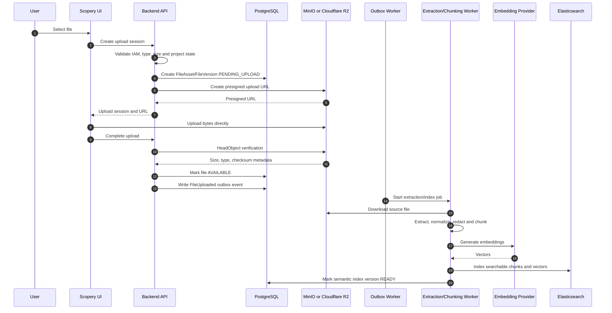
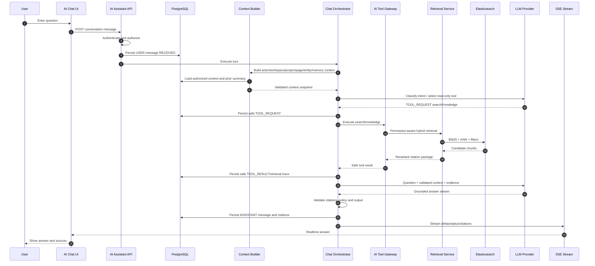
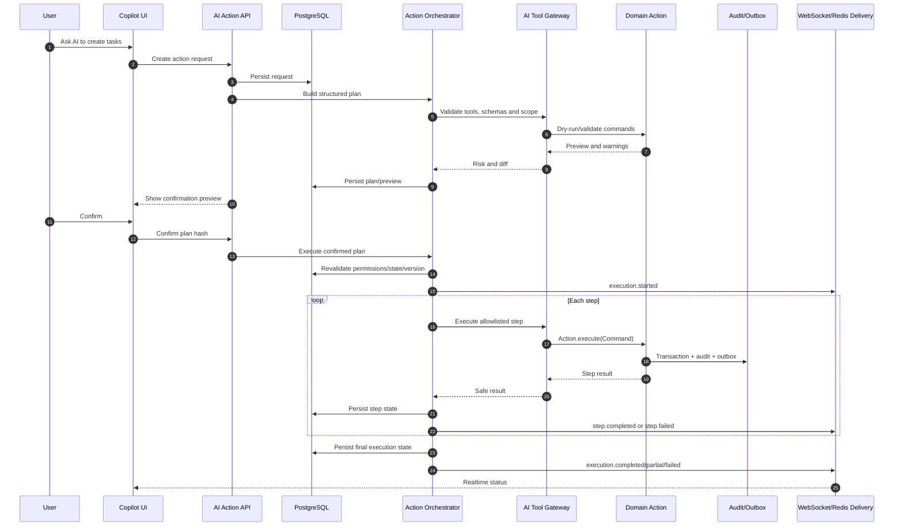

# SCOPERY BACKEND — PHASE 41–45 AI COPILOT ROADMAP ADDENDUM

> Purpose: extend Phase 00 with a detailed Advanced AI Assistant & Knowledge Intelligence track.
>
> This addendum does not replace Phase 07 or Phase 21. It continues capabilities explicitly deferred by Phase 21 and Phase 32.

---

# 1. Roadmap extension

| Phase | Name | Main outcome | User level |
|---:|---|---|---|
| 41 | Knowledge Graph / Semantic Index / Elasticsearch Hybrid Search / RAG | Permission-aware retrieval, citations, graph and indexing | Foundation |
| 42 | Contextual AI Chat / In-App Guide / Project Q&A | Replace guide and answer using page/project context | Level 1–2 |
| 43 | AI Recommendation / Suggestion Engine | Evidence-backed next-best actions and structured proposals | Level 3 |
| 44 | AI Tool Gateway / Action Planning / Agentic Operations | Preview, confirm and execute allowlisted domain actions | Level 4–5 |
| 45 | AI Governance / Evaluation / Safety / Hardening | Quality gates, rollout, cost, safety, incidents and kill switches | Production gate |

---

# 2. Capability progression

```text
Keyword search
→ semantic/hybrid retrieval
→ grounded answer
→ contextual guide
→ structured suggestion
→ action preview/diff
→ confirmed execution
→ governed limited auto-execution
```

---

# 3. Relationship with existing phases

```text
Phase 07 = provider/model/deployment/agent/prompt/execution platform.
Phase 21 = project-planning-specific proposal and safe-apply foundation.
Phase 32 = permission-aware keyword search/navigation/productivity.
Phase 41 = full semantic/RAG retrieval deferred by Phase 21/32.
Phase 42 = general read-only assistant and guide.
Phase 43 = common recommendation/suggestion layer; adapts Phase 21 history.
Phase 44 = common safe action gateway; absorbs compatible safe-apply behavior.
Phase 45 = evaluation/governance/release gate for the AI stack.
```

Phase 21 must not be deleted or silently rewritten.

---

# 4. AI authority model

| Level | Capability | Default authority |
|---:|---|---|
| 1 | Explain product/page/field | Read-only |
| 2 | Answer from project context | Read-only + citations |
| 3 | Recommend change | Suggestion only |
| 4 | Build plan and diff | Preview + confirmation |
| 5 | Execute allowed action | Policy-controlled; low risk may auto-execute, high risk confirms, critical may be forbidden |

Execution modes:

```text
READ_ONLY
SUGGEST_ONLY
CONFIRM_BEFORE_EXECUTE
AUTO_EXECUTE
FORBIDDEN
```

---

# 5. Non-negotiable architecture

```text
PostgreSQL/domain modules = source of truth
Elasticsearch = rebuildable search/semantic index
LLM = reasoning/generation
AiToolGateway = allowlisted action gateway
Action.execute(Command) = business mutation path
IAM + resource authorization = mandatory
Audit + outbox + idempotency = mandatory
```

Prohibited:

```text
LLM direct repository/JPA/SQL
arbitrary shell/code/HTTP tool
AI permission grant
cross-tenant retrieval
silent high-risk mutation
uncited project facts presented as grounded
hidden reasoning storage/exposure
```

---


# 5A. Locked implementation decisions

```text
Local object storage:
- MinIO through Docker Compose.

Production object storage:
- Cloudflare R2, private buckets by default.

Storage protocol:
- S3-compatible API through ObjectStorageProvider.
- AWS SDK for Java v2 S3 client/presigner inside infrastructure only.

Durable metadata/state:
- PostgreSQL.

Search/retrieval:
- Elasticsearch 8.x BM25 + KNN vector + hybrid fusion/reranking.

Chat realtime:
- SSE in Phase 42.

Agent action realtime:
- WebSocket in Phase 44, with Redis Pub/Sub or Streams for multi-instance coordination.
- REST/PostgreSQL remain authoritative.

Conversation persistence:
- USER, ASSISTANT, TOOL_REQUEST and TOOL_RESULT traces are persisted safely.
- Private chain-of-thought is never stored or exposed.

AI/provider portability:
- LlmProvider, EmbeddingProvider, RerankerProvider and ObjectStorageProvider ports.
```

Overall AI call direction:

```text
User question
→ persist USER message
→ build authorized context
→ classify intent
→ call registered searchKnowledge tool
→ Elasticsearch hybrid retrieval + graph expansion + reranking
→ return accessible evidence/citations
→ LLM grounded response
→ validate policy/citations
→ persist ASSISTANT/tool trace
→ stream answer with SSE
```

Higher-level action direction:

```text
User action request
→ proposed allowlisted tool calls
→ action plan and dry-run
→ preview/diff
→ confirmation where required
→ revalidate permission/state/version
→ execute Application Actions
→ persist execution/audit/outbox
→ stream progress with WebSocket
```

---

# 6. Product outcome

```text
User: “Tài liệu requirement này đang thiếu gì?”
AI: retrieves current requirement/document/task/test evidence and answers with citations.

User: “Đề xuất task còn thiếu.”
AI: creates structured suggestions with reason, confidence and impact.

User: “Tạo các task đó giúp tôi.”
AI: creates an action plan, shows the diff and requests confirmation.

User confirms.
AI: executes registered task actions, reports exact success/failure and preserves audit.
```

---

# PHASE 41 — TO-BE Knowledge Graph, Semantic Index, Elasticsearch Hybrid Search, RAG Retrieval & Grounding Foundation

> Project: Scopery Backend  
> Phase: 41  
> Document type: TO-BE implementation-grade specification  
> Status: Planning / Semantic retrieval and knowledge intelligence foundation  
> Roadmap group: Advanced AI Assistant & Knowledge Intelligence  
> Depends on: Phase 00–40, with hard runtime dependencies limited to Core Platform and explicitly declared adapters  
> API base: `/api`  
> Primary module: `modules/semanticindex`, `modules/knowledgegraph`, `modules/retrieval`, or `modules/knowledge` depending on repository architecture  
> Important rule: Phase 41 builds the permission-aware semantic retrieval foundation. It does not yet deliver complete conversational chat, recommendation, or action execution.

---

# 0. Purpose

Phase 41 upgrades Scopery from basic permission-aware keyword search into a reusable knowledge intelligence platform.

It continues capabilities explicitly deferred by Phase 21 and Phase 32:

```text
Phase 08  → Knowledge/document type foundation
Phase 21  → AI planning proposal; full RAG and semantic index deferred
Phase 27  → Document Hub and versioned documents
Phase 28  → Requirement/application/screen/API traceability
Phase 31  → Meetings, minutes, comments and actions
Phase 32  → Global keyword search/navigation/productivity
Phase 38  → Sensitive data, privacy and retention controls
Phase 39  → Import/export/connectors
```

Phase 41 must work as a standalone semantic search/retrieval module even when conversational AI is disabled.

Phase 41 answers:

```text
How is Scopery data transformed into AI-readable knowledge?
How are document/entity changes indexed incrementally?
How does Elasticsearch support BM25 and vector retrieval together?
How are workspace/project/IAM filters enforced before results reach AI?
How are chunks versioned, cited, invalidated and rebuilt?
How can relationship graph expansion improve retrieval without granting access?
```

---

# 1. Product intention and core principle

```text
PostgreSQL/domain objects are source of truth.
Elasticsearch is a rebuildable derived index.
Object storage keeps file bytes.
KnowledgeChunk is a traceable projection, not hidden business truth.
Permission filtering is mandatory before a result reaches a caller or LLM.
Every returned chunk must point to a source object/version.
Archive, delete, retention and permission changes invalidate retrieval.
```

Standalone and modular behavior remains mandatory:

```text
Each capability works with Core Platform and available adapters.
Missing optional modules reduce available sources/tools/packs gracefully.
No optional integration becomes a hidden hard runtime dependency.
```

---

# 2. Source inputs

Before coding Phase 41, the agent must read:

```text
1. Phase 00 master roadmap and completion state
2. Phase 02 IAM; Phase 04 audit/outbox/idempotency; Phase 05 Event Registry
3. Phase 07 AI Agent Platform; Phase 08 Knowledge foundation
4. Phase 09–10 Project Core and authorization
5. Phase 21 AI Planning spec/completion
6. Phase 23 hardening
7. Phase 24–31 business artifacts
8. Phase 32 Search/Productivity
9. Phase 33 Custom Fields; Phase 34 Governance
10. Phase 38 privacy/retention; Phase 39 connectors
11. Current document extraction/storage, Elasticsearch config, outbox consumers, migrations and tests
```

The agent must inspect actual code, migrations, seeders and tests. Documentation alone is not proof of implementation.

---

# 3. Current expected gaps

Likely missing or partial:

```text
KnowledgeSource / KnowledgeProjection / KnowledgeChunk
EmbeddingModelProfile / EmbeddingJob / EmbeddingRecord
SemanticIndexDefinition / index aliases / schema versioning
HybridRetrievalPolicy / RetrievalRequest / RetrievalTrace
CitationReference
KnowledgeGraphNode / KnowledgeGraphEdge
incremental index consumer, reindex, invalidation and dead-letter flow
ACL/permission signature projection and retrieval debug
```

Every item must be classified as:

```text
CURRENTLY_IMPLEMENTED
PARTIALLY_IMPLEMENTED
MUST_IMPLEMENT_IN_PHASE_41
MUST_HARDEN_IN_PHASE_41
SEED_ONLY_IN_PHASE_41
DEFERRED_TO_PHASE_XX
NOT_IN_SCOPE_FOR_PHASE_41
```

---

# 4. Target statement

Phase 41 must deliver:

```text
1. Register supported entity/document sources and source versions
2. Build canonical text/metadata projections
3. Create immutable versioned chunks with stable traceability
4. Generate embeddings asynchronously with approved profiles
5. Use versioned Elasticsearch full-text and dense-vector indexes
6. Implement mandatory tenant/workspace/project/source filters
7. Implement lexical + vector hybrid retrieval and reranking fallback
8. Return citation-bearing context packages
9. Build bounded project relationship graph
10. Index incrementally from outbox/domain events
11. Support project/workspace/full reindex with safe alias switch
12. Integrate privacy, retention, masking, archive/delete invalidation
13. Add IAM, events, audit, observability and tests
```

---

# 5. Boundary decisions

## Must implement

```text
semantic retrieval
vector embeddings
Elasticsearch hybrid search
knowledge source/chunk/citation
relationship graph foundation
index lifecycle
permission-aware RAG context
```
## Must not claim

```text
complete AI chat
recommendation engine
business mutation
cross-tenant search
public anonymous semantic search
unrestricted graph reasoning
automatic fine-tuning
```

General prohibitions:

```text
No cross-tenant access.
No permission bypass.
No raw secret exposure.
No hidden chain-of-thought storage/exposure.
No capability may claim a side effect or quality level not implemented and tested.
```

---

# 6. Required entities and value objects

## KnowledgeSource

```text
workspaceId/projectId
sourceType/sourceRefId/sourceVersionRefId
title/language/classification
contentHash/permissionSignature
status/lastObservedAt/lastIndexedAt/version
```
## KnowledgeProjection

```text
sourceId/projectionVersion
plainText/structuredMetadata/headings
extractionMethod/extractorVersion/contentHash
status/redacted error
```
## KnowledgeChunk

```text
sourceId/projectionVersion/chunkOrdinal
chunkType/headingPath/plainText
source offsets/token estimate/contentHash
classification/metadata/isCurrent
```
## EmbeddingModelProfile

```text
provider/model/deployment
vectorDimension/maxInputTokens
normalization/batch/status/version
```
## EmbeddingJob

```text
source/chunk scope
profile version
status/attempt/idempotency key
timestamps/redacted failure
```
## SemanticIndexDefinition

```text
index family/read alias/write alias
schema/analyzer/vector version
status
```
## RetrievalTrace

```text
lexical/vector candidates
filters/exclusion reasons
reranking/latency
final citation IDs
```
## CitationReference

```text
source type/ref/version
chunk/heading/fragment
canonical app route
classification
```
## KnowledgeGraphNode/Edge

```text
typed node
typed directional edge
workspace/project scope
source/permission lifecycle
```

All mutable important entities should follow repository conventions for UUIDs, audit columns, optimistic versioning and Flyway migrations.

---


# 6A. Locked technology decisions for Phase 41–45

The following technology decisions are now explicit and must be treated as the default implementation baseline unless a later Architecture Decision Record replaces them:

```text
Backend runtime:
- Java 21.
- Spring Boot 3.x.
- Spring Web MVC for normal REST endpoints.
- Spring SSE support for Phase 42 chat streaming.
- Spring WebSocket support for Phase 44 long-running agent execution updates.

Primary transactional database:
- PostgreSQL.
- Spring Data JPA/Hibernate.
- Flyway migrations.

Search and retrieval:
- Elasticsearch 8.x.
- BM25 lexical retrieval.
- dense_vector + KNN semantic retrieval.
- Reciprocal Rank Fusion or equivalent deterministic hybrid merge.
- Optional reranker through a provider adapter.

Object/file storage:
- Local development and integration testing: MinIO.
- Staging/production: Cloudflare R2.
- Protocol: S3-compatible API.
- Java client: AWS SDK for Java v2 S3 client/presigner, behind ObjectStorageProvider.

Caching, rate limiting and distributed realtime coordination:
- Redis.
- Redis Pub/Sub or Redis Streams may coordinate multi-instance execution/status delivery.
- PostgreSQL remains the durable source of truth; Redis is never the sole durable record.

Reliability and observability:
- Resilience4j for timeout/retry/circuit-breaker/bulkhead policies.
- Micrometer metrics.
- OpenTelemetry traces.
- Prometheus-compatible metrics collection.
- Grafana-compatible dashboards.
- Structured JSON logs with correlation/trace IDs.

AI provider integration:
- LlmProvider abstraction.
- EmbeddingProvider abstraction.
- RerankerProvider abstraction.
- Provider/model/deployment selected by versioned profile; domain/application code must not depend directly on one vendor SDK.
```

Provider-specific SDKs may exist only inside infrastructure adapters. Domain and application layers depend on ports/interfaces.

---

# 6B. Locked object storage architecture

The final storage decision is:

```text
Local development: MinIO.
Production storage: Cloudflare R2.
Communication protocol: S3-compatible API.
```

These three concepts have different responsibilities:

```text
MinIO
= object storage server run locally, normally through Docker Compose.

Cloudflare R2
= managed production object storage containing real user/project file bytes.

S3-compatible API
= the common API contract used by Scopery Backend to communicate with both systems.
```

The system must use the same application port and mostly the same infrastructure implementation in both environments:

```java
public interface ObjectStorageProvider {
    StoredObject upload(StorageUploadRequest request);
    PresignedUpload createPresignedUpload(PresignedUploadRequest request);
    PresignedDownload createPresignedDownload(PresignedDownloadRequest request);
    StorageObjectMetadata head(String objectKey);
    InputStream download(String objectKey);
    void delete(String objectKey);
}
```

Default adapter direction:

```text
ObjectStorageProvider
    ↓
S3CompatibleObjectStorageProvider
    ↓ configuration only
    ├── MinIO local endpoint
    └── Cloudflare R2 production endpoint
```

Direct dependencies from domain/application services to Cloudflare, MinIO or AWS-specific classes are forbidden.

## Storage responsibility split

```text
Cloudflare R2 / MinIO:
- raw file bytes;
- original uploads;
- generated exports;
- optional derived artifacts such as preview images or extracted text blobs when explicitly modeled.

PostgreSQL:
- FileAsset/FileVersion metadata;
- ownership and workspace/project relationships;
- object key;
- content type;
- size;
- checksum;
- upload status;
- retention state;
- security classification;
- audit references.

Elasticsearch:
- extracted searchable text;
- chunks;
- embeddings;
- searchable metadata projection;
- citation/source references.
```

R2 and MinIO are not business databases. Elasticsearch is not the source of truth for file ownership or permissions.

## Required object-key convention

Object keys must be opaque, normalized and tenant-scoped. A recommended pattern is:

```text
workspaces/{workspaceId}/projects/{projectId}/documents/{documentId}/versions/{versionId}/source/{generatedObjectName}
workspaces/{workspaceId}/projects/{projectId}/meetings/{meetingId}/attachments/{attachmentId}/{generatedObjectName}
workspaces/{workspaceId}/exports/{exportJobId}/{generatedObjectName}
```

Rules:

```text
- Never use an untrusted original filename as the complete object key.
- Preserve the original filename in PostgreSQL metadata.
- Include immutable IDs in object keys.
- Prevent path traversal and control characters.
- Default bucket visibility is private.
- Public permanent URLs are forbidden for private project files.
```

## Presigned upload/download

Large file bytes should normally flow directly between frontend and object storage through short-lived presigned URLs:

```text
Frontend → Backend: create upload session.
Backend: validate permission/type/size and create PENDING_UPLOAD metadata.
Backend → storage: create presigned upload URL.
Frontend → MinIO/R2: upload bytes directly.
Frontend → Backend: complete upload.
Backend → storage: HeadObject verification.
Backend: mark AVAILABLE and publish FileUploaded/FileVersionCreated.
```

Download/preview flow:

```text
Frontend → Backend: request file preview/download.
Backend: authorize the current user against the current resource state.
Backend → storage: create short-lived presigned download URL.
Frontend → MinIO/R2: download bytes directly.
```

Presigned URLs must be short-lived, scoped to one object/operation and must not replace application authorization.

## Environment configuration

```yaml
# application-local.yml
storage:
  provider: s3-compatible
  endpoint: http://localhost:9000
  region: us-east-1
  bucket: scopery-local
  access-key: ${MINIO_ACCESS_KEY}
  secret-key: ${MINIO_SECRET_KEY}
  path-style-access: true
```

```yaml
# application-production.yml
storage:
  provider: s3-compatible
  endpoint: https://${R2_ACCOUNT_ID}.r2.cloudflarestorage.com
  region: auto
  bucket: ${R2_BUCKET_NAME}
  access-key: ${R2_ACCESS_KEY_ID}
  secret-key: ${R2_SECRET_ACCESS_KEY}
  path-style-access: true
```

Secrets must come from environment/secret management and must never be committed to source control.

## Storage test levels

```text
Unit tests:
- mock ObjectStorageProvider.

Integration tests:
- real MinIO container.

Staging smoke tests:
- dedicated private Cloudflare R2 staging bucket.
```

R2 smoke tests must cover CORS, presigned upload/download, Unicode filenames, multipart upload, metadata headers, Content-Disposition, cancellation, timeout, delete and private-bucket access.

---

# 6C. File ingestion and semantic indexing flow



Failure rules:

```text
- Upload completion is not trusted until HeadObject verification succeeds.
- Extraction/indexing failure does not delete the source file.
- Source file status and semantic-index status are separate.
- Duplicate events are safe through idempotency keys.
- Old Elasticsearch read alias remains active until replacement index is healthy.
- Delete/retention/access changes must invalidate both bytes and derived indexes according to policy.
```

---

# 6D. General AI retrieval call and search tool contract

The retrieval layer must be callable through a registered read-only tool rather than giving an LLM direct Elasticsearch access.

```text
Tool code: searchKnowledge
Execution class: READ_ONLY
Direct Elasticsearch access by LLM: forbidden
Permission source: authenticated backend context, not LLM-supplied IDs
```

Recommended internal input contract:

```json
{
  "query": "Why is API Integration blocked?",
  "workspaceId": "server-resolved",
  "projectId": "server-resolved",
  "sourceTypes": ["TASK", "TASK_DEPENDENCY", "MEETING_MINUTE", "DECISION", "RISK"],
  "filters": {},
  "topK": 20,
  "rerankTopN": 8,
  "includeGraphExpansion": true
}
```

The backend must overwrite or reject tenant/project/security fields supplied by a model. The model cannot widen its own scope.

Search pipeline:

```text
Validated actor/context
→ query normalization/rewrite
→ mandatory workspace/project/security filters
→ Elasticsearch BM25 candidates
→ Elasticsearch KNN vector candidates
→ bounded knowledge-graph expansion
→ merge and deduplicate
→ Reciprocal Rank Fusion
→ optional reranking
→ field-level masking
→ citation package
→ retrieval trace for authorized diagnostics
```

Recommended output contract:

```json
{
  "retrievalMode": "HYBRID",
  "results": [
    {
      "sourceType": "TASK",
      "sourceId": "uuid",
      "sourceVersion": 7,
      "chunkId": "uuid",
      "title": "API Integration",
      "heading": "Blocker",
      "content": "Task is waiting for Authentication API.",
      "score": 0.92,
      "appRoute": "/projects/{projectId}/tasks/{taskId}"
    }
  ],
  "truncated": false
}
```

Every result returned to an AI caller must include enough immutable source/version information to build a citation and later detect staleness.

---

---

# 7. Architecture and processing flow

```text
Domain transaction
→ outbox event
→ KnowledgeSourceResolver
→ permission-aware ProjectionBuilder
→ ChunkingService
→ EmbeddingJob
→ Elasticsearch bulk index
→ versioned read alias
→ retrieval/citation package
```

Required index behavior:

```text
asynchronous + retryable + idempotent
new index for schema changes
validate before alias switch
old read alias remains on failed rebuild
bounded retention of old indexes
observable indexing lag and failures
controlled mappings for custom metadata
```

```text
1. Normalize query and resolve actor scope.
2. Apply mandatory tenant/workspace/project/source filters.
3. Run lexical BM25 search.
4. Run vector KNN search.
5. Merge by configured RRF/weighting strategy.
6. Revalidate effective access when required.
7. Optionally expand graph with bounded depth/fan-out.
8. Rerank top candidates; fall back safely on failure.
9. Deduplicate near-identical chunks.
10. Return limited context with citations.
```

---

# 8. API contract

Required API examples:

```text
POST /api/semantic-index/retrieval/search
GET /api/semantic-index/sources/{sourceId}
GET /api/semantic-index/sources/{sourceId}/chunks
POST /api/semantic-index/sources/{sourceId}/reindex
POST /api/semantic-index/reindex/workspaces/{workspaceId}
POST /api/semantic-index/reindex/projects/{projectId}
GET /api/semantic-index/indexing-jobs/{jobId}
GET /api/semantic-index/indexing-status
POST /api/semantic-index/debug/retrieval
GET /api/knowledge-graph/nodes/{nodeId}/related
POST /api/knowledge-graph/traverse
```

Controllers must map Request → Command/QueryService and return DTOs, never JPA/domain aggregates.

---

# 9. IAM and authorization

Required permissions:

```text
SEMANTIC_SEARCH_USE
SEMANTIC_SEARCH_PROJECT_USE
SEMANTIC_INDEX_VIEW_STATUS
SEMANTIC_INDEX_MANAGE
SEMANTIC_INDEX_REINDEX
SEMANTIC_INDEX_DEBUG
KNOWLEDGE_SOURCE_VIEW
KNOWLEDGE_SOURCE_MANAGE
KNOWLEDGE_CHUNK_VIEW
KNOWLEDGE_GRAPH_VIEW
KNOWLEDGE_GRAPH_MANAGE
EMBEDDING_PROFILE_VIEW
EMBEDDING_PROFILE_MANAGE
```

Rules:

```text
AI/search capability permission never grants access to underlying source objects.
Resource authorization and field masking remain mandatory.
Administrative/debug/governance permissions are sensitive and audited.
External portal scope must be explicit; internal access is never inferred.
```

---

# 10. Event Registry integration

Recommended source system:

```text
SCOPERY_AI_PHASE_41
```

Required events:

```text
KNOWLEDGE_SOURCE_DISCOVERED
KNOWLEDGE_SOURCE_UPDATED
KNOWLEDGE_SOURCE_INVALIDATED
KNOWLEDGE_PROJECTION_CREATED
KNOWLEDGE_PROJECTION_FAILED
KNOWLEDGE_CHUNKS_CREATED
EMBEDDING_JOB_REQUESTED
EMBEDDING_JOB_SUCCEEDED
EMBEDDING_JOB_FAILED
SEMANTIC_INDEX_JOB_STARTED
SEMANTIC_INDEX_JOB_SUCCEEDED
SEMANTIC_INDEX_JOB_FAILED
SEMANTIC_INDEX_REBUILD_STARTED
SEMANTIC_INDEX_ALIAS_SWITCHED
SEMANTIC_INDEX_SOURCE_REMOVED
KNOWLEDGE_GRAPH_NODE_INDEXED
KNOWLEDGE_GRAPH_EDGE_INDEXED
RETRIEVAL_REQUEST_EXECUTED
RETRIEVAL_REQUEST_BLOCKED
```

Event payloads must not include raw prompt/document content, vectors, secrets, tokens, unmasked sensitive fields or hidden reasoning.

---

# 11. Audit, outbox, idempotency, privacy and observability

```text
Audit all policy/configuration changes and sensitive administrative views.
Use outbox for cross-module/asynchronous effects.
Use stable idempotency keys for repeatable jobs/executions.
Redact errors and telemetry.
Apply Phase 38 retention, legal hold and sensitive-field policy.
Correlate operations with traceId and source/execution identifiers.
```

---

# 12. Business rules master

```text
KSR-001 PostgreSQL/domain object remains source of truth.
KSR-002 Every chunk references one source/version.
KSR-003 Content hash change creates a new current projection.
KSR-004 Archive/delete/access change invalidates retrieval promptly.
CHK-001 Chunk is immutable within a projection version.
CHK-002 Excluded sensitive fields cannot enter projection/chunk.
EMB-001 Embedding uses an approved active profile.
IDX-001 Index is rebuildable from source truth.
IDX-002 Alias switches only after validation.
ACL-001 Tenant/workspace scope is mandatory.
ACL-002 Indexed ACL cannot grant domain access.
RET-001 Returned context has citations.
RET-002 Context/result/token limits are enforced.
GPH-001 Graph edges never grant access.
PRV-001 Privacy/retention updates derived indexes.
```

---

# 13. Error catalog

```text
KNOWLEDGE_SOURCE_NOT_FOUND
KNOWLEDGE_SOURCE_UNSUPPORTED
KNOWLEDGE_SOURCE_ACCESS_DENIED
KNOWLEDGE_PROJECTION_FAILED
KNOWLEDGE_EXTRACTION_UNSUPPORTED
KNOWLEDGE_CHUNK_NOT_FOUND
EMBEDDING_PROFILE_NOT_FOUND
EMBEDDING_PROFILE_INACTIVE
EMBEDDING_DIMENSION_MISMATCH
EMBEDDING_JOB_FAILED
SEMANTIC_INDEX_NOT_CONFIGURED
SEMANTIC_INDEX_UNAVAILABLE
SEMANTIC_INDEX_MAPPING_INVALID
SEMANTIC_INDEX_ALIAS_SWITCH_FAILED
SEMANTIC_RETRIEVAL_ACCESS_DENIED
SEMANTIC_RETRIEVAL_POLICY_NOT_FOUND
SEMANTIC_RETRIEVAL_CONTEXT_LIMIT_EXCEEDED
SEMANTIC_RETRIEVAL_DEBUG_ACCESS_DENIED
KNOWLEDGE_GRAPH_TRAVERSAL_LIMIT_EXCEEDED
```

Use module-specific error catalogs. Do not throw generic business exceptions or leak provider/internal stack details.

---

# 14. Required tests

```text
sourceVersionChange_createsNewProjection
unchangedSource_doesNotDuplicateProjection
archivedSource_notRetrievable
restrictedField_notProjected
chunkOffsets_traceToSource
embeddingUsesApprovedProfile
embeddingJobRetry_success
embeddingDimensionMismatch_blocked
indexWrite_idempotent
reindexFailure_keepsOldReadAlias
hybridSearch_mergesLexicalAndVectorResults
retrieval_filtersUnauthorizedProject
retrieval_doesNotLeakSensitiveSnippet
retrieval_returnsCitationForEveryChunk
retrievalGraphExpansion_respectsDepth
privacyAnonymization_triggersReindex
retentionDelete_removesChunksVectorsEdges
taskPermissionChange_refreshesAcl
minioPresignedUpload_integrationPasses
r2PresignedUpload_stagingSmokePasses
headObjectMismatch_doesNotMarkAvailable
privateBucket_fileNotPubliclyReadable
storageDelete_reconcilesPostgresR2AndElasticsearch
searchKnowledge_serverOverridesModelScope
```

Mandatory build gates:

```bash
mvn compile
mvn test
```

---

# 15. Manual verification checklist

```text
1. Index one workspace/project with an approved embedding profile.
2. Verify exact task-code search and semantic concept search.
3. Verify hybrid results contain citations and app routes.
4. Remove project permission and confirm results disappear.
5. Update/archive/delete a source and confirm invalidation.
6. Run project reindex and verify safe alias behavior.
7. Simulate embedding failure and verify lexical fallback.
8. Verify sensitive/custom fields are excluded or masked.
9. Run admin retrieval debug and inspect stage trace.
10. Verify graph related results obey permission and depth limits.
```

---

# 16. Acceptance criteria

Phase 41 is accepted only if:

```text
1. KnowledgeSource, Projection and Chunk implemented/tested
2. Embedding profile/job implemented/tested
3. Elasticsearch full-text + vector strategy implemented/tested
4. Permission-aware hybrid retrieval implemented/tested
5. Every returned chunk has a citation
6. Knowledge graph foundation implemented/tested
7. Incremental indexing and safe reindex implemented/tested
8. Privacy/retention/access invalidation implemented/tested
9. IAM/events/audit/outbox/idempotency implemented
10. No chat/recommendation/mutation is falsely claimed
11. `mvn compile` and `mvn test` pass
12. Completion file exists
13. MinIO local and Cloudflare R2 production adapters work through one ObjectStorageProvider
14. Presigned upload/download and object verification are implemented/tested
15. searchKnowledge uses server-resolved authorization scope and never exposes direct Elasticsearch access to LLM
```

Do not mark complete when tests fail, access can leak, or a deferred capability is merely claimed.

---

# 17. Required phase completion file

Agent must create:

```text
docs/phase-complete/PHASE_41_KNOWLEDGE_GRAPH_SEMANTIC_INDEX_RAG_TO_BE_COMPLETE.md
```

Required sections:

```text
# Phase 41 — Complete

## 1. Summary
## 2. Source Inputs Reviewed
## 3. Current vs TO-BE Matrix
## 4. Implemented/Hardened
## 5. Deferred Items
## 6. Boundary Decision
## 7. Entity Mapping
## 8. Elasticsearch Index/Alias Strategy
## 9. Projection Strategy
## 10. Chunking Strategy
## 11. Embedding Strategy
## 12. Hybrid Retrieval/Reranking
## 13. Citation Strategy
## 14. ACL Filtering
## 15. Knowledge Graph
## 16. Incremental Indexing
## 17. Reindex/Recovery
## 18. Privacy/Retention
## 19. API Changes
## 20. Authorization/Event Matrix
## 21. Audit/Outbox/Idempotency
## 22. Tests/Results
## 23. Manual Verification
## 24. Assumptions/Deviations/Risks
## 25. Object Storage Decision (MinIO/R2/S3 API)
## 26. Presigned Upload/Download and File Ingestion
## 27. searchKnowledge Tool Contract
## 28. Technology Stack and Provider Adapters

```

---

# 18. Prompt to give coding agent

```text
You are implementing Phase 41 — TO-BE Knowledge Graph, Semantic Index, Elasticsearch Hybrid Search, RAG Retrieval & Grounding Foundation.

This is not an as-is documentation task.

Before coding:
- Read CLAUDE.md / CLAUDE.ms.
- Read Coding_convention.md.
- Read Phase 00–40 docs and completion files.
- Inspect current backend code, migrations, seeders and tests.

Your task:
1. Classify current search/knowledge/index capability.
2. Implement KnowledgeSource, KnowledgeProjection and KnowledgeChunk.
3. Implement approved embedding profiles and idempotent jobs.
4. Implement versioned Elasticsearch indexes and safe alias switching.
5. Implement permission-aware lexical + vector hybrid retrieval.
6. Implement citations, traces and bounded knowledge graph.
7. Implement event-driven incremental indexing and controlled reindex.
8. Integrate privacy, retention, masking and access invalidation.
9. Implement ObjectStorageProvider using one S3-compatible adapter for MinIO local and Cloudflare R2 production.
10. Implement private-bucket presigned upload/download, HeadObject verification and storage/index reconciliation.
11. Implement the registered read-only searchKnowledge tool with server-resolved authorization scope.
12. Add IAM, events, audit/outbox/idempotency and tests.
13. Run mvn compile/test and create the completion file.

Do not implement or claim capabilities outside the explicit Phase 41 boundary.
```

---

# 19. Quick tracking matrix

| Capability | Current backend | Phase action | Later |
|---|---|---|---|
| Keyword global search | Phase 32 | Reuse/harden | — |
| Knowledge source/projection/chunk | Missing/unknown | Must implement | — |
| Embeddings/vector index | Missing | Must implement | Phase 45 evaluates |
| Hybrid retrieval/citation | Missing | Must implement | Phase 42 consumes |
| ACL-aware semantic search | Missing | Must implement | — |
| Knowledge graph | Missing | Foundation | Advanced graph later |
| Incremental indexing/reindex | Missing/partial | Must implement | Phase 45 hardens |
| AI chat | Missing | Defer | Phase 42 |
| AI suggestion | Partial Phase 21 | Defer generalized | Phase 43 |
| AI action execution | Missing | Defer | Phase 44 |

| Local object storage | Missing/unknown | MinIO through S3-compatible API | — |
| Production object storage | Missing/unknown | Cloudflare R2 private bucket | Phase 45 governs |
| Presigned upload/download | Missing/partial | Must implement | Phase 45 hardens |
| searchKnowledge read-only tool | Missing | Must implement | Phase 42 consumes |

---

# 20. Agent anti-bịa rules

```text
1. Do not claim implementation without code and tests.
2. Do not bypass IAM, resource authorization, masking, governance or baseline rules.
3. Do not treat Elasticsearch, LLM output, suggestion or conversation memory as source of truth.
4. Do not store/expose hidden reasoning.
5. Do not hide partial failure, insufficient evidence, stale state, provider outage or deferred gaps.
6. Do not activate adapters/tools/providers that do not exist and pass tests.
7. Do not claim external side effects without real provider delivery result.
```

---

# 21. Final principle

Phase 41 is complete when:

```text
source truth
+ canonical projection
+ versioned chunks
+ approved embeddings
+ hybrid retrieval
+ strict permission filters
+ citations
+ graph relationships
+ invalidation/reindex
= trustworthy RAG foundation
```

---

# PHASE 42 — TO-BE Contextual AI Chat, In-App Guide, Explain This Page, Help Replacement & Grounded Project Q&A

> Project: Scopery Backend  
> Phase: 42  
> Document type: TO-BE implementation-grade specification  
> Status: Planning / Low-risk contextual assistant and user guidance layer  
> Roadmap group: Advanced AI Assistant & Knowledge Intelligence  
> Depends on: Phase 00–41, with hard runtime dependencies limited to Core Platform and explicitly declared adapters  
> API base: `/api`  
> Primary module: `modules/aichat`, `modules/assistant`, or `modules/copilot` depending on repository architecture  
> Important rule: Phase 42 answers, explains, guides and links users to the correct UI/action, but it does not mutate business data.

---

# 0. Purpose

Phase 42 delivers the first user-facing AI Copilot experience.

It implements the low-risk levels requested for Scopery:

```text
Level 1 — Guide: explain where and how to do something.
Level 2 — Contextual Answer: explain the current page, object, state or error.
```

It uses Phase 41 retrieval and Phase 07 AI execution to replace fragmented static guides with grounded, context-aware help.

Phase 42 answers:

```text
What does this page or field do?
Why is this button disabled?
Why is this task blocked?
Where is the latest approved document or decision?
How do I create WBS/tasks from requirements?
What can I do next with my current permissions?
```

---

# 1. Product intention and core principle

```text
The assistant may explain and guide.
It may not silently change data.
Project facts must be grounded in accessible sources.
UI context is a hint, not permission.
Conversation memory is scoped, minimized and revalidated.
```

Standalone and modular behavior remains mandatory:

```text
Each capability works with Core Platform and available adapters.
Missing optional modules reduce available sources/tools/packs gracefully.
No optional integration becomes a hidden hard runtime dependency.
```

---

# 2. Source inputs

Before coding Phase 42, the agent must read:

```text
1. Phase 00–41 docs/completion
2. Phase 02 IAM
3. Phase 07 AI Agent Platform
4. Phase 08/27 Knowledge/Document
5. Phase 09–10 Project/Authorization
6. Phase 21 AI Planning
7. Phase 32 Search/Navigation/QuickAction metadata
8. Phase 33 Custom Fields
9. Phase 34 Governance
10. Phase 38 privacy/retention
11. Phase 41 retrieval
12. Frontend route/page/action metadata and current error catalogs
13. Current code, migrations and tests
```

The agent must inspect actual code, migrations, seeders and tests. Documentation alone is not proof of implementation.

---

# 3. Current expected gaps

Likely missing or partial:

```text
AiConversation
AiMessage
AiMessageCitation
AiContextSnapshot
AiConversationMemorySummary
AiSuggestedQuestion
AiGuideDefinition
AiAnswerFeedback
streaming state
conversation retention/context budget policies
```

Every item must be classified as:

```text
CURRENTLY_IMPLEMENTED
PARTIALLY_IMPLEMENTED
MUST_IMPLEMENT_IN_PHASE_42
MUST_HARDEN_IN_PHASE_42
SEED_ONLY_IN_PHASE_42
DEFERRED_TO_PHASE_XX
NOT_IN_SCOPE_FOR_PHASE_42
```

---

# 4. Target statement

Phase 42 must deliver:

```text
1. Persist workspace/project scoped conversations and messages
2. Capture validated page/entity/permission context
3. Provide contextual chat and grounded Q&A
4. Attach citations and in-app routes
5. Implement Explain Page/Field/Disabled Action
6. Provide suggested questions/help prompts
7. Manage history/title/archive/delete/retention
8. Implement safe memory summarization
9. Handle insufficient evidence/access restrictions honestly
10. Enforce quota/context/token limits
11. Add feedback, IAM, events, privacy, audit and tests
```

---

# 5. Boundary decisions

## Allowed

```text
read-only Q&A
page/field/process explanation
navigation guidance
status and disabled-action explanation
summaries/comparisons of accessible records
in-app routes when registered
```
## Not allowed

```text
create/update/delete entity
send message/notification
change status/date/assignee
apply suggestion
approve/finalize/lock
claim an action occurred
```

General prohibitions:

```text
No cross-tenant access.
No permission bypass.
No raw secret exposure.
No hidden chain-of-thought storage/exposure.
No capability may claim a side effect or quality level not implemented and tested.
```

---

# 6. Required entities and value objects

## AiConversation

```text
workspaceId/projectId/owner
type/capabilityLevel/assistantAgent
status/title/lastMessageAt
retention policy/version
```
## AiMessage

```text
conversation/role/content/status
model/deployment/prompt refs
tokens/latency/error
no hidden chain-of-thought
```
## AiContextSnapshot

```text
actor/workspace/project
route/page/entity/tab
visible fields/available action codes
permission signature/locale/timezone/context hash
```
## AiMessageCitation

```text
message ordinal
source type/ref/version/chunk
title/heading/fragment/app route
```
## AiConversationMemorySummary

```text
versioned user-visible summary
permission-aware invalidation
no hidden reasoning
```
## AiSuggestedQuestion/AiGuideDefinition

```text
page/action/locale scoped prompts
official metadata-backed guidance
```
## AiAnswerFeedback

```text
rating/reason/comment
incorrect/outdated/citation/permission/helpfulness issue
```

All mutable important entities should follow repository conventions for UUIDs, audit columns, optimistic versioning and Flyway migrations.

---


# 6A. Locked technology decisions for Phase 41–45

The following technology decisions are now explicit and must be treated as the default implementation baseline unless a later Architecture Decision Record replaces them:

```text
Backend runtime:
- Java 21.
- Spring Boot 3.x.
- Spring Web MVC for normal REST endpoints.
- Spring SSE support for Phase 42 chat streaming.
- Spring WebSocket support for Phase 44 long-running agent execution updates.

Primary transactional database:
- PostgreSQL.
- Spring Data JPA/Hibernate.
- Flyway migrations.

Search and retrieval:
- Elasticsearch 8.x.
- BM25 lexical retrieval.
- dense_vector + KNN semantic retrieval.
- Reciprocal Rank Fusion or equivalent deterministic hybrid merge.
- Optional reranker through a provider adapter.

Object/file storage:
- Local development and integration testing: MinIO.
- Staging/production: Cloudflare R2.
- Protocol: S3-compatible API.
- Java client: AWS SDK for Java v2 S3 client/presigner, behind ObjectStorageProvider.

Caching, rate limiting and distributed realtime coordination:
- Redis.
- Redis Pub/Sub or Redis Streams may coordinate multi-instance execution/status delivery.
- PostgreSQL remains the durable source of truth; Redis is never the sole durable record.

Reliability and observability:
- Resilience4j for timeout/retry/circuit-breaker/bulkhead policies.
- Micrometer metrics.
- OpenTelemetry traces.
- Prometheus-compatible metrics collection.
- Grafana-compatible dashboards.
- Structured JSON logs with correlation/trace IDs.

AI provider integration:
- LlmProvider abstraction.
- EmbeddingProvider abstraction.
- RerankerProvider abstraction.
- Provider/model/deployment selected by versioned profile; domain/application code must not depend directly on one vendor SDK.
```

Provider-specific SDKs may exist only inside infrastructure adapters. Domain and application layers depend on ports/interfaces.

---

# 6B. Locked object storage architecture

The final storage decision is:

```text
Local development: MinIO.
Production storage: Cloudflare R2.
Communication protocol: S3-compatible API.
```

These three concepts have different responsibilities:

```text
MinIO
= object storage server run locally, normally through Docker Compose.

Cloudflare R2
= managed production object storage containing real user/project file bytes.

S3-compatible API
= the common API contract used by Scopery Backend to communicate with both systems.
```

The system must use the same application port and mostly the same infrastructure implementation in both environments:

```java
public interface ObjectStorageProvider {
    StoredObject upload(StorageUploadRequest request);
    PresignedUpload createPresignedUpload(PresignedUploadRequest request);
    PresignedDownload createPresignedDownload(PresignedDownloadRequest request);
    StorageObjectMetadata head(String objectKey);
    InputStream download(String objectKey);
    void delete(String objectKey);
}
```

Default adapter direction:

```text
ObjectStorageProvider
    ↓
S3CompatibleObjectStorageProvider
    ↓ configuration only
    ├── MinIO local endpoint
    └── Cloudflare R2 production endpoint
```

Direct dependencies from domain/application services to Cloudflare, MinIO or AWS-specific classes are forbidden.

## Storage responsibility split

```text
Cloudflare R2 / MinIO:
- raw file bytes;
- original uploads;
- generated exports;
- optional derived artifacts such as preview images or extracted text blobs when explicitly modeled.

PostgreSQL:
- FileAsset/FileVersion metadata;
- ownership and workspace/project relationships;
- object key;
- content type;
- size;
- checksum;
- upload status;
- retention state;
- security classification;
- audit references.

Elasticsearch:
- extracted searchable text;
- chunks;
- embeddings;
- searchable metadata projection;
- citation/source references.
```

R2 and MinIO are not business databases. Elasticsearch is not the source of truth for file ownership or permissions.

## Required object-key convention

Object keys must be opaque, normalized and tenant-scoped. A recommended pattern is:

```text
workspaces/{workspaceId}/projects/{projectId}/documents/{documentId}/versions/{versionId}/source/{generatedObjectName}
workspaces/{workspaceId}/projects/{projectId}/meetings/{meetingId}/attachments/{attachmentId}/{generatedObjectName}
workspaces/{workspaceId}/exports/{exportJobId}/{generatedObjectName}
```

Rules:

```text
- Never use an untrusted original filename as the complete object key.
- Preserve the original filename in PostgreSQL metadata.
- Include immutable IDs in object keys.
- Prevent path traversal and control characters.
- Default bucket visibility is private.
- Public permanent URLs are forbidden for private project files.
```

## Presigned upload/download

Large file bytes should normally flow directly between frontend and object storage through short-lived presigned URLs:

```text
Frontend → Backend: create upload session.
Backend: validate permission/type/size and create PENDING_UPLOAD metadata.
Backend → storage: create presigned upload URL.
Frontend → MinIO/R2: upload bytes directly.
Frontend → Backend: complete upload.
Backend → storage: HeadObject verification.
Backend: mark AVAILABLE and publish FileUploaded/FileVersionCreated.
```

Download/preview flow:

```text
Frontend → Backend: request file preview/download.
Backend: authorize the current user against the current resource state.
Backend → storage: create short-lived presigned download URL.
Frontend → MinIO/R2: download bytes directly.
```

Presigned URLs must be short-lived, scoped to one object/operation and must not replace application authorization.

## Environment configuration

```yaml
# application-local.yml
storage:
  provider: s3-compatible
  endpoint: http://localhost:9000
  region: us-east-1
  bucket: scopery-local
  access-key: ${MINIO_ACCESS_KEY}
  secret-key: ${MINIO_SECRET_KEY}
  path-style-access: true
```

```yaml
# application-production.yml
storage:
  provider: s3-compatible
  endpoint: https://${R2_ACCOUNT_ID}.r2.cloudflarestorage.com
  region: auto
  bucket: ${R2_BUCKET_NAME}
  access-key: ${R2_ACCESS_KEY_ID}
  secret-key: ${R2_SECRET_ACCESS_KEY}
  path-style-access: true
```

Secrets must come from environment/secret management and must never be committed to source control.

## Storage test levels

```text
Unit tests:
- mock ObjectStorageProvider.

Integration tests:
- real MinIO container.

Staging smoke tests:
- dedicated private Cloudflare R2 staging bucket.
```

R2 smoke tests must cover CORS, presigned upload/download, Unicode filenames, multipart upload, metadata headers, Content-Disposition, cancellation, timeout, delete and private-bucket access.

---

# 6C. Conversation, message and tool-call persistence

Phase 42 must persist user-visible conversation history and the minimum operational trace needed to reproduce and govern a response.

Required message roles:

```text
SYSTEM
USER
ASSISTANT
TOOL_REQUEST
TOOL_RESULT
```

Required message statuses:

```text
RECEIVED
QUEUED
RETRIEVING
GENERATING
STREAMING
COMPLETED
FAILED
CANCELLED
BLOCKED
```

`AiMessage` must support or link to:

```text
conversationId
parentMessageId/turnId
role
status
user-visible content
model provider/model/deployment/profile refs
input/output token count
latency
finish reason
error code and redacted failure summary
created/started/completed/cancelled timestamps
correlation/trace ID
```

`TOOL_REQUEST` and `TOOL_RESULT` records must store a safe, schema-validated representation:

```text
- tool code/version;
- request hash;
- masked input summary;
- server-resolved workspace/project scope;
- result source IDs/versions/chunk IDs;
- result count and truncation flag;
- latency/status/error code;
- no secrets;
- no raw hidden chain-of-thought.
```

Large retrieval payloads may be stored as bounded snapshots or referenced by durable retrieval trace IDs. Conversation history must not become an unlimited duplicate document store.

Conversation memory rules:

```text
- Store a user-visible, versioned summary only.
- Never store or expose private chain-of-thought.
- Memory is not project truth.
- Memory must be invalidated/rebuilt after permission, retention or major source-version changes.
- Every new turn revalidates access independently of old conversation content.
```

---

# 6D. End-to-end AI chat call flow



Read-only chat must never call Phase 44 mutation tools.

---

# 6E. Chat streaming protocol: SSE

Phase 42 must use Server-Sent Events as the default response-streaming protocol because the main flow is server-to-client token/status delivery.

Required API direction:

```text
POST /api/ai-assistant/conversations/{conversationId}/messages
→ persists the user message and creates an assistant message/turn
→ returns messageId, turnId and stream endpoint

GET /api/ai-assistant/messages/{messageId}/stream
Accept: text/event-stream
→ streams the assistant turn

POST /api/ai-assistant/messages/{messageId}/cancel
→ requests cancellation
```

Required SSE event types:

```text
message.started
context.completed
retrieval.started
retrieval.completed
answer.delta
citation.added
answer.completed
answer.cancelled
answer.failed
heartbeat
```

Example:

```text
event: answer.delta
id: 17
data: {"messageId":"...","sequence":17,"text":"The task is blocked"}
```

Streaming rules:

```text
- Sequence numbers are monotonic per assistant message.
- SSE is a delivery channel, not the durable source of truth.
- Final answer/status/citations are persisted in PostgreSQL.
- Reconnect uses Last-Event-ID or a resume cursor where supported.
- Client can recover final state from GET message/conversation APIs.
- Heartbeats prevent idle proxy termination.
- Duplicate deltas after reconnect must be deduplicated by sequence.
- Cancellation is best-effort and final durable status must be CANCELLED or COMPLETED/FAILED.
- Provider/network failure persists FAILED state and a redacted error code.
```

WebSocket is not mandatory for Phase 42. It is introduced in Phase 44 for long-running bidirectional agent execution status.

---

---

# 7. Architecture and processing flow

```text
Resolve authenticated actor
→ validate workspace/project/entity
→ validate page/action metadata
→ select retrieval policy
→ retrieve accessible evidence
→ fit context budget
→ execute approved assistant prompt
→ validate answer/citations
→ persist user-visible answer and metadata
```

Response modes:

```text
GENERAL_GUIDE
GROUNDED_ANSWER
CURRENT_PAGE_EXPLANATION
FIELD_EXPLANATION
DISABLED_ACTION_EXPLANATION
TRACEABILITY_ANSWER
COMPARISON_SUMMARY
INSUFFICIENT_EVIDENCE
ACCESS_RESTRICTED
OUT_OF_SCOPE
```

General guide may use registered product metadata. Project factual answers require citations.

---

# 8. API contract

Required API examples:

```text
POST /api/ai-assistant/conversations
GET /api/ai-assistant/conversations
GET /api/ai-assistant/conversations/{conversationId}
PATCH /api/ai-assistant/conversations/{conversationId}
POST /api/ai-assistant/conversations/{conversationId}/messages
GET /api/ai-assistant/conversations/{conversationId}/messages
POST /api/ai-assistant/conversations/{conversationId}/archive
DELETE /api/ai-assistant/conversations/{conversationId}
POST /api/ai-assistant/explain-page
POST /api/ai-assistant/explain-field
POST /api/ai-assistant/explain-disabled-action
GET /api/ai-assistant/suggested-questions
POST /api/ai-assistant/messages/{messageId}/feedback
GET /api/ai-assistant/messages/{messageId}/stream
POST /api/ai-assistant/messages/{messageId}/cancel
GET /api/ai-assistant/messages/{messageId}
```

Controllers must map Request → Command/QueryService and return DTOs, never JPA/domain aggregates.

---

# 9. IAM and authorization

Required permissions:

```text
AI_ASSISTANT_USE
AI_ASSISTANT_PROJECT_USE
AI_ASSISTANT_CONVERSATION_VIEW
AI_ASSISTANT_CONVERSATION_MANAGE
AI_ASSISTANT_GUIDE_USE
AI_ASSISTANT_TRACEABILITY_USE
AI_ASSISTANT_FEEDBACK_CREATE
AI_ASSISTANT_ADMIN_VIEW
AI_ASSISTANT_PROMPT_MANAGE
```

Rules:

```text
AI/search capability permission never grants access to underlying source objects.
Resource authorization and field masking remain mandatory.
Administrative/debug/governance permissions are sensitive and audited.
External portal scope must be explicit; internal access is never inferred.
```

---

# 10. Event Registry integration

Recommended source system:

```text
SCOPERY_AI_PHASE_42
```

Required events:

```text
AI_CONVERSATION_CREATED
AI_CONVERSATION_ARCHIVED
AI_CONVERSATION_DELETED
AI_MESSAGE_REQUESTED
AI_MESSAGE_COMPLETED
AI_MESSAGE_FAILED
AI_MESSAGE_BLOCKED
AI_ANSWER_CITATIONS_ATTACHED
AI_ANSWER_FEEDBACK_SUBMITTED
AI_CONTEXT_ACCESS_REVALIDATED
AI_CONTEXT_REDACTED
AI_GUIDE_RESPONSE_GENERATED
```

Event payloads must not include raw prompt/document content, vectors, secrets, tokens, unmasked sensitive fields or hidden reasoning.

---

# 11. Audit, outbox, idempotency, privacy and observability

```text
Audit all policy/configuration changes and sensitive administrative views.
Use outbox for cross-module/asynchronous effects.
Use stable idempotency keys for repeatable jobs/executions.
Redact errors and telemetry.
Apply Phase 38 retention, legal hold and sensitive-field policy.
Correlate operations with traceId and source/execution identifiers.
```

---

# 12. Business rules master

```text
CHAT-001 Conversation belongs to one workspace.
CHAT-002 Project conversation cannot mix hidden projects.
CHAT-003 Every message revalidates effective access.
CHAT-004 Client-provided page context never grants access.
CHAT-005 Hidden reasoning is never stored/exposed.
ANS-001 Project factual answer requires citation.
ANS-002 General guide knowledge is distinguishable from project evidence.
ANS-003 Assistant never claims mutation in Phase 42.
ANS-004 Missing evidence produces uncertainty, not invention.
MEM-001 Memory summary contains only user-visible content.
MEM-002 Permission changes can invalidate/redact memory.
GUIDE-001 UI instructions use registered page/action metadata.
PRV-001 Conversation follows retention and sensitive-access policy.
```

---

# 13. Error catalog

```text
AI_CONVERSATION_NOT_FOUND
AI_CONVERSATION_ACCESS_DENIED
AI_CONVERSATION_INVALID_STATUS
AI_CONVERSATION_PROJECT_SCOPE_MISMATCH
AI_MESSAGE_NOT_FOUND
AI_MESSAGE_EXECUTION_FAILED
AI_MESSAGE_BLOCKED_BY_POLICY
AI_MESSAGE_CONTEXT_TOO_LARGE
AI_CONTEXT_ENTITY_NOT_FOUND
AI_CONTEXT_ACCESS_DENIED
AI_CONTEXT_PAGE_UNKNOWN
AI_CONTEXT_PERMISSION_CHANGED
AI_RETRIEVAL_INSUFFICIENT_EVIDENCE
AI_CITATION_INVALID
AI_CITATION_ACCESS_DENIED
AI_GUIDE_DEFINITION_NOT_FOUND
AI_ASSISTANT_QUOTA_EXCEEDED
AI_ASSISTANT_MODEL_UNAVAILABLE
```

Use module-specific error catalogs. Do not throw generic business exceptions or leak provider/internal stack details.

---

# 14. Required tests

```text
createProjectConversation_requiresProjectAccess
conversationCannotSwitchProjectSilently
messageRevalidatesProjectAccess
pageContextDoesNotGrantEntityAccess
permissionRemoved_oldConversationCannotRetrieveSource
restrictedFinanceSource_notIncluded
groundedAnswer_containsCitation
citationPointsToAccessibleSource
missingEvidence_returnsInsufficientEvidence
assistantDoesNotClaimMutation
explainDisabledAction_usesActualReasonCode
productGuideAnswer_usesRegisteredPageMetadata
memorySummary_containsNoHiddenReasoning
permissionChange_invalidatesUnsafeSummary
quotaExceeded_blocksProviderCall
streamFailure_persistsFailedMessage
toolRequestAndResult_persistSafeTrace
toolTrace_neverStoresSecretOrChainOfThought
sseSequence_monotonic
sseReconnect_deduplicatesBySequence
sseCancel_persistsFinalState
sseDisconnect_clientCanRecoverFromRest
```

Mandatory build gates:

```bash
mvn compile
mvn test
```

---

# 15. Manual verification checklist

```text
1. Open a project page and ask what the page does.
2. Ask why a blocked task cannot start and verify cited dependency.
3. Ask for restricted finance data and confirm no leakage.
4. Open a citation to the latest approved document.
5. Remove permission and retry an old conversation.
6. Use Explain Field and Why Disabled.
7. Ask about an unknown page and verify honest fallback.
8. Archive/delete a conversation and verify audit/retention.
9. Confirm no business record changes during chat.
```

---

# 16. Acceptance criteria

Phase 42 is accepted only if:

```text
1. Conversation/message/context/citation entities implemented/tested
2. Page/entity/project context validated
3. Grounded Q&A uses Phase 41
4. Project facts include citations
5. Explain Page/Field/Disabled Action implemented
6. Every message revalidates permissions
7. Memory/retention/privacy implemented
8. Assistant never mutates or falsely claims mutation
9. IAM/events/audit/quota implemented
10. `mvn compile` and `mvn test` pass
11. Completion file exists
12. USER/ASSISTANT/TOOL_REQUEST/TOOL_RESULT persistence is implemented and bounded
13. SSE streaming, reconnect, sequence, cancellation and durable final-state recovery are implemented/tested
14. WebSocket is not required or falsely claimed for Phase 42
```

Do not mark complete when tests fail, access can leak, or a deferred capability is merely claimed.

---

# 17. Required phase completion file

Agent must create:

```text
docs/phase-complete/PHASE_42_CONTEXTUAL_AI_CHAT_GUIDANCE_TO_BE_COMPLETE.md
```

Required sections:

```text
# Phase 42 — Complete

## 1. Summary
## 2. Inputs Reviewed
## 3. Current vs TO-BE
## 4. Implemented/Hardened
## 5. Deferred Items
## 6. Read-only Boundary
## 7. Entity Mapping
## 8. API Changes
## 9. Conversation Strategy
## 10. Page/Entity Context
## 11. Retrieval/Citations
## 12. Guide Metadata
## 13. Disabled Action Explanation
## 14. Memory/Retention
## 15. Prompt Profiles
## 16. Permissions/Masking
## 17. Quota/Cost
## 18. Events/Audit
## 19. Tests/Results
## 20. Manual Verification
## 21. Assumptions/Deviations/Risks
## 22. Message/Tool Transcript Persistence
## 23. SSE Streaming Contract and Recovery
## 24. End-to-End AI Call Flow
## 25. Technology Stack and Provider Adapters

```

---

# 18. Prompt to give coding agent

```text
You are implementing Phase 42 — TO-BE Contextual AI Chat, In-App Guide, Explain This Page, Help Replacement & Grounded Project Q&A.

This is not an as-is documentation task.

Before coding:
- Read CLAUDE.md / CLAUDE.ms.
- Read Coding_convention.md.
- Read Phase 00–41 docs and completion files.
- Inspect current backend code, migrations, seeders and tests.

Your task:
1. Classify current chat/help capability.
2. Implement conversation/message/context/citation/memory/feedback.
3. Implement read-only contextual chat using Phase 41.
4. Implement Explain Page/Field/Disabled Action.
5. Require citations for project facts.
6. Revalidate IAM/source access on every message.
7. Persist bounded USER/ASSISTANT/TOOL_REQUEST/TOOL_RESULT traces without hidden chain-of-thought.
8. Implement SSE streaming with sequence, heartbeat, reconnect/resume, cancellation and durable final-state recovery.
9. Implement retention/quota/audit/privacy.
10. Seed assistants/prompts/suggested questions.
11. Add events/permissions/tests and run compile/test.

Do not implement or claim capabilities outside the explicit Phase 42 boundary.
```

---

# 19. Quick tracking matrix

| Capability | Current backend | Phase action | Later |
|---|---|---|---|
| AI provider/agent | Phase 07 | Reuse | Phase 45 governs |
| Hybrid retrieval | Phase 41 | Reuse | — |
| Conversation/context | Missing | Must implement | — |
| Product guide | Static/unknown | AI guide metadata | — |
| Project Q&A/citations | Missing | Must implement | — |
| Memory/feedback | Missing | Must implement | — |
| General suggestions | Partial Phase 21 | Defer | Phase 43 |
| Action execution | Missing | Defer | Phase 44 |
| Evaluation dashboard | Missing | Defer | Phase 45 |

| Tool request/result transcript | Missing | Must implement safely | Phase 45 governs |
| SSE chat streaming | Missing/partial | Must implement | Phase 45 hardens |
| WebSocket chat | Not required | Explicitly defer | Phase 44 action execution |

---

# 20. Agent anti-bịa rules

```text
1. Do not claim implementation without code and tests.
2. Do not bypass IAM, resource authorization, masking, governance or baseline rules.
3. Do not treat Elasticsearch, LLM output, suggestion or conversation memory as source of truth.
4. Do not store/expose hidden reasoning.
5. Do not hide partial failure, insufficient evidence, stale state, provider outage or deferred gaps.
6. Do not activate adapters/tools/providers that do not exist and pass tests.
7. Do not claim external side effects without real provider delivery result.
```

---

# 21. Final principle

Phase 42 is complete when:

```text
validated page/entity context
+ permission-aware retrieval
+ grounded response
+ citations
+ honest uncertainty
+ read-only boundary
= trustworthy contextual assistant
```

---

# PHASE 43 — TO-BE AI Recommendation, Suggestion Engine, Project Health Insight & Next-best-action Proposal

> Project: Scopery Backend  
> Phase: 43  
> Document type: TO-BE implementation-grade specification  
> Status: Planning / Structured AI recommendation and proposal layer  
> Roadmap group: Advanced AI Assistant & Knowledge Intelligence  
> Depends on: Phase 00–42, with hard runtime dependencies limited to Core Platform and explicitly declared adapters  
> API base: `/api`  
> Primary module: `modules/airecommendation`, `modules/assistant`, or `modules/copilot/suggestion` depending on repository architecture  
> Important rule: Phase 43 produces structured, evidence-backed suggestions. Suggestions are not business mutations and become applicable only through Phase 44.

---

# 0. Purpose

Phase 43 implements Level 3 — Suggest.

Phase 21 already defines project-planning-specific proposals. Phase 43 keeps Phase 21 history and generalizes a common recommendation model across planning, requirements, quality, meetings, resources, governance, documents and support.

Phase 43 answers:

```text
What should change?
Why and based on which evidence?
How confident is the system?
What impact/risk may occur?
Which action could accept/edit/reject/apply it?
Does it require baseline/change request or stronger permission?
```

---

# 1. Product intention and core principle

```text
AI may recommend.
Human remains accountable.
Suggestions are explainable and evidence-backed.
Accept does not equal apply.
Domain validation and authorization remain mandatory.
```

Standalone and modular behavior remains mandatory:

```text
Each capability works with Core Platform and available adapters.
Missing optional modules reduce available sources/tools/packs gracefully.
No optional integration becomes a hidden hard runtime dependency.
```

---

# 2. Source inputs

Before coding Phase 43, the agent must read:

```text
1. Phase 00–42 docs/completion
2. Phase 21 AI Planning
3. Phase 22 project health/reporting
4. Phase 24–31 scope/RAID/quality/documents/requirements/meetings
5. Phase 34–37 governance/notifications/profitability/resources
6. Phase 40 support
7. Phase 41 retrieval and Phase 42 context
8. Actual domain actions, migrations and tests
```

The agent must inspect actual code, migrations, seeders and tests. Documentation alone is not proof of implementation.

---

# 3. Current expected gaps

Likely missing or partial:

```text
AiRecommendationPolicy
AiRecommendationRun
AiSuggestion/AiSuggestionItem
AiSuggestionEvidence/AiSuggestionImpact
AiSuggestionReview/Feedback
AiSuggestionSuppression/dedup/cooldown
NextBestActionDefinition
cross-module detector registry
staleness/expiration handling
```

Every item must be classified as:

```text
CURRENTLY_IMPLEMENTED
PARTIALLY_IMPLEMENTED
MUST_IMPLEMENT_IN_PHASE_43
MUST_HARDEN_IN_PHASE_43
SEED_ONLY_IN_PHASE_43
DEFERRED_TO_PHASE_XX
NOT_IN_SCOPE_FOR_PHASE_43
```

---

# 4. Target statement

Phase 43 must deliver:

```text
1. General recommendation policy/run model
2. Structured common suggestion schema
3. Evidence/citations and confidence
4. Impact and risk classification
5. Review lifecycle generated→viewed→edited→accepted/rejected→expired/superseded
6. Deduplication/suppression/cooldown
7. Next-best-action definitions
8. Project/page/entity/user scoped APIs
9. Initial recommendation packs
10. Compatibility adapter for Phase 21 suggestions
11. Feedback/acceptance analytics
12. No mutation before Phase 44
13. IAM/privacy/events/audit/tests
```

---

# 5. Boundary decisions

## May generate

```text
insight/warning/recommendation
proposed drafts/field changes/links/dependencies
next-best action
reason/evidence/confidence/impact
```
## Does not execute

```text
create/update/delete domain object
send external message
change permission
approve/finalize
apply baseline/change request
destructive bulk update
```

General prohibitions:

```text
No cross-tenant access.
No permission bypass.
No raw secret exposure.
No hidden chain-of-thought storage/exposure.
No capability may claim a side effect or quality level not implemented and tested.
```

---

# 6. Required entities and value objects

## AiRecommendationPolicy

```text
scope/trigger/source types
agent/prompt refs
confidence/severity/cooldown/limits
allowed types/status/version
```
## AiRecommendationRun

```text
policy/scope/trigger
context/retrieval refs
status/count/model/cost/latency
```
## AiSuggestion

```text
type/category/severity/status
title/summary/reason
confidence/impact/risk
target/expiry/dedup/supersedes/version
```
## AiSuggestionItem

```text
operation/entity/target
schema-bound proposed payload
masked before snapshot
required permission/confirmation/baseline impact
```
## AiSuggestionEvidence

```text
citation/source
evidence type/support strength
fragment reference
```
## AiSuggestionImpact

```text
scope/schedule/cost/revenue/margin/quality/resource/risk/compliance/client visibility
direction/magnitude/source/assumptions
```
## AiSuggestionReview/Feedback

```text
decision/edited payload/reason
helpful/reason/comment/outcome
```
## AiSuggestionSuppression

```text
object/category/project mute
cooldown
non-suppressible critical policy
```
## NextBestActionDefinition

```text
action code/label
entity types/permissions
capability/risk
Phase 44 tool and UI metadata
```

All mutable important entities should follow repository conventions for UUIDs, audit columns, optimistic versioning and Flyway migrations.

---


# 6A. Locked technology decisions for Phase 41–45

The following technology decisions are now explicit and must be treated as the default implementation baseline unless a later Architecture Decision Record replaces them:

```text
Backend runtime:
- Java 21.
- Spring Boot 3.x.
- Spring Web MVC for normal REST endpoints.
- Spring SSE support for Phase 42 chat streaming.
- Spring WebSocket support for Phase 44 long-running agent execution updates.

Primary transactional database:
- PostgreSQL.
- Spring Data JPA/Hibernate.
- Flyway migrations.

Search and retrieval:
- Elasticsearch 8.x.
- BM25 lexical retrieval.
- dense_vector + KNN semantic retrieval.
- Reciprocal Rank Fusion or equivalent deterministic hybrid merge.
- Optional reranker through a provider adapter.

Object/file storage:
- Local development and integration testing: MinIO.
- Staging/production: Cloudflare R2.
- Protocol: S3-compatible API.
- Java client: AWS SDK for Java v2 S3 client/presigner, behind ObjectStorageProvider.

Caching, rate limiting and distributed realtime coordination:
- Redis.
- Redis Pub/Sub or Redis Streams may coordinate multi-instance execution/status delivery.
- PostgreSQL remains the durable source of truth; Redis is never the sole durable record.

Reliability and observability:
- Resilience4j for timeout/retry/circuit-breaker/bulkhead policies.
- Micrometer metrics.
- OpenTelemetry traces.
- Prometheus-compatible metrics collection.
- Grafana-compatible dashboards.
- Structured JSON logs with correlation/trace IDs.

AI provider integration:
- LlmProvider abstraction.
- EmbeddingProvider abstraction.
- RerankerProvider abstraction.
- Provider/model/deployment selected by versioned profile; domain/application code must not depend directly on one vendor SDK.
```

Provider-specific SDKs may exist only inside infrastructure adapters. Domain and application layers depend on ports/interfaces.

---

# 6B. Locked object storage architecture

The final storage decision is:

```text
Local development: MinIO.
Production storage: Cloudflare R2.
Communication protocol: S3-compatible API.
```

These three concepts have different responsibilities:

```text
MinIO
= object storage server run locally, normally through Docker Compose.

Cloudflare R2
= managed production object storage containing real user/project file bytes.

S3-compatible API
= the common API contract used by Scopery Backend to communicate with both systems.
```

The system must use the same application port and mostly the same infrastructure implementation in both environments:

```java
public interface ObjectStorageProvider {
    StoredObject upload(StorageUploadRequest request);
    PresignedUpload createPresignedUpload(PresignedUploadRequest request);
    PresignedDownload createPresignedDownload(PresignedDownloadRequest request);
    StorageObjectMetadata head(String objectKey);
    InputStream download(String objectKey);
    void delete(String objectKey);
}
```

Default adapter direction:

```text
ObjectStorageProvider
    ↓
S3CompatibleObjectStorageProvider
    ↓ configuration only
    ├── MinIO local endpoint
    └── Cloudflare R2 production endpoint
```

Direct dependencies from domain/application services to Cloudflare, MinIO or AWS-specific classes are forbidden.

## Storage responsibility split

```text
Cloudflare R2 / MinIO:
- raw file bytes;
- original uploads;
- generated exports;
- optional derived artifacts such as preview images or extracted text blobs when explicitly modeled.

PostgreSQL:
- FileAsset/FileVersion metadata;
- ownership and workspace/project relationships;
- object key;
- content type;
- size;
- checksum;
- upload status;
- retention state;
- security classification;
- audit references.

Elasticsearch:
- extracted searchable text;
- chunks;
- embeddings;
- searchable metadata projection;
- citation/source references.
```

R2 and MinIO are not business databases. Elasticsearch is not the source of truth for file ownership or permissions.

## Required object-key convention

Object keys must be opaque, normalized and tenant-scoped. A recommended pattern is:

```text
workspaces/{workspaceId}/projects/{projectId}/documents/{documentId}/versions/{versionId}/source/{generatedObjectName}
workspaces/{workspaceId}/projects/{projectId}/meetings/{meetingId}/attachments/{attachmentId}/{generatedObjectName}
workspaces/{workspaceId}/exports/{exportJobId}/{generatedObjectName}
```

Rules:

```text
- Never use an untrusted original filename as the complete object key.
- Preserve the original filename in PostgreSQL metadata.
- Include immutable IDs in object keys.
- Prevent path traversal and control characters.
- Default bucket visibility is private.
- Public permanent URLs are forbidden for private project files.
```

## Presigned upload/download

Large file bytes should normally flow directly between frontend and object storage through short-lived presigned URLs:

```text
Frontend → Backend: create upload session.
Backend: validate permission/type/size and create PENDING_UPLOAD metadata.
Backend → storage: create presigned upload URL.
Frontend → MinIO/R2: upload bytes directly.
Frontend → Backend: complete upload.
Backend → storage: HeadObject verification.
Backend: mark AVAILABLE and publish FileUploaded/FileVersionCreated.
```

Download/preview flow:

```text
Frontend → Backend: request file preview/download.
Backend: authorize the current user against the current resource state.
Backend → storage: create short-lived presigned download URL.
Frontend → MinIO/R2: download bytes directly.
```

Presigned URLs must be short-lived, scoped to one object/operation and must not replace application authorization.

## Environment configuration

```yaml
# application-local.yml
storage:
  provider: s3-compatible
  endpoint: http://localhost:9000
  region: us-east-1
  bucket: scopery-local
  access-key: ${MINIO_ACCESS_KEY}
  secret-key: ${MINIO_SECRET_KEY}
  path-style-access: true
```

```yaml
# application-production.yml
storage:
  provider: s3-compatible
  endpoint: https://${R2_ACCOUNT_ID}.r2.cloudflarestorage.com
  region: auto
  bucket: ${R2_BUCKET_NAME}
  access-key: ${R2_ACCESS_KEY_ID}
  secret-key: ${R2_SECRET_ACCESS_KEY}
  path-style-access: true
```

Secrets must come from environment/secret management and must never be committed to source control.

## Storage test levels

```text
Unit tests:
- mock ObjectStorageProvider.

Integration tests:
- real MinIO container.

Staging smoke tests:
- dedicated private Cloudflare R2 staging bucket.
```

R2 smoke tests must cover CORS, presigned upload/download, Unicode filenames, multipart upload, metadata headers, Content-Disposition, cancellation, timeout, delete and private-bucket access.

---

# 6C. Recommendation generation and retrieval integration

Phase 43 must reuse Phase 41 retrieval and Phase 42 context/citation persistence. It must not create a parallel search implementation.

```text
Trigger/event/manual request
→ resolve authorized project scope
→ retrieve current evidence through searchKnowledge/retrieval service
→ run deterministic checks and/or approved model profile
→ normalize into structured AiSuggestion
→ validate evidence/citations/confidence/staleness
→ persist suggestion
→ optionally publish inbox/notification event
```

Each suggestion must persist:

```text
suggestion type and version
workspace/project/resource scope
reason and user-visible explanation
evidence source IDs/versions/chunks
confidence method/value
impact method/value
recommended action code
suggestion status
created/observed/expires/stale timestamps
policy/profile/model/tool versions
```

A suggestion generated from conversation context must link to the originating conversation/message/turn, but the suggestion record remains independently reviewable and permission-aware.

## Realtime delivery

Suggestion generation may reuse SSE when initiated interactively from chat or UI. Background-generated suggestions are delivered through durable inbox/notification records; WebSocket is not required for suggestion persistence.

SSE event examples for interactive generation:

```text
suggestion.started
suggestion.evidence.completed
suggestion.candidate
suggestion.completed
suggestion.failed
```

## Storage usage

Large source attachments remain in MinIO/R2. Suggestions store only source references, citations and bounded derived explanations in PostgreSQL. Elasticsearch remains a derived retrieval index.

---

---

# 7. Architecture and processing flow

```text
Trigger
→ resolve policy
→ permission-aware context
→ deterministic detectors
→ retrieve evidence
→ optional LLM analysis
→ schema/target/permission validation
→ deterministic impact where possible
→ dedup/suppress
→ persist suggestion
→ work inbox/digest
```

Initial packs:

```text
Planning/task: missing tasks, estimates, owners, dependencies, blocked mitigation.
Requirement/quality: missing test or app/screen/API trace, release blockers.
Meeting: missing action owner/date, probable decision/risk, stale task status.
Resource/schedule: overload, capacity shortage, critical path risk.
Governance/document: outdated current link, baseline variance, visibility concern.
Support: convert to defect/change request/problem/knowledge item.
```

---

# 8. API contract

Required API examples:

```text
POST /api/ai-recommendations/runs
GET /api/ai-recommendations/runs/{runId}
GET /api/ai-recommendations/projects/{projectId}
GET /api/ai-recommendations/entities/{entityType}/{entityId}
GET /api/ai-recommendations/next-best-actions
GET /api/ai-recommendations/suggestions/{suggestionId}
POST /api/ai-recommendations/suggestions/{suggestionId}/view
POST /api/ai-recommendations/suggestions/{suggestionId}/accept
POST /api/ai-recommendations/suggestions/{suggestionId}/reject
PATCH /api/ai-recommendations/suggestions/{suggestionId}/edit
POST /api/ai-recommendations/suggestions/{suggestionId}/suppress
POST /api/ai-recommendations/suggestions/{suggestionId}/feedback
POST /api/ai-recommendations/suggestions/{suggestionId}/prepare-apply
```

Controllers must map Request → Command/QueryService and return DTOs, never JPA/domain aggregates.

---

# 9. IAM and authorization

Required permissions:

```text
AI_RECOMMENDATION_VIEW
AI_RECOMMENDATION_GENERATE
AI_RECOMMENDATION_REVIEW
AI_RECOMMENDATION_EDIT
AI_RECOMMENDATION_ACCEPT
AI_RECOMMENDATION_REJECT
AI_RECOMMENDATION_SUPPRESS
AI_RECOMMENDATION_POLICY_VIEW
AI_RECOMMENDATION_POLICY_MANAGE
AI_RECOMMENDATION_ANALYTICS_VIEW
```

Rules:

```text
AI/search capability permission never grants access to underlying source objects.
Resource authorization and field masking remain mandatory.
Administrative/debug/governance permissions are sensitive and audited.
External portal scope must be explicit; internal access is never inferred.
```

---

# 10. Event Registry integration

Recommended source system:

```text
SCOPERY_AI_PHASE_43
```

Required events:

```text
AI_RECOMMENDATION_RUN_REQUESTED
AI_RECOMMENDATION_RUN_SUCCEEDED
AI_RECOMMENDATION_RUN_FAILED
AI_SUGGESTION_GENERATED
AI_SUGGESTION_VIEWED
AI_SUGGESTION_EDITED
AI_SUGGESTION_ACCEPTED
AI_SUGGESTION_REJECTED
AI_SUGGESTION_EXPIRED
AI_SUGGESTION_SUPERSEDED
AI_SUGGESTION_SUPPRESSED
AI_SUGGESTION_READY_TO_APPLY
AI_SUGGESTION_FEEDBACK_SUBMITTED
```

Event payloads must not include raw prompt/document content, vectors, secrets, tokens, unmasked sensitive fields or hidden reasoning.

---

# 11. Audit, outbox, idempotency, privacy and observability

```text
Audit all policy/configuration changes and sensitive administrative views.
Use outbox for cross-module/asynchronous effects.
Use stable idempotency keys for repeatable jobs/executions.
Redact errors and telemetry.
Apply Phase 38 retention, legal hold and sensitive-field policy.
Correlate operations with traceId and source/execution identifiers.
```

---

# 12. Business rules master

```text
REC-001 Suggestion belongs to one workspace/project scope.
REC-002 Evidence must be accessible to viewer.
REC-003 Suggestion never grants source access.
REC-004 Suggestion is not mutation.
REC-005 Proposed payload must match registered schema.
REC-006 Confidence is not certainty.
REC-007 Numeric impact needs deterministic source or qualitative label.
REC-008 Duplicates are deduplicated.
REC-009 Material target changes expire/revalidate suggestion.
REC-010 Accept does not equal apply.
REC-011 Suppression cannot hide non-suppressible critical findings.
REC-012 Phase 21 records remain traceable.
```

---

# 13. Error catalog

```text
AI_RECOMMENDATION_POLICY_NOT_FOUND
AI_RECOMMENDATION_POLICY_INACTIVE
AI_RECOMMENDATION_RUN_NOT_FOUND
AI_RECOMMENDATION_RUN_FAILED
AI_RECOMMENDATION_CONTEXT_ACCESS_DENIED
AI_SUGGESTION_NOT_FOUND
AI_SUGGESTION_ACCESS_DENIED
AI_SUGGESTION_INVALID_STATUS
AI_SUGGESTION_STALE
AI_SUGGESTION_SCHEMA_INVALID
AI_SUGGESTION_TARGET_NOT_FOUND
AI_SUGGESTION_EVIDENCE_MISSING
AI_SUGGESTION_EVIDENCE_ACCESS_DENIED
AI_SUGGESTION_DUPLICATE
AI_SUGGESTION_SUPPRESSION_FORBIDDEN
AI_SUGGESTION_PREPARE_APPLY_UNAVAILABLE
AI_SUGGESTION_IMPACT_UNVERIFIED
```

Use module-specific error catalogs. Do not throw generic business exceptions or leak provider/internal stack details.

---

# 14. Required tests

```text
generateRequirementCoverageSuggestion_success
generateTaskDependencySuggestion_withEvidence
deterministicFinding_doesNotRequireLlm
generatedSuggestion_schemaValid
suggestionWithoutEvidence_rejectedUnlessHeuristicLabeled
suggestionViewerCannotSeeRestrictedEvidence
financeSuggestion_masksSensitiveValues
acceptSuggestion_doesNotMutateDomain
editSuggestion_preservesOriginalAndAudit
materialTargetChange_expiresSuggestion
duplicateSuggestion_deduplicated
suppressedSuggestion_notRegeneratedDuringCooldown
planningSuggestion_mapsToCommonContract
historicalPlanningSuggestion_remainsReadable
recommendationRun_idempotent
partialDetectorFailure_recordsPartialStatus
```

Mandatory build gates:

```bash
mvn compile
mvn test
```

---

# 15. Manual verification checklist

```text
1. Generate project suggestions for incomplete requirements/tasks.
2. Verify reason, evidence, confidence and impact.
3. Accept a suggestion and confirm no domain mutation.
4. Reject/suppress and verify cooldown.
5. Change the target and verify expiration/staleness.
6. Test restricted finance/resource evidence.
7. Generate meeting and support suggestions.
8. Prepare apply and verify Phase 44 handoff/controlled unavailable result.
```

---

# 16. Acceptance criteria

Phase 43 is accepted only if:

```text
1. Common policy/run/suggestion model implemented
2. Items/evidence/confidence/impact structured
3. Review/edit/accept/reject/expire/suppress lifecycle implemented
4. Dedup and stale target handling implemented
5. Initial recommendation packs classified/implemented
6. Phase 21 integrated without history loss
7. Accept never mutates domain
8. Prepare-apply safely hands off to Phase 44
9. IAM/masking/audit/events implemented
10. Compile/test pass and completion file exists
```

Do not mark complete when tests fail, access can leak, or a deferred capability is merely claimed.

---

# 17. Required phase completion file

Agent must create:

```text
docs/phase-complete/PHASE_43_AI_RECOMMENDATION_SUGGESTION_ENGINE_TO_BE_COMPLETE.md
```

Required sections:

```text
# Phase 43 — Complete

## 1. Summary
## 2. Inputs Reviewed
## 3. Current vs TO-BE
## 4. Implemented/Hardened
## 5. Phase 21 Compatibility
## 6. Boundary
## 7. Entity Mapping
## 8. Policy/Trigger
## 9. Suggestion Schema
## 10. Evidence/Citations
## 11. Confidence/Impact
## 12. Lifecycle/Staleness
## 13. Dedup/Suppression
## 14. Recommendation Packs
## 15. API Changes
## 16. Permissions/Masking
## 17. Events/Notifications/Inbox
## 18. Audit/Idempotency
## 19. Tests/Results
## 20. Manual Verification
## 21. Assumptions/Deviations/Risks
## 22. Retrieval/Chat Integration
## 23. Interactive SSE Suggestion Delivery
## 24. Storage and Evidence References

```

---

# 18. Prompt to give coding agent

```text
You are implementing Phase 43 — TO-BE AI Recommendation, Suggestion Engine, Project Health Insight & Next-best-action Proposal.

This is not an as-is documentation task.

Before coding:
- Read CLAUDE.md / CLAUDE.ms.
- Read Coding_convention.md.
- Read Phase 00–42 docs and completion files.
- Inspect current backend code, migrations, seeders and tests.

Your task:
1. Classify current recommendation capability.
2. Implement policy/run/suggestion/items/evidence/impact/review/suppression/next-best-action.
3. Adapt Phase 21 suggestions to common contract.
4. Implement initial recommendation packs where modules exist.
5. Implement confidence, impact, dedup, cooldown and staleness.
6. Reuse Phase 41 retrieval and Phase 42 context/citation persistence; do not build parallel search.
7. Support optional interactive SSE delivery while persisting durable suggestions.
8. Ensure accept/edit/reject never mutate domain.
9. Add prepare-apply handoff to Phase 44.
10. Add IAM/events/audit/inbox/tests and run compile/test.

Do not implement or claim capabilities outside the explicit Phase 43 boundary.
```

---

# 19. Quick tracking matrix

| Capability | Current backend | Phase action | Later |
|---|---|---|---|
| AI planning suggestions | Phase 21 | Reuse/adapt | Phase 44 applies |
| General suggestion model | Missing | Must implement | — |
| Evidence/citations | Phase 41/42 | Integrate | — |
| Confidence/impact | Partial/unknown | Must implement | Phase 45 evaluates |
| Review/dedup/suppression | Partial/missing | Generalize | — |
| Next-best action | Missing | Must implement | Phase 44 tool mapping |
| General apply | Limited Phase 21 | Defer | Phase 44 |
| Outcome evaluation | Missing | Defer | Phase 45 |

| Interactive suggestion SSE | Missing | Optional delivery + durable persistence | Phase 45 hardens |
| Parallel suggestion search | Not allowed | Reuse Phase 41/42 | — |

---

# 20. Agent anti-bịa rules

```text
1. Do not claim implementation without code and tests.
2. Do not bypass IAM, resource authorization, masking, governance or baseline rules.
3. Do not treat Elasticsearch, LLM output, suggestion or conversation memory as source of truth.
4. Do not store/expose hidden reasoning.
5. Do not hide partial failure, insufficient evidence, stale state, provider outage or deferred gaps.
6. Do not activate adapters/tools/providers that do not exist and pass tests.
7. Do not claim external side effects without real provider delivery result.
```

---

# 21. Final principle

Phase 43 is complete when:

```text
structured suggestion
+ accessible evidence
+ confidence and impact
+ lifecycle
+ dedup/staleness
+ human review
+ no mutation
= trustworthy next-best action
```

---

# PHASE 44 — TO-BE AI Tool Gateway, Action Planning, Safe Execution, Acting-on-behalf & Agentic Operations

> Project: Scopery Backend  
> Phase: 44  
> Document type: TO-BE implementation-grade specification  
> Status: Planning / Controlled AI action execution and agentic operations layer  
> Roadmap group: Advanced AI Assistant & Knowledge Intelligence  
> Depends on: Phase 00–43, with hard runtime dependencies limited to Core Platform and explicitly declared adapters  
> API base: `/api`  
> Primary module: `modules/aitool`, `modules/aiaction`, `modules/copilot/action`, or `modules/agentic` depending on repository architecture  
> Important rule: Phase 44 executes only allowlisted domain commands. AI cannot call repositories/database directly, bypass IAM, or perform forbidden destructive/sensitive actions.

---

# 0. Purpose

Phase 44 implements:

```text
Level 4 — Prepare Action: build a validated plan and diff.
Level 5 — Execute Allowed Action: execute approved actions through registered domain commands.
```

It generalizes Phase 21 safe apply and consumes accepted Phase 43 suggestions or direct chat intent.

Phase 44 answers:

```text
Which allowlisted domain tools are needed?
What objects/versions will change?
What risk/permission/baseline impact exists?
Does the user need to confirm?
How are steps executed idempotently?
How are partial failure and compensation reported?
```

---

# 1. Product intention and core principle

```text
AI never writes database directly.
Every tool maps to a real Application Action/Command.
Human authorization and agent/tool authorization are both required.
State/version is revalidated immediately before execution.
High-risk actions require confirmation.
Forbidden actions remain forbidden.
Every execution is auditable and idempotent.
```

Standalone and modular behavior remains mandatory:

```text
Each capability works with Core Platform and available adapters.
Missing optional modules reduce available sources/tools/packs gracefully.
No optional integration becomes a hidden hard runtime dependency.
```

---

# 2. Source inputs

Before coding Phase 44, the agent must read:

```text
1. Phase 00–43 docs/completion
2. Phase 02 IAM and acting-on-behalf
3. Phase 04 audit/outbox/idempotency
4. Phase 07 AI tool concepts
5. Phase 09–40 domain actions
6. Phase 19 baseline/change guards
7. Phase 21 safe apply
8. Phase 32 commands/quick actions
9. Phase 34 governance/locking
10. Phase 38 sensitive controls
11. Phase 39 providers/connectors
12. Phase 41–43 retrieval/chat/suggestions
13. Current transaction/error/versioning code and tests
```

The agent must inspect actual code, migrations, seeders and tests. Documentation alone is not proof of implementation.

---

# 3. Current expected gaps

Likely missing or partial:

```text
AiToolDefinition/AiToolVersion/schema
AiToolAuthorizationPolicy/AiToolRiskPolicy
AiActionRequest/AiActionPlan/AiActionStep
AiActionPreview/AiActionConfirmation
AiActionExecution/AiActionStepExecution
AiActionCompensation
policy decision and acting-on-behalf trace
batch limits and gateway adapters
```

Every item must be classified as:

```text
CURRENTLY_IMPLEMENTED
PARTIALLY_IMPLEMENTED
MUST_IMPLEMENT_IN_PHASE_44
MUST_HARDEN_IN_PHASE_44
SEED_ONLY_IN_PHASE_44
DEFERRED_TO_PHASE_XX
NOT_IN_SCOPE_FOR_PHASE_44
```

---

# 4. Target statement

Phase 44 must deliver:

```text
1. Versioned allowlisted tool catalog
2. Tool schemas and domain action mapping
3. Risk classes and execution modes
4. Natural-language intent to structured plan
5. Dry-run/preview and masked diff
6. Permission/state/version/baseline/policy validation
7. Confirmation lifecycle bound to plan hash
8. Step-by-step domain action execution
9. Idempotency/retries/partial handling
10. Explicit compensation when supported
11. Acting-on-behalf traceability
12. Safe batch limits
13. Phase 21/43 apply integration
14. Action history/summary
15. IAM/events/audit/metrics/tests
```

---

# 5. Boundary decisions

## Allowed architecture

```text
AI Orchestrator → AiToolGateway → allowlisted adapter → Action.execute(Command)
registered query/read tools
provider-backed external tools only when real and configured
```
## Forbidden architecture

```text
LLM→repository/JPA/raw SQL
arbitrary shell/code execution
arbitrary HTTP URL
unrestricted connector credentials
direct Elasticsearch business mutation
AI permission grants
```

General prohibitions:

```text
No cross-tenant access.
No permission bypass.
No raw secret exposure.
No hidden chain-of-thought storage/exposure.
No capability may claim a side effect or quality level not implemented and tested.
```

---

# 6. Required entities and value objects

## AiToolDefinition/AiToolVersion

```text
code/module/adapter
input/output schema
permissions/scopes/risk/mode
dry-run/compensation/batch/status/version
```
## AiToolAuthorizationPolicy

```text
workspace/project/user/agent/tool
risk/batch/time/sensitive/external dimensions
ALLOW_AUTO/ALLOW_CONFIRM/PREVIEW_ONLY/DENY
```
## AiActionRequest

```text
conversation/message/suggestion refs
actor/workspace/project/intent/scope
client context/status
```
## AiActionPlan

```text
plan version/hash/status
summary/risk/mode
context/expiry/confirmation
baseline/external side effect
```
## AiActionStep

```text
sequence/tool/version
schema-bound input/target/expected version
dependencies/permission/risk/mode/compensation
```
## AiActionPreview

```text
masked before/after
reason/warnings
baseline/finance/resource/client impact
```
## AiActionConfirmation

```text
plan/version/hash
user/decision/time/expiry/channel
```
## AiActionExecution/StepExecution

```text
actor/agent/acting-on-behalf
status/trace/idempotency
per-step attempts/results/redacted errors
```
## AiActionCompensation

```text
supported compensation only
best-effort status
never fake global rollback
```

All mutable important entities should follow repository conventions for UUIDs, audit columns, optimistic versioning and Flyway migrations.

---


# 6A. Locked technology decisions for Phase 41–45

The following technology decisions are now explicit and must be treated as the default implementation baseline unless a later Architecture Decision Record replaces them:

```text
Backend runtime:
- Java 21.
- Spring Boot 3.x.
- Spring Web MVC for normal REST endpoints.
- Spring SSE support for Phase 42 chat streaming.
- Spring WebSocket support for Phase 44 long-running agent execution updates.

Primary transactional database:
- PostgreSQL.
- Spring Data JPA/Hibernate.
- Flyway migrations.

Search and retrieval:
- Elasticsearch 8.x.
- BM25 lexical retrieval.
- dense_vector + KNN semantic retrieval.
- Reciprocal Rank Fusion or equivalent deterministic hybrid merge.
- Optional reranker through a provider adapter.

Object/file storage:
- Local development and integration testing: MinIO.
- Staging/production: Cloudflare R2.
- Protocol: S3-compatible API.
- Java client: AWS SDK for Java v2 S3 client/presigner, behind ObjectStorageProvider.

Caching, rate limiting and distributed realtime coordination:
- Redis.
- Redis Pub/Sub or Redis Streams may coordinate multi-instance execution/status delivery.
- PostgreSQL remains the durable source of truth; Redis is never the sole durable record.

Reliability and observability:
- Resilience4j for timeout/retry/circuit-breaker/bulkhead policies.
- Micrometer metrics.
- OpenTelemetry traces.
- Prometheus-compatible metrics collection.
- Grafana-compatible dashboards.
- Structured JSON logs with correlation/trace IDs.

AI provider integration:
- LlmProvider abstraction.
- EmbeddingProvider abstraction.
- RerankerProvider abstraction.
- Provider/model/deployment selected by versioned profile; domain/application code must not depend directly on one vendor SDK.
```

Provider-specific SDKs may exist only inside infrastructure adapters. Domain and application layers depend on ports/interfaces.

---

# 6B. Locked object storage architecture

The final storage decision is:

```text
Local development: MinIO.
Production storage: Cloudflare R2.
Communication protocol: S3-compatible API.
```

These three concepts have different responsibilities:

```text
MinIO
= object storage server run locally, normally through Docker Compose.

Cloudflare R2
= managed production object storage containing real user/project file bytes.

S3-compatible API
= the common API contract used by Scopery Backend to communicate with both systems.
```

The system must use the same application port and mostly the same infrastructure implementation in both environments:

```java
public interface ObjectStorageProvider {
    StoredObject upload(StorageUploadRequest request);
    PresignedUpload createPresignedUpload(PresignedUploadRequest request);
    PresignedDownload createPresignedDownload(PresignedDownloadRequest request);
    StorageObjectMetadata head(String objectKey);
    InputStream download(String objectKey);
    void delete(String objectKey);
}
```

Default adapter direction:

```text
ObjectStorageProvider
    ↓
S3CompatibleObjectStorageProvider
    ↓ configuration only
    ├── MinIO local endpoint
    └── Cloudflare R2 production endpoint
```

Direct dependencies from domain/application services to Cloudflare, MinIO or AWS-specific classes are forbidden.

## Storage responsibility split

```text
Cloudflare R2 / MinIO:
- raw file bytes;
- original uploads;
- generated exports;
- optional derived artifacts such as preview images or extracted text blobs when explicitly modeled.

PostgreSQL:
- FileAsset/FileVersion metadata;
- ownership and workspace/project relationships;
- object key;
- content type;
- size;
- checksum;
- upload status;
- retention state;
- security classification;
- audit references.

Elasticsearch:
- extracted searchable text;
- chunks;
- embeddings;
- searchable metadata projection;
- citation/source references.
```

R2 and MinIO are not business databases. Elasticsearch is not the source of truth for file ownership or permissions.

## Required object-key convention

Object keys must be opaque, normalized and tenant-scoped. A recommended pattern is:

```text
workspaces/{workspaceId}/projects/{projectId}/documents/{documentId}/versions/{versionId}/source/{generatedObjectName}
workspaces/{workspaceId}/projects/{projectId}/meetings/{meetingId}/attachments/{attachmentId}/{generatedObjectName}
workspaces/{workspaceId}/exports/{exportJobId}/{generatedObjectName}
```

Rules:

```text
- Never use an untrusted original filename as the complete object key.
- Preserve the original filename in PostgreSQL metadata.
- Include immutable IDs in object keys.
- Prevent path traversal and control characters.
- Default bucket visibility is private.
- Public permanent URLs are forbidden for private project files.
```

## Presigned upload/download

Large file bytes should normally flow directly between frontend and object storage through short-lived presigned URLs:

```text
Frontend → Backend: create upload session.
Backend: validate permission/type/size and create PENDING_UPLOAD metadata.
Backend → storage: create presigned upload URL.
Frontend → MinIO/R2: upload bytes directly.
Frontend → Backend: complete upload.
Backend → storage: HeadObject verification.
Backend: mark AVAILABLE and publish FileUploaded/FileVersionCreated.
```

Download/preview flow:

```text
Frontend → Backend: request file preview/download.
Backend: authorize the current user against the current resource state.
Backend → storage: create short-lived presigned download URL.
Frontend → MinIO/R2: download bytes directly.
```

Presigned URLs must be short-lived, scoped to one object/operation and must not replace application authorization.

## Environment configuration

```yaml
# application-local.yml
storage:
  provider: s3-compatible
  endpoint: http://localhost:9000
  region: us-east-1
  bucket: scopery-local
  access-key: ${MINIO_ACCESS_KEY}
  secret-key: ${MINIO_SECRET_KEY}
  path-style-access: true
```

```yaml
# application-production.yml
storage:
  provider: s3-compatible
  endpoint: https://${R2_ACCOUNT_ID}.r2.cloudflarestorage.com
  region: auto
  bucket: ${R2_BUCKET_NAME}
  access-key: ${R2_ACCESS_KEY_ID}
  secret-key: ${R2_SECRET_ACCESS_KEY}
  path-style-access: true
```

Secrets must come from environment/secret management and must never be committed to source control.

## Storage test levels

```text
Unit tests:
- mock ObjectStorageProvider.

Integration tests:
- real MinIO container.

Staging smoke tests:
- dedicated private Cloudflare R2 staging bucket.
```

R2 smoke tests must cover CORS, presigned upload/download, Unicode filenames, multipart upload, metadata headers, Content-Disposition, cancellation, timeout, delete and private-bucket access.

---

# 6C. Tool gateway and action-call contract

The LLM does not execute an application action directly. It may emit a structured proposed tool call that is validated and converted into an `AiActionPlan`.

```text
LLM proposed tool call
→ schema validation
→ tool/version lookup
→ server-side scope resolution
→ actor permission check
→ agent/tool policy check
→ domain dry-run validation
→ risk classification
→ preview/diff
→ confirmation when required
→ final revalidation
→ Action.execute(Command)
```

Tool request fields supplied by a model are untrusted. Workspace/project/user identity, expected resource visibility and effective permissions are resolved by backend context.

Each active tool must declare:

```text
toolCode
toolVersion
input/output JSON schema
mapped Application Action/Command
required actor permissions
required agent/tool permissions
allowed scopes
risk class
execution mode
batch limit
dry-run support
idempotency strategy
compensation capability
external side-effect flag
```

No tool may expose repository, EntityManager, raw SQL, shell, arbitrary code execution or unrestricted HTTP access.

---

# 6D. Durable action execution and realtime status

REST APIs and PostgreSQL remain the source of truth for action plans and execution state. Phase 44 adds WebSocket for long-running, bidirectional execution updates.

Recommended channel:

```text
WebSocket endpoint: /api/ws/ai-actions
Subscription topic: /user/queue/ai-actions/{executionId}
Client commands: subscribe, pause, resume, cancel where policy permits
```

Required realtime event types:

```text
execution.started
step.started
step.progress
step.completed
step.failed
execution.waiting_for_confirmation
execution.paused
execution.resumed
execution.cancelled
execution.partially_completed
execution.completed
execution.failed
compensation.started
compensation.completed
heartbeat
```

Rules:

```text
- WebSocket messages are delivery notifications, not authoritative storage.
- Every state transition is persisted before or atomically with publication.
- Reconnecting clients query REST for the current execution and step states.
- Event payloads contain sequence numbers and execution version.
- Cancellation/pause is accepted only when the current step/tool supports it.
- A dropped connection must not roll back or duplicate the action.
- Multi-instance delivery may use Redis Pub/Sub or Redis Streams.
- Redis is not the only durable execution record.
- SSE may be offered as read-only fallback for environments where WebSocket is unavailable.
```

## Chat integration

When an action originates from chat, persist links among:

```text
AiConversation
AiMessage USER
AiMessage TOOL_REQUEST or proposed action call
AiActionRequest
AiActionPlan
AiActionExecution
AiMessage ASSISTANT execution summary
```

Tool-result persistence must be redacted and bounded. Final user-visible result must state exactly which steps succeeded, failed, were skipped or compensated.

---

# 6E. Example high-level action flow



---

---

# 7. Architecture and processing flow

```text
User intent or accepted suggestion
→ resolve accessible context
→ choose allowlisted tools
→ build schema-valid steps
→ dry-run/domain validation
→ risk and authorization policy
→ preview/diff
→ confirmation when required
→ revalidate state/versions/permissions
→ execute Action.execute(Command)
→ audit/outbox/result/compensation
```

Execution modes and default direction:

```text
READ_ONLY
SUGGEST_ONLY
CONFIRM_BEFORE_EXECUTE
AUTO_EXECUTE
FORBIDDEN
```

Risk classes:

```text
LOW / MEDIUM / HIGH / CRITICAL
```

Low-risk drafts may be auto-executed by workspace policy. Bulk, external, baseline, finance, finalize/lock and sensitive actions require confirmation or are forbidden. Permission mutation and project/workspace deletion are forbidden for the general assistant.

---

# 8. API contract

Required API examples:

```text
GET /api/ai-actions/tools
GET /api/ai-actions/tools/{toolCode}
POST /api/ai-actions/requests
GET /api/ai-actions/requests/{requestId}
POST /api/ai-actions/requests/{requestId}/plan
GET /api/ai-actions/plans/{planId}
POST /api/ai-actions/plans/{planId}/validate
POST /api/ai-actions/plans/{planId}/preview
POST /api/ai-actions/plans/{planId}/confirm
POST /api/ai-actions/plans/{planId}/cancel
POST /api/ai-actions/plans/{planId}/execute
GET /api/ai-actions/executions/{executionId}
GET /api/ai-actions/executions/{executionId}/steps
POST /api/ai-actions/executions/{executionId}/compensate
GET /api/ai-actions/history
GET /api/ai-actions/executions/{executionId}/events
POST /api/ai-actions/executions/{executionId}/pause
POST /api/ai-actions/executions/{executionId}/resume
POST /api/ai-actions/executions/{executionId}/cancel
WebSocket /api/ws/ai-actions
```

Controllers must map Request → Command/QueryService and return DTOs, never JPA/domain aggregates.

---

# 9. IAM and authorization

Required permissions:

```text
AI_TOOL_VIEW
AI_TOOL_MANAGE
AI_ACTION_REQUEST
AI_ACTION_PLAN
AI_ACTION_PREVIEW
AI_ACTION_CONFIRM
AI_ACTION_EXECUTE
AI_ACTION_AUTO_EXECUTE
AI_ACTION_HISTORY_VIEW
AI_ACTION_COMPENSATE
AI_ACT_ON_BEHALF
AI_ACTION_POLICY_VIEW
AI_ACTION_POLICY_MANAGE
```

Rules:

```text
AI/search capability permission never grants access to underlying source objects.
Resource authorization and field masking remain mandatory.
Administrative/debug/governance permissions are sensitive and audited.
External portal scope must be explicit; internal access is never inferred.
```

---

# 10. Event Registry integration

Recommended source system:

```text
SCOPERY_AI_PHASE_44
```

Required events:

```text
AI_TOOL_CREATED
AI_TOOL_VERSION_ACTIVATED
AI_TOOL_DISABLED
AI_ACTION_REQUEST_CREATED
AI_ACTION_PLAN_CREATED
AI_ACTION_PLAN_VALIDATED
AI_ACTION_PLAN_INVALIDATED
AI_ACTION_PREVIEW_GENERATED
AI_ACTION_CONFIRMATION_REQUESTED
AI_ACTION_PLAN_CONFIRMED
AI_ACTION_PLAN_CANCELLED
AI_ACTION_EXECUTION_STARTED
AI_ACTION_STEP_SUCCEEDED
AI_ACTION_STEP_FAILED
AI_ACTION_EXECUTION_SUCCEEDED
AI_ACTION_EXECUTION_PARTIAL
AI_ACTION_EXECUTION_FAILED
AI_ACTION_COMPENSATION_STARTED
AI_ACTION_COMPENSATION_COMPLETED
AI_ACTION_POLICY_DENIED
```

Event payloads must not include raw prompt/document content, vectors, secrets, tokens, unmasked sensitive fields or hidden reasoning.

---

# 11. Audit, outbox, idempotency, privacy and observability

```text
Audit all policy/configuration changes and sensitive administrative views.
Use outbox for cross-module/asynchronous effects.
Use stable idempotency keys for repeatable jobs/executions.
Redact errors and telemetry.
Apply Phase 38 retention, legal hold and sensitive-field policy.
Correlate operations with traceId and source/execution identifiers.
```

---

# 12. Business rules master

```text
TOOL-001 Only active registered tool version is executable.
TOOL-002 Tool maps to allowlisted domain action.
TOOL-003 Input schema validates before execution.
AUTH-001 Human business permission and agent/tool permission are both required.
AUTH-002 AI cannot elevate/grant permission.
PLAN-001 Plan is versioned and hashed.
PLAN-002 Material state change invalidates confirmation.
PLAN-003 Preview precedes confirmation when required.
PLAN-004 Expected target version is checked.
EXEC-001 No direct repository/database write.
EXEC-002 Every step uses domain action/error catalog.
EXEC-003 Repeated execution is idempotent.
EXEC-004 Partial execution is reported honestly.
EXEC-005 Compensation only when supported.
RISK-001 Forbidden action cannot be overridden by user text.
RISK-002 High/critical does not auto-execute by default.
BASE-001 Baseline-controlled changes route to ChangeRequest.
EXT-001 External side effects require real provider, permission, confirmation and delivery tracking.
BULK-001 Batch limits are enforced.
```

---

# 13. Error catalog

```text
AI_TOOL_NOT_FOUND
AI_TOOL_INACTIVE
AI_TOOL_SCHEMA_INVALID
AI_TOOL_ADAPTER_NOT_FOUND
AI_TOOL_PERMISSION_DENIED
AI_TOOL_POLICY_DENIED
AI_ACTION_REQUEST_NOT_FOUND
AI_ACTION_PLAN_NOT_FOUND
AI_ACTION_PLAN_INVALID_STATUS
AI_ACTION_PLAN_VALIDATION_FAILED
AI_ACTION_PLAN_STALE
AI_ACTION_PLAN_EXPIRED
AI_ACTION_PREVIEW_REQUIRED
AI_ACTION_CONFIRMATION_REQUIRED
AI_ACTION_CONFIRMATION_INVALID
AI_ACTION_CONFIRMATION_EXPIRED
AI_ACTION_EXECUTION_ALREADY_COMPLETED
AI_ACTION_EXECUTION_FAILED
AI_ACTION_EXECUTION_PARTIAL
AI_ACTION_STEP_FAILED
AI_ACTION_IDEMPOTENCY_CONFLICT
AI_ACTION_TARGET_VERSION_CONFLICT
AI_ACTION_BASELINE_GUARD_BLOCKED
AI_ACTION_BATCH_LIMIT_EXCEEDED
AI_ACTION_EXTERNAL_PROVIDER_UNAVAILABLE
AI_ACTION_COMPENSATION_UNSUPPORTED
AI_ACTION_FORBIDDEN
```

Use module-specific error catalogs. Do not throw generic business exceptions or leak provider/internal stack details.

---

# 14. Required tests

```text
inactiveTool_notExecutable
unknownAdapter_blocked
toolSchemaVersionImmutable
missingDomainCapability_toolNotActive
createActionPlan_fromAcceptedSuggestion
createActionPlan_fromChatIntent
invalidToolPayload_rejected
previewShowsMaskedBeforeAfter
highRiskPlan_requiresConfirmation
forbiddenPermissionChangePlan_denied
actorWithoutBusinessPermission_denied
agentWithoutToolPermission_denied
resourceAccessRevalidatedBeforeExecution
confirmedPlan_executesDomainAction
unconfirmedPlan_executionBlocked
repeatedExecution_doesNotDuplicateCreate
versionConflict_invalidatesPlan
multiStepPartialFailure_recordsPartial
supportedCompensation_executes
bulkLimit_enforced
externalEmail_requiresConfirmedProviderTool
changeRequestGuard_preserved
webSocketDisconnect_executionContinuesAndRestRecoversState
webSocketEvents_haveMonotonicSequence
redisUnavailable_executionStateRemainsDurable
pauseCancel_onlyWhenToolSupportsIt
chatOrigin_linksMessagePlanAndExecution
```

Mandatory build gates:

```bash
mvn compile
mvn test
```

---

# 15. Manual verification checklist

```text
1. Ask AI to create draft tasks and inspect preview.
2. Confirm and verify domain actions/audit/outbox.
3. Repeat execution and verify no duplicates.
4. Modify target before confirmation and verify invalidation.
5. Move baseline-controlled dates and verify ChangeRequest route.
6. Ask AI to grant permission and verify forbidden.
7. Force a middle-step failure and inspect PARTIAL status.
8. Test supported compensation and bulk limit.
9. Test external message without provider/confirmation.
10. Review human actor + agent + tool version history.
11. Verify no repository/SQL/shell tool exists.
```

---

# 16. Acceptance criteria

Phase 44 is accepted only if:

```text
1. Tool catalog/schema/policy implemented
2. Request/plan/step/preview/confirmation/execution implemented
3. Every active tool maps to existing domain action
4. Dual actor+agent authorization enforced
5. Risk/confirmation/forbidden rules enforced
6. Versions/state revalidated
7. Idempotency prevents duplicates
8. Partial/compensation represented honestly
9. Baseline/change guards preserved
10. Phase 21/43 apply uses gateway
11. Audit/events/metrics implemented
12. No DB/repository/shell/arbitrary HTTP tool
13. Compile/test pass and completion exists
14. WebSocket execution updates are implemented with REST/PostgreSQL as durable truth
15. Redis coordination failure cannot lose or falsify execution state
16. Chat-originated action links conversation/message/request/plan/execution end to end
```

Do not mark complete when tests fail, access can leak, or a deferred capability is merely claimed.

---

# 17. Required phase completion file

Agent must create:

```text
docs/phase-complete/PHASE_44_AI_TOOL_ACTION_AGENTIC_OPERATIONS_TO_BE_COMPLETE.md
```

Required sections:

```text
# Phase 44 — Complete

## 1. Summary
## 2. Inputs Reviewed
## 3. Current vs TO-BE
## 4. Implemented/Hardened
## 5. Forbidden Actions Boundary
## 6. Tool Registry Mapping
## 7. Entity Mapping
## 8. Action Plan/Steps
## 9. Preview/Diff
## 10. Risk/Modes
## 11. Confirmation
## 12. Acting-on-behalf
## 13. Domain Action Gateway
## 14. Idempotency/Concurrency
## 15. Partial/Compensation
## 16. Baseline/ChangeRequest
## 17. External Side Effects
## 18. API/Authorization
## 19. Events/Audit/Observability
## 20. Tests/Results
## 21. Manual Verification
## 22. Assumptions/Deviations/Risks
## 23. WebSocket/Redis Realtime Execution
## 24. Chat-to-Action Traceability
## 25. Tool Gateway Schema Contract
## 26. Technology Stack and Recovery

```

---

# 18. Prompt to give coding agent

```text
You are implementing Phase 44 — TO-BE AI Tool Gateway, Action Planning, Safe Execution, Acting-on-behalf & Agentic Operations.

This is not an as-is documentation task.

Before coding:
- Read CLAUDE.md / CLAUDE.ms.
- Read Coding_convention.md.
- Read Phase 00–43 docs and completion files.
- Inspect current backend code, migrations, seeders and tests.

Your task:
1. Classify current AI tool/safe-apply capability.
2. Implement versioned tool definitions, schemas and policies.
3. Implement request/plan/steps/preview/confirmation/execution/compensation.
4. Map active tools to existing Application Actions/Commands.
5. Enforce dual authorization, risk modes, batch limits and forbidden actions.
6. Revalidate state/version/permission immediately before execution.
7. Persist chat-to-request-to-plan-to-execution traceability and bounded tool results.
8. Implement WebSocket execution updates with REST/PostgreSQL as durable truth and Redis coordination for multi-instance delivery.
9. Implement reconnect, pause/resume/cancel only where supported, and SSE read-only fallback if selected.
10. Preserve baseline/governance guards.
11. Integrate Phase 21 and Phase 43 apply.
12. Add audit/events/idempotency/metrics/tests and run compile/test.

Do not implement or claim capabilities outside the explicit Phase 44 boundary.
```

---

# 19. Quick tracking matrix

| Capability | Current backend | Phase action | Later |
|---|---|---|---|
| Domain actions | Existing | Reuse only | — |
| Phase 21 safe apply | Limited | Adapt/migrate | — |
| Tool registry/plan/preview | Missing | Must implement | Phase 45 governs |
| Confirmation/dual auth | Partial/missing | Must implement | — |
| Idempotent execution | Platform partial | Harden | — |
| Partial/compensation | Missing | Implement honestly | — |
| Low-risk auto execute | Missing | Policy-controlled | Phase 45 rollout |
| Permission mutation | Not allowed | Forbidden | Maybe never |
| Critical autonomy | Not allowed | Forbidden/default | Maybe never |

| WebSocket execution updates | Missing | Must implement | Phase 45 hardens |
| Redis multi-instance delivery | Missing/unknown | Implement as coordination only | Phase 45 governs |
| Chat-to-action traceability | Missing | Must implement | — |

---

# 20. Agent anti-bịa rules

```text
1. Do not claim implementation without code and tests.
2. Do not bypass IAM, resource authorization, masking, governance or baseline rules.
3. Do not treat Elasticsearch, LLM output, suggestion or conversation memory as source of truth.
4. Do not store/expose hidden reasoning.
5. Do not hide partial failure, insufficient evidence, stale state, provider outage or deferred gaps.
6. Do not activate adapters/tools/providers that do not exist and pass tests.
7. Do not claim external side effects without real provider delivery result.
```

---

# 21. Final principle

Phase 44 is complete when:

```text
user intent
+ allowlisted tool
+ valid plan
+ preview/diff
+ dual authorization
+ risk policy
+ confirmation
+ domain action execution
+ idempotency/audit
= controlled agentic operation
```

---

# PHASE 45 — TO-BE AI Governance, Evaluation, Safety, Observability, Cost Control & Production Hardening

> Project: Scopery Backend  
> Phase: 45  
> Document type: TO-BE implementation-grade specification  
> Status: Planning / AI trust, evaluation, operations and production-readiness gate  
> Roadmap group: Advanced AI Assistant & Knowledge Intelligence  
> Depends on: Phase 00–44, with hard runtime dependencies limited to Core Platform and explicitly declared adapters  
> API base: `/api`  
> Primary module: `modules/aigovernance`, `modules/aievaluation`, `modules/aiobservability`, or platform AI extensions depending on repository architecture  
> Important rule: Phase 45 is the release gate for Phase 41–44. It measures quality and safety, controls rollout/cost, and provides incident/kill-switch operations.

---

# 0. Purpose

Phase 45 is the production-readiness gate for the AI Copilot stack.

It does not add broad business modules. It evaluates, governs, observes, hardens and controls release of retrieval, chat, recommendation and action capabilities.

Phase 45 answers:

```text
Does retrieval find the correct accessible evidence?
Are answers grounded and citations accurate?
Are suggestions useful and supported?
Are tool selection, arguments and action plans valid?
Can policies, permissions or confirmation be bypassed?
Are cost, latency, outage and rollback controlled?
```

---

# 1. Product intention and core principle

```text
AI is not production-ready because it looks good in a demo.
It is production-ready only when quality, permission safety,
action safety, cost, reliability and recovery are measured and controlled.
```

Evaluation must combine deterministic checks, human review and clearly identified model-assisted evaluation.

Standalone and modular behavior remains mandatory:

```text
Each capability works with Core Platform and available adapters.
Missing optional modules reduce available sources/tools/packs gracefully.
No optional integration becomes a hidden hard runtime dependency.
```

---

# 2. Source inputs

Before coding Phase 45, the agent must read:

```text
1. Phase 00–44 docs/completion
2. Phase 07 AI logs/usage policies
3. Phase 23 hardening/observability
4. Phase 38 privacy/retention
5. Phase 41 retrieval traces
6. Phase 42 conversation/feedback
7. Phase 43 suggestion lifecycle
8. Phase 44 action history/policy decisions
9. Current metrics/logging/tracing/CI
10. Phase 40 incident/support
11. Current code, migrations and tests
```

The agent must inspect actual code, migrations, seeders and tests. Documentation alone is not proof of implementation.

---

# 3. Current expected gaps

Likely missing or partial:

```text
AiEvaluationDataset/DatasetVersion/Case
AiEvaluationRun/Result/MetricDefinition
AiQualityGate
AiReleaseCandidate/AiRolloutPolicy
AiExperiment
AiSafetyFinding/AiIncident
AiRedTeamScenario
AiCostBudget/UsageSnapshot
AiLatencySlo/ModelRoutingPolicy
AiKillSwitch/RegressionBaseline
```

Every item must be classified as:

```text
CURRENTLY_IMPLEMENTED
PARTIALLY_IMPLEMENTED
MUST_IMPLEMENT_IN_PHASE_45
MUST_HARDEN_IN_PHASE_45
SEED_ONLY_IN_PHASE_45
DEFERRED_TO_PHASE_XX
NOT_IN_SCOPE_FOR_PHASE_45
```

---

# 4. Target statement

Phase 45 must deliver:

```text
1. Versioned benchmark datasets/cases
2. Retrieval/chat/suggestion/action evaluation
3. Deterministic/human/model-assisted metrics
4. Blocking quality gates
5. Regression tests for model/prompt/index/tool/policy
6. Safety/red-team scenarios
7. Permission leakage and citation integrity suites
8. Cost budgets and model routing
9. Latency/reliability SLOs
10. Canary rollout/rollback/kill switches
11. AI incident and safety finding lifecycle
12. Dashboards/reports/alerts
13. Privacy/retention/redaction for telemetry
14. Operational runbook
```

---

# 5. Boundary decisions

## Does

```text
evaluate/compare/release-gate
monitor/alert
promote/rollback/disable configuration
track incidents/findings
control budget/routing
```
## Does not

```text
fine-tune by default
claim certification
automatically broaden permission
enable autonomous critical actions
store raw sensitive prompts indefinitely
replace human product acceptance
```

General prohibitions:

```text
No cross-tenant access.
No permission bypass.
No raw secret exposure.
No hidden chain-of-thought storage/exposure.
No capability may claim a side effect or quality level not implemented and tested.
```

---

# 6. Required entities and value objects

## AiEvaluationDataset/Version

```text
scope/source policy/status/version
immutable published cases
global/workspace governance
```
## AiEvaluationCase

```text
input/context fixture
expected sources/assertions
forbidden content
expected suggestions/tools/actions
risk/tags/reviewer
```
## AiEvaluationRun/Result

```text
explicit model/prompt/index/policy/tool targets
metric/pass/fail/evidence/evaluator
latency/cost/error
```
## AiMetricDefinition

```text
retrieval precision/recall/rank
groundedness/citation/refusal
suggestion precision/acceptance/staleness
tool/action validity/success/policy denial
latency/token/cost
```
## AiQualityGate

```text
scope/thresholds
blocking/non-blocking
required datasets/safety
sample/latency/cost
pass/warn/fail/insufficient
```
## AiReleaseCandidate/RolloutPolicy

```text
assistant/prompt/model/retrieval/recommendation/tool targets
internal/admin/pilot/canary/GA/rollback stages
```
## AiSafetyFinding/AiIncident

```text
permission leak/sensitive exposure/citation mismatch/policy bypass/duplicate mutation/cost/outage/index staleness
owner/severity/status/lifecycle
```
## AiCostBudget/UsageSnapshot

```text
workspace/user/agent/capability/model scope
daily/monthly token/currency
warning/block/fallback
```
## AiKillSwitch

```text
provider/model/agent/retrieval/recommendation/tool/risk/workspace target
immediate audited state
```

All mutable important entities should follow repository conventions for UUIDs, audit columns, optimistic versioning and Flyway migrations.

---


# 6A. Locked technology decisions for Phase 41–45

The following technology decisions are now explicit and must be treated as the default implementation baseline unless a later Architecture Decision Record replaces them:

```text
Backend runtime:
- Java 21.
- Spring Boot 3.x.
- Spring Web MVC for normal REST endpoints.
- Spring SSE support for Phase 42 chat streaming.
- Spring WebSocket support for Phase 44 long-running agent execution updates.

Primary transactional database:
- PostgreSQL.
- Spring Data JPA/Hibernate.
- Flyway migrations.

Search and retrieval:
- Elasticsearch 8.x.
- BM25 lexical retrieval.
- dense_vector + KNN semantic retrieval.
- Reciprocal Rank Fusion or equivalent deterministic hybrid merge.
- Optional reranker through a provider adapter.

Object/file storage:
- Local development and integration testing: MinIO.
- Staging/production: Cloudflare R2.
- Protocol: S3-compatible API.
- Java client: AWS SDK for Java v2 S3 client/presigner, behind ObjectStorageProvider.

Caching, rate limiting and distributed realtime coordination:
- Redis.
- Redis Pub/Sub or Redis Streams may coordinate multi-instance execution/status delivery.
- PostgreSQL remains the durable source of truth; Redis is never the sole durable record.

Reliability and observability:
- Resilience4j for timeout/retry/circuit-breaker/bulkhead policies.
- Micrometer metrics.
- OpenTelemetry traces.
- Prometheus-compatible metrics collection.
- Grafana-compatible dashboards.
- Structured JSON logs with correlation/trace IDs.

AI provider integration:
- LlmProvider abstraction.
- EmbeddingProvider abstraction.
- RerankerProvider abstraction.
- Provider/model/deployment selected by versioned profile; domain/application code must not depend directly on one vendor SDK.
```

Provider-specific SDKs may exist only inside infrastructure adapters. Domain and application layers depend on ports/interfaces.

---

# 6B. Locked object storage architecture

The final storage decision is:

```text
Local development: MinIO.
Production storage: Cloudflare R2.
Communication protocol: S3-compatible API.
```

These three concepts have different responsibilities:

```text
MinIO
= object storage server run locally, normally through Docker Compose.

Cloudflare R2
= managed production object storage containing real user/project file bytes.

S3-compatible API
= the common API contract used by Scopery Backend to communicate with both systems.
```

The system must use the same application port and mostly the same infrastructure implementation in both environments:

```java
public interface ObjectStorageProvider {
    StoredObject upload(StorageUploadRequest request);
    PresignedUpload createPresignedUpload(PresignedUploadRequest request);
    PresignedDownload createPresignedDownload(PresignedDownloadRequest request);
    StorageObjectMetadata head(String objectKey);
    InputStream download(String objectKey);
    void delete(String objectKey);
}
```

Default adapter direction:

```text
ObjectStorageProvider
    ↓
S3CompatibleObjectStorageProvider
    ↓ configuration only
    ├── MinIO local endpoint
    └── Cloudflare R2 production endpoint
```

Direct dependencies from domain/application services to Cloudflare, MinIO or AWS-specific classes are forbidden.

## Storage responsibility split

```text
Cloudflare R2 / MinIO:
- raw file bytes;
- original uploads;
- generated exports;
- optional derived artifacts such as preview images or extracted text blobs when explicitly modeled.

PostgreSQL:
- FileAsset/FileVersion metadata;
- ownership and workspace/project relationships;
- object key;
- content type;
- size;
- checksum;
- upload status;
- retention state;
- security classification;
- audit references.

Elasticsearch:
- extracted searchable text;
- chunks;
- embeddings;
- searchable metadata projection;
- citation/source references.
```

R2 and MinIO are not business databases. Elasticsearch is not the source of truth for file ownership or permissions.

## Required object-key convention

Object keys must be opaque, normalized and tenant-scoped. A recommended pattern is:

```text
workspaces/{workspaceId}/projects/{projectId}/documents/{documentId}/versions/{versionId}/source/{generatedObjectName}
workspaces/{workspaceId}/projects/{projectId}/meetings/{meetingId}/attachments/{attachmentId}/{generatedObjectName}
workspaces/{workspaceId}/exports/{exportJobId}/{generatedObjectName}
```

Rules:

```text
- Never use an untrusted original filename as the complete object key.
- Preserve the original filename in PostgreSQL metadata.
- Include immutable IDs in object keys.
- Prevent path traversal and control characters.
- Default bucket visibility is private.
- Public permanent URLs are forbidden for private project files.
```

## Presigned upload/download

Large file bytes should normally flow directly between frontend and object storage through short-lived presigned URLs:

```text
Frontend → Backend: create upload session.
Backend: validate permission/type/size and create PENDING_UPLOAD metadata.
Backend → storage: create presigned upload URL.
Frontend → MinIO/R2: upload bytes directly.
Frontend → Backend: complete upload.
Backend → storage: HeadObject verification.
Backend: mark AVAILABLE and publish FileUploaded/FileVersionCreated.
```

Download/preview flow:

```text
Frontend → Backend: request file preview/download.
Backend: authorize the current user against the current resource state.
Backend → storage: create short-lived presigned download URL.
Frontend → MinIO/R2: download bytes directly.
```

Presigned URLs must be short-lived, scoped to one object/operation and must not replace application authorization.

## Environment configuration

```yaml
# application-local.yml
storage:
  provider: s3-compatible
  endpoint: http://localhost:9000
  region: us-east-1
  bucket: scopery-local
  access-key: ${MINIO_ACCESS_KEY}
  secret-key: ${MINIO_SECRET_KEY}
  path-style-access: true
```

```yaml
# application-production.yml
storage:
  provider: s3-compatible
  endpoint: https://${R2_ACCOUNT_ID}.r2.cloudflarestorage.com
  region: auto
  bucket: ${R2_BUCKET_NAME}
  access-key: ${R2_ACCESS_KEY_ID}
  secret-key: ${R2_SECRET_ACCESS_KEY}
  path-style-access: true
```

Secrets must come from environment/secret management and must never be committed to source control.

## Storage test levels

```text
Unit tests:
- mock ObjectStorageProvider.

Integration tests:
- real MinIO container.

Staging smoke tests:
- dedicated private Cloudflare R2 staging bucket.
```

R2 smoke tests must cover CORS, presigned upload/download, Unicode filenames, multipart upload, metadata headers, Content-Disposition, cancellation, timeout, delete and private-bucket access.

---

# 6C. Cross-phase production governance requirements

Phase 45 governs the entire technical chain:

```text
MinIO/R2 file ingestion
→ extraction/chunking
→ Elasticsearch indexing
→ hybrid retrieval
→ chat/SSE
→ suggestions
→ action planning/WebSocket execution
→ audit/evaluation/incident response
```

The phase must define versioned operational policies for:

```text
model/provider routing
embedding/reranker profiles
storage provider configuration
file type/size limits
presigned URL TTL
retrieval topK/context budget
SSE/WebSocket timeout and heartbeat
Redis retention and failure behavior
action batch/risk/confirmation limits
conversation/tool trace retention
cost ceilings and kill switches
```

## Provider portability

The production system must remain portable through:

```java
interface LlmProvider
interface EmbeddingProvider
interface RerankerProvider
interface ObjectStorageProvider
```

Provider replacement must not require domain model changes. Configuration and infrastructure adapters are allowed to vary.

## Storage governance

Required controls:

```text
- Cloudflare R2 production buckets private by default.
- Separate local, staging and production buckets/credentials.
- Least-privilege R2 API tokens.
- Object keys and metadata must not expose secrets.
- Malware/file validation hook before AVAILABLE where implemented.
- Retention/delete jobs reconcile PostgreSQL, R2 and Elasticsearch.
- Orphan-object and missing-object reconciliation jobs.
- Checksums verified after upload and during recovery where applicable.
- Backup/export/restore runbook documented.
```

## Streaming governance

Required controls:

```text
SSE:
- maximum turn duration;
- heartbeat interval;
- reconnect/resume behavior;
- cancellation timeout;
- final-state persistence check.

WebSocket:
- authenticated connection/subscription;
- authorization per execution;
- heartbeat/idle timeout;
- reconnect through REST state recovery;
- bounded event payloads;
- Redis degradation behavior;
- no secret/tool raw payload broadcast.
```

## Resilience policies

Use Resilience4j or equivalent explicit policies for:

```text
LLM provider timeout/retry/circuit breaker
embedding provider timeout/retry
reranker fallback
Elasticsearch timeout and lexical fallback
R2/MinIO timeout and retry
Redis degradation
SSE/WebSocket publication failure
```

Retries are allowed only for operations proven idempotent or protected by idempotency keys.

## Observability baseline

Metrics and traces must cover:

```text
file upload completion/failure/size/latency
extraction/chunk/embedding/index lag
retrieval latency and result count
citation coverage
chat first-token and completion latency
SSE disconnect/reconnect/cancel/failure
suggestion generation/acceptance/staleness
plan/confirmation/execution/partial/compensation
WebSocket active sessions and delivery failures
provider token/cost/rate-limit/error
R2/Elasticsearch/Redis availability
```

Dashboards must separate tenant-safe aggregate operational data from sensitive per-conversation debugging.

---

# 6D. Required evaluation coverage for the detailed architecture

Evaluation suites must include:

```text
Storage and ingestion:
- presigned upload/download correctness;
- R2/MinIO compatibility;
- orphan/missing object reconciliation;
- extraction and reindex recovery.

Retrieval:
- BM25 exact lookup;
- vector semantic lookup;
- hybrid merge/reranking;
- authorization and field masking;
- citation source/version correctness.

Conversation:
- USER/ASSISTANT/TOOL_REQUEST/TOOL_RESULT persistence;
- no chain-of-thought persistence;
- memory invalidation;
- SSE ordering/reconnect/cancel/failure recovery.

Suggestion:
- evidence quality;
- confidence calibration;
- stale/deduplicated/suppressed behavior.

Action:
- tool schema validation;
- dual authorization;
- preview/confirmation hash;
- WebSocket progress delivery;
- disconnect recovery;
- idempotency/partial/compensation.
```

Production release gates must fail when access-control leakage, citation-source mismatch, destructive tool escape, missing durable final state or unreconciled storage deletion is detected.

---

---

# 7. Architecture and processing flow

```text
Versioned target (model/prompt/index/policy/tool)
→ evaluation datasets/cases
→ deterministic + human + model-assisted evaluators
→ metric results
→ blocking quality gate
→ release candidate
→ internal/pilot/canary rollout
→ monitoring/alerts
→ rollback or kill switch
```

Mandatory safety scenarios include:

```text
cross-workspace request
prompt injection in indexed content
secret/token request
ignore permission request
permission grant request
project/workspace delete request
unauthorized finance/rate change
malicious tool argument
citation spoofing
archived/deleted retrieval
bulk over limit
confirmation replay after plan change
external side effect without confirmation
```

Indexed/user content is untrusted data, never system instruction.

---

# 8. API contract

Required API examples:

```text
POST /api/ai-governance/datasets
POST /api/ai-governance/datasets/{id}/versions
GET /api/ai-governance/datasets
POST /api/ai-governance/evaluation-runs
GET /api/ai-governance/evaluation-runs/{runId}
GET /api/ai-governance/evaluation-runs/{runId}/results
POST /api/ai-governance/quality-gates
POST /api/ai-governance/quality-gates/{gateId}/evaluate
POST /api/ai-governance/release-candidates
POST /api/ai-governance/release-candidates/{id}/promote
POST /api/ai-governance/release-candidates/{id}/rollback
GET /api/ai-governance/dashboard
GET /api/ai-governance/cost-usage
POST /api/ai-governance/incidents
PATCH /api/ai-governance/incidents/{id}
POST /api/ai-governance/kill-switches
PATCH /api/ai-governance/kill-switches/{id}
```

Controllers must map Request → Command/QueryService and return DTOs, never JPA/domain aggregates.

---

# 9. IAM and authorization

Required permissions:

```text
AI_GOVERNANCE_VIEW
AI_GOVERNANCE_MANAGE
AI_EVALUATION_DATASET_VIEW
AI_EVALUATION_DATASET_MANAGE
AI_EVALUATION_RUN
AI_QUALITY_GATE_VIEW
AI_QUALITY_GATE_MANAGE
AI_RELEASE_CANDIDATE_VIEW
AI_RELEASE_CANDIDATE_MANAGE
AI_ROLLOUT_MANAGE
AI_EXPERIMENT_MANAGE
AI_SAFETY_FINDING_VIEW
AI_SAFETY_FINDING_MANAGE
AI_INCIDENT_MANAGE
AI_COST_VIEW
AI_COST_BUDGET_MANAGE
AI_KILL_SWITCH_MANAGE
```

Rules:

```text
AI/search capability permission never grants access to underlying source objects.
Resource authorization and field masking remain mandatory.
Administrative/debug/governance permissions are sensitive and audited.
External portal scope must be explicit; internal access is never inferred.
```

---

# 10. Event Registry integration

Recommended source system:

```text
SCOPERY_AI_PHASE_45
```

Required events:

```text
AI_EVALUATION_DATASET_PUBLISHED
AI_EVALUATION_RUN_STARTED
AI_EVALUATION_RUN_COMPLETED
AI_EVALUATION_RUN_FAILED
AI_QUALITY_GATE_PASSED
AI_QUALITY_GATE_FAILED
AI_RELEASE_CANDIDATE_CREATED
AI_RELEASE_CANDIDATE_PROMOTED
AI_RELEASE_CANDIDATE_ROLLED_BACK
AI_ROLLOUT_POLICY_CHANGED
AI_SAFETY_FINDING_CREATED
AI_SAFETY_FINDING_RESOLVED
AI_INCIDENT_CREATED
AI_INCIDENT_RESOLVED
AI_COST_BUDGET_WARNING
AI_COST_BUDGET_EXCEEDED
AI_LATENCY_SLO_BREACHED
AI_PROVIDER_HEALTH_DEGRADED
AI_KILL_SWITCH_ACTIVATED
AI_KILL_SWITCH_RELEASED
```

Event payloads must not include raw prompt/document content, vectors, secrets, tokens, unmasked sensitive fields or hidden reasoning.

---

# 11. Audit, outbox, idempotency, privacy and observability

```text
Audit all policy/configuration changes and sensitive administrative views.
Use outbox for cross-module/asynchronous effects.
Use stable idempotency keys for repeatable jobs/executions.
Redact errors and telemetry.
Apply Phase 38 retention, legal hold and sensitive-field policy.
Correlate operations with traceId and source/execution identifiers.
```

---

# 12. Business rules master

```text
EVAL-001 Published dataset version is immutable.
EVAL-002 Evaluation target versions are explicit.
EVAL-003 Evaluator type is distinguishable.
EVAL-004 Mandatory safety cases cannot be silently waived.
GATE-001 Failed blocking gate prevents promotion.
GATE-002 Insufficient data is not a pass.
ROLL-001 Promotion/rollback is audited.
ROLL-002 Kill switch is immediately effective.
SAFE-001 Permission leakage suite must pass.
SAFE-002 Retrieved content cannot override system/tool policy.
SAFE-003 Forbidden-action suite must pass before action rollout.
COST-001 Hard budget blocks before provider call.
COST-002 Fallback model must be approved/gated.
INC-001 Safety incident has owner/severity/status.
PRV-001 Production data is not automatically copied into benchmarks.
```

---

# 13. Error catalog

```text
AI_EVALUATION_DATASET_NOT_FOUND
AI_EVALUATION_DATASET_INVALID_STATUS
AI_EVALUATION_DATASET_VERSION_IMMUTABLE
AI_EVALUATION_CASE_INVALID
AI_EVALUATION_RUN_NOT_FOUND
AI_EVALUATION_RUN_FAILED
AI_EVALUATION_TARGET_INVALID
AI_METRIC_DEFINITION_NOT_FOUND
AI_QUALITY_GATE_NOT_FOUND
AI_QUALITY_GATE_FAILED
AI_QUALITY_GATE_INSUFFICIENT_DATA
AI_RELEASE_CANDIDATE_NOT_FOUND
AI_RELEASE_PROMOTION_BLOCKED
AI_ROLLOUT_INVALID_TRANSITION
AI_EXPERIMENT_INVALID
AI_SAFETY_FINDING_NOT_FOUND
AI_INCIDENT_NOT_FOUND
AI_COST_BUDGET_EXCEEDED
AI_MODEL_ROUTING_UNAVAILABLE
AI_KILL_SWITCH_NOT_FOUND
AI_KILL_SWITCH_ALREADY_ACTIVE
AI_GOVERNANCE_ACCESS_DENIED
```

Use module-specific error catalogs. Do not throw generic business exceptions or leak provider/internal stack details.

---

# 14. Required tests

```text
publishDatasetVersion_immutable
runRetrievalEvaluation_success
runChatEvaluation_success
runSuggestionEvaluation_success
runActionEvaluation_success
evaluationTargetVersions_persisted
insufficientData_notPassed
blockingMetricFailure_blocksRelease
mandatorySafetyFailure_blocksRelease
passedGate_allowsPromotion
rollbackRestoresPreviousApprovedTarget
promptInjectionFromDocument_doesNotChangeSystemPolicy
crossWorkspaceLeakageSuite_passes
permissionGrantRequest_forbidden
confirmationReplay_afterPlanChange_blocked
citationSpoofing_detected
hardBudgetBlocksProviderCall
fallbackUsesApprovedModelOnly
canaryRolloutTargetsConfiguredWorkspaces
killSwitchImmediatelyDisablesCapability
criticalSafetyFinding_createsAlert
traceLinksConversationRetrievalAction
telemetryRetention_applied
metricsDoNotStoreRawSensitiveContent
```

Mandatory build gates:

```bash
mvn compile
mvn test
```

---

# 15. Manual verification checklist

```text
1. Publish retrieval benchmark and compare two index/policy versions.
2. Run grounded Q&A evaluation and inspect citation accuracy.
3. Run prompt injection/cross-workspace leakage suites.
4. Block an action release candidate with a failing forbidden-action test.
5. Promote a passing assistant to a pilot workspace.
6. Activate kill switch and verify immediate disable/fallback.
7. Trigger cost warning and hard budget block.
8. Simulate provider outage and safe degradation.
9. Create/resolve AI safety incident.
10. Verify dashboard correlation chat→retrieval→suggestion→action.
11. Verify telemetry retention/redaction.
12. Produce production-readiness report/runbook.
```

---

# 16. Acceptance criteria

Phase 45 is accepted only if:

```text
1. Evaluation datasets/cases/runs/results implemented
2. Retrieval/chat/suggestion/action metrics implemented
3. Blocking quality gates enforced
4. Permission leakage/prompt injection red-team suites implemented
5. Release/canary/rollback/kill switch implemented
6. Cost budgets/usage/routing implemented
7. Latency/reliability metrics and alerts implemented
8. Safety finding/incident lifecycle implemented
9. Telemetry privacy/retention implemented
10. Correlated dashboards/reporting implemented
11. Failed blocking gate cannot promote
12. Compile/test pass
13. Completion file and runbook exist
```

Do not mark complete when tests fail, access can leak, or a deferred capability is merely claimed.

---

# 17. Required phase completion file

Agent must create:

```text
docs/phase-complete/PHASE_45_AI_GOVERNANCE_EVALUATION_SAFETY_HARDENING_TO_BE_COMPLETE.md
```

Required sections:

```text
# Phase 45 — Complete

## 1. Summary
## 2. Inputs Reviewed
## 3. Current vs TO-BE
## 4. Implemented/Hardened
## 5. Boundary
## 6. Entity Mapping
## 7. Evaluation Dataset
## 8. Metric Catalog
## 9. Retrieval Evaluation
## 10. Chat/Citation Evaluation
## 11. Suggestion Evaluation
## 12. Tool/Action Evaluation
## 13. Safety/Red Team
## 14. Quality Gates
## 15. Release/Rollout/Rollback
## 16. Kill Switch
## 17. Cost/Routing
## 18. Latency/Reliability
## 19. Incident/Findings
## 20. Dashboards/Alerts
## 21. Privacy/Retention
## 22. API/Auth/Events
## 23. Tests/Results
## 24. Manual Verification
## 25. Operational Runbook
## 26. Assumptions/Deviations/Risks
## 27. Storage/Streaming Governance
## 28. Provider Portability
## 29. R2/MinIO/SSE/WebSocket Release Gates
## 30. Operational Dashboards and Runbooks

```

---

# 18. Prompt to give coding agent

```text
You are implementing Phase 45 — TO-BE AI Governance, Evaluation, Safety, Observability, Cost Control & Production Hardening.

This is not an as-is documentation task.

Before coding:
- Read CLAUDE.md / CLAUDE.ms.
- Read Coding_convention.md.
- Read Phase 00–44 docs and completion files.
- Inspect current backend code, migrations, seeders and tests.

Your task:
1. Classify current AI evaluation/governance capability.
2. Implement datasets/cases/runs/results/metrics.
3. Implement retrieval/chat/suggestion/action evaluation.
4. Implement blocking quality gates and release candidates.
5. Implement canary/rollback/kill switch.
6. Implement red-team permission leakage/prompt injection/forbidden action suites.
7. Implement storage, SSE, WebSocket, Redis and provider-portability quality gates.
8. Implement cost budgets/routing/SLOs and Resilience4j policies.
9. Implement findings/incidents/dashboards/alerts with Micrometer/OpenTelemetry metrics and traces.
10. Apply privacy/retention/redaction and PostgreSQL/R2/Elasticsearch reconciliation controls.
11. Add IAM/events/audit/tests, run compile/test and create operational runbooks.

Do not implement or claim capabilities outside the explicit Phase 45 boundary.
```

---

# 19. Quick tracking matrix

| Capability | Current backend | Phase action | Later |
|---|---|---|---|
| AI logs | Phase 07 | Reuse/harden | — |
| Retrieval/chat/suggestion/action traces | Phase 41–44 | Evaluate/monitor | — |
| Benchmark datasets | Missing | Must implement | — |
| Quality gates | Missing | Must implement | — |
| Red-team suite | Missing | Must implement | Security analytics later |
| Release/canary/rollback | Missing | Must implement | — |
| Kill switch | Missing | Must implement | — |
| Cost budgets/routing | Partial Phase 07 | Harden | — |
| AI incidents | Missing | Must implement | SIEM later |
| Fine-tuning/multi-agent | Missing | Not required | Later backlog |

| MinIO/R2 storage governance | Phase 41 | Evaluate/harden | — |
| SSE/WebSocket recovery | Phase 42/44 | Evaluate/harden | — |
| Redis degradation behavior | Phase 44 | Evaluate/harden | — |
| Provider portability | Phase 41–44 ports | Quality gate | — |

---

# 20. Agent anti-bịa rules

```text
1. Do not claim implementation without code and tests.
2. Do not bypass IAM, resource authorization, masking, governance or baseline rules.
3. Do not treat Elasticsearch, LLM output, suggestion or conversation memory as source of truth.
4. Do not store/expose hidden reasoning.
5. Do not hide partial failure, insufficient evidence, stale state, provider outage or deferred gaps.
6. Do not activate adapters/tools/providers that do not exist and pass tests.
7. Do not claim external side effects without real provider delivery result.
```

---

# 21. Final principle

Phase 45 is complete when:

```text
versioned evaluation
+ measurable quality
+ mandatory safety gates
+ controlled rollout
+ cost/latency limits
+ observability
+ incident/kill switch
+ privacy retention
= production-governed AI Copilot
```
